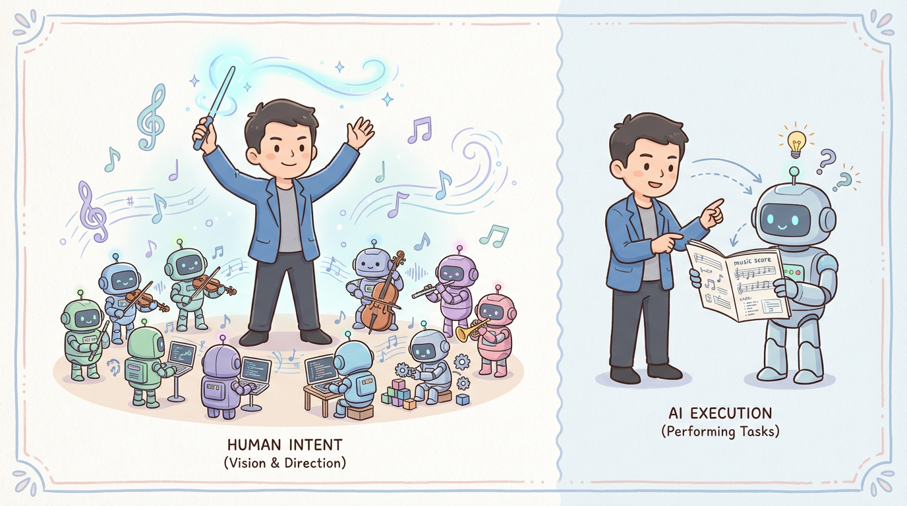
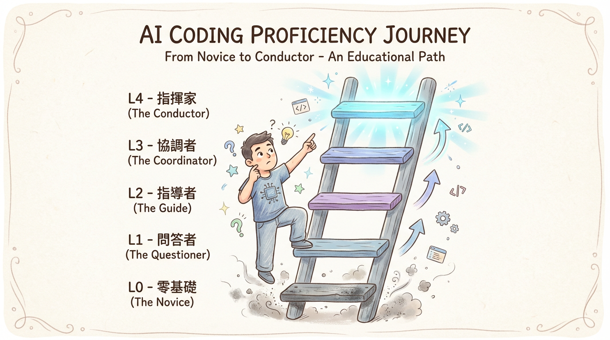

# 第一章：典範轉移 —— 你在哪個層級「Vibe」？

阿捷第一次嘗試 Vibe Coding 時，感覺糟透了。

他對著聊天視窗輸入：「幫我做一個使用者登入功能。」

AI 吐出了一大堆程式碼，看起來似是而非。他花了一整個下午，才勉強讓它跑起來，但感覺整個系統像個不穩定的黑盒子。

「這東西根本沒用，還不如我自己寫快！」他對我抱怨。

我笑著說：「你這不叫 Vibe Coding，你這叫『許願池式編程』。你只是把 AI 當成一個更厲害的 Google。要真正發揮它的力量，你得先知道你和它，分別站在哪個位置。」

這就是我們首先要搞清楚的：Vibe Coding 的典範轉移，以及我們在其中的位置。

---

## 1.1 定義 Vibe Coding 的雙重性

根據 OpenAI 聯合創始人 Andrej Karpathy 的定義，最純粹的 Vibe Coding 形式涉及使用者完全信任 AI 的輸出，甚至「忘記程式碼的存在」。

這在做週末專案或快速驗證想法時，非常有用。

然而，在專業的軟體工程領域，我們追求的是「**負責任的 AI 輔助工程**」。在這個模式下，角色分工非常明確：

- **AI 的角色**：一個擁有無限精力但缺乏判斷力的「初級工程師」。它會犯錯，會偷懶，會走捷徑。
- **人類的角色**：一個經驗豐富的「技術經理」。你負責制定規格、審查程式碼、並為最終的品質承擔全部責任。

當阿捷理解到這一點時，他鬆了一口氣：「所以，我不需要因為 AI 犯錯而沮喪，我只需要像帶新人一樣帶它？」

「完全正確。」我說。

## 1.2 AI 輔助編碼的熟練度階層

「那要怎麼『帶』它呢？」阿捷問。

「首先，你要知道開發者使用 AI 的幾個境界。」我向他展示了業界廣泛認同的能力成熟度模型。

| 熟練度等級 | 稱號 | 行為特徵 | 阿捷的理解 |
| :--- | :--- | :--- | :--- |
| **L0** | **盧德主義者** | 完全拒絕 AI 協助，懷疑其價值。 | 「這是我一開始的狀態。」 |
| **L1** | **問答者** | 把 AI 當 Google 用，解釋錯誤或查找文件。 | 「這是我現在的狀態！」 |
| **L2** | **補全者** | 依賴 GitHub Copilot 進行行級別的程式碼補全。 | 「我的同事好像是這樣。」 |
| **L3** | **功能編輯者** | 能透過提示詞生成完整函式，並要求 AI 重構。 | 「這聽起來很棒。」 |
| **L4** | **指揮家** | 設定宏觀戰略，管理多個 AI 代理，專注於安全審查與架構。 | 「這是我們的目標。」 |

「『指揮家』，」我強調，「不再關注語法細節，而是專注於兩件事：**上下文工程**和**工作分解**。這也是我們後面章節會深入探討的。」

## 1.3 Vibe Coding 的五層進化論

「這個階層讓我看清了個人成長的路徑，」阿捷說，「那從 AI 的角度看，它的能力是怎麼分的？」

「好問題，這就是 AI 的自主性分級。」

- **第一層：單次問答 (Autocomplete / Assistant)**
  - **行為**：把 AI 當 Google 用，問完就走。
  - **阿捷的狀態**：AI 是我的**計算機**。

- **第二層：工作流交互 (Chat / Pair Programmer)**
  - **行為**：在一個對話中，讓 AI 幫你除錯、重構。
  - **阿捷的狀態**：AI 是我的**結對程式員**。

- **第三層：系統化運作 (Agentic Generation / Builder)**
  - **行為**：給 AI 一個高層次的指令，它能自己去操作檔案、安裝依賴。
  - **阿捷的狀態**：AI 是我的**生產線**。**（這就是我們現在所處的 Vibe Coding 主要階段）**

- **第四層：自動化與介面化 (Multi-Agent Systems / Architect)**
  - **行為**：AI 代理之間可以互相協商，甚至幫你做使用者研究。
  - **阿捷的狀態**：AI 成了我的**產品**。

- **第五層：生態整合 (Full Autonomy)**
  - **行為**：AI 管理整個軟體生命週期，達到「忘記程式碼存在」的境界。
  - **阿捷的狀態**：AI 成了我的**生態系統**。

---

聊完後，阿捷恍然大悟：「我明白了，我一直想讓一個『結對程式員』（第二層）去做『生產線』（第三層）的工作，還期待它有『生態系統』（第五層）的智慧。我不僅用錯了方法，連期待都錯了。」

「沒錯，」我說，「Vibe Coding 的第一步，就是**校準你的期待**。你不是在跟一個無所不能的神對話，你是在學習如何領導一個潛力無限但心智不熟的團隊。而你，就是這個團隊的領導者。」

## 1.4 工具生態導覽：選擇你的 AI 戰友

「我理解了心態，」阿捷接著問，「但具體來說，我應該用什麼工具呢？市面上這麼多選擇，我有點眼花撩亂。」

「好問題，」我說，「讓我帶你快速認識目前主流的 Vibe Coding 工具生態。」

### 編輯器整合型

這類工具直接嵌入你熟悉的開發環境，讓你邊寫邊 Vibe。

| 工具 | 特點 | 適合誰 |
| :--- | :--- | :--- |
| **GitHub Copilot** | 行級補全的始祖，與 VS Code 深度整合 | 已有開發經驗、追求補全效率的開發者 |
| **Cursor** | 專為 AI 設計的 IDE，內建 Agent 模式 | 想要完整 Vibe Coding 體驗的開發者 |
| **Windsurf** | 類似 Cursor，強調多檔案編輯能力 | 喜歡嘗試新工具的早期採用者 |
| **Antigravity** | Google 的 AI IDE，可自動生成 commit message | 追求極致整合體驗的開發者 |

### 終端 / CLI 型

這類工具讓你在命令列中與 AI 協作，適合喜歡純文字介面的開發者。

| 工具 | 特點 | 適合誰 |
| :--- | :--- | :--- |
| **Claude Code** | Anthropic 官方 CLI，可直接操作檔案系統 | 習慣終端操作、重視隱私的開發者 |
| **Aider** | 開源的 Git 感知助手，支援多模型 | 喜歡開源、需要多模型切換的開發者 |
| **Gemini CLI** | Google 官方 CLI，支援多模態與檔案系統操作 | 熟悉 Google Cloud 生態系的開發者 |

### 全托管平台型

這類工具提供完整的雲端開發環境，讓你「零配置」開始 Vibe。

| 工具 | 特點 | 適合誰 |
| :--- | :--- | :--- |
| **Replit Agent** | 從對話直接生成可部署的應用 | 完全零基礎的初學者、快速驗證想法 |
| **Bolt.new** | 專注前端，快速生成 React 應用 | 設計師、想快速做原型的 PM |
| **v0.dev** | Vercel 出品，專精 UI 元件生成 | 需要快速生成介面元件的開發者 |
| **Lovable** | 從描述生成完整應用，強調「可愛」的體驗 | 非技術背景的創業者 |
| **AI Studio** | Google 官方的網頁版 AI 工具，適合快速原型設計 | 想快速體驗 Gemini 模型能力的開發者 |

---

**阿捷的選擇**：「所以我該選哪個？」

「我的建議是：」

1. **如果你是程式初學者**：從 **Replit Agent** 開始，它會讓你最快看到成果，建立信心。

2. **如果你有基礎開發經驗**：使用 **Cursor** 或 **Claude Code**，它們能讓你在「控制」與「自動」之間取得最佳平衡。

3. **如果你是資深開發者**：根據專案需求混用工具。用 Cursor 寫主要功能，用 Claude Code 做批次重構，用 v0.dev 快速生成 UI 原型。

「記住，」我強調，「工具只是工具。真正的核心能力是你的**上下文工程**和**品味判斷**。這些能力可以遷移到任何工具上。」