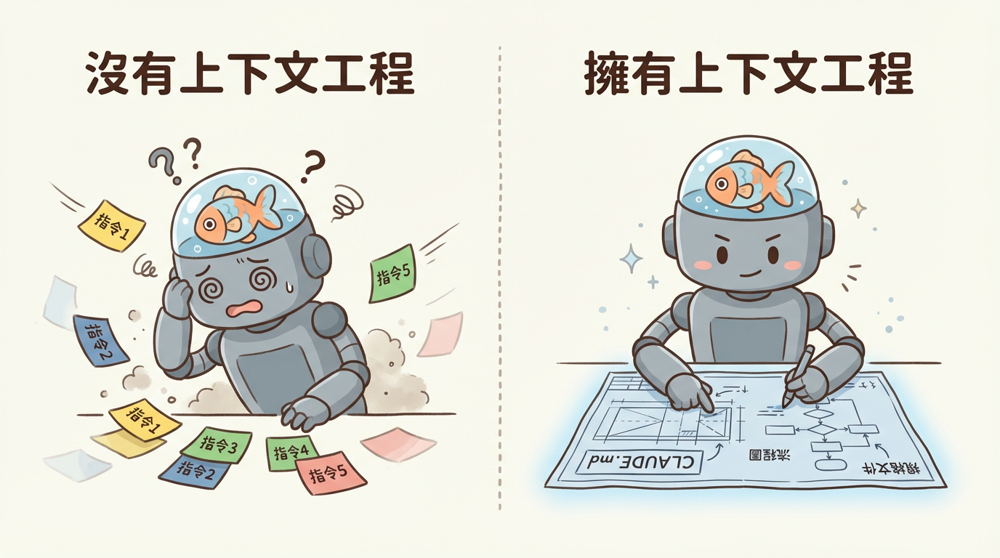

# 第二章：上下文工程 —— 如何讓 AI 不再「金魚腦」



「我快被 AI 搞瘋了！」

幾天後，阿捷又來找我，臉上寫滿了挫敗。「我讓它遵循一個特定的程式碼風格，它一開始做得很好，但改了幾個檔案後，它就全忘了！我感覺自己像在對著金魚說話，每七秒就要重複一次。」

我聽完笑了：「恭喜你，你踩到了 Vibe Coding 裡最大也最重要的一個坑——**上下文漂移 (Context Drift)**。」

AI 的上下文視窗（Context Window）就像它的短期記憶。一旦對話變長，舊的資訊就會被擠掉，導致它「遺忘」你最初的指令。這不是它「不聽話」，而是它的大腦構造天生如此。

「那怎麼辦？難道每次都要開一個新的聊天視窗？」阿捷問。

「當然不是，」我說，「專業的開發者，會從『提醒』AI，進化到『影響』AI。我們用的方法，就叫做**上下文工程 (Context Engineering)**。」

---

### 給沒耐心的你：一句話解釋上下文工程

> **與其不斷地在對話中提醒 AI 專案規則，不如把這些規則寫成一份清晰的「專案說明書」，在它開工前就直接拍在它桌上。**

---

## 2.1 上下文漂移的病理機制

【**圖解建議**：此處可畫一個漏斗圖，頂部是大量的初始指令，經過多輪對話後，底部只剩下最後幾條指令，旁邊標註「指令衰減」、「事實遺忘」。】

上下文漂移主要有三種症狀：

- **指令衰減 (Instruction Drift)**：AI 逐漸忽略初期設定的架構約束（「總是使用 TypeScript 接口」這類規則被遺忘）。
- **事實遺忘 (Factual Forgetting)**：AI 混淆了檔案結構或重新定義了已存在的變數。
- **邏輯退化 (Coherence Loss)**：在長期的除錯中，AI 陷入循環，反覆提出無效的解決方案（這就是「修復迴圈」）。

「這三點我全中！」阿捷激動地說，「所以問題不在我，在於我沒有給它建立『長期記憶』的方法。」

「沒錯，」我說，「接下來，我們就來打造這份『專案說明書』。」

## 2.2 必要文件體系詳解：構建 AI 的長期記憶

為了對抗上下文漂移，我們必須建立一套 AI 優先的專案文件體系。這些文件，就是 AI 的「憲法」。

### 2.2.1 `CLAUDE.md` / `AGENTS.md`：專案的憲法

- **這是什麼**：專案根目錄下的一個檔案，等於是 AI 的入職手冊。
- **阿捷的筆記**：AI 每次進入專案，我都要先讓它讀這個檔案。
- **核心內容**：
  - **專案概觀**：用 2-3 句話說清楚這是什麼專案。
  - **技術堆疊**：詳細鎖定版本，如 `Python 3.12, Pydantic v2 (嚴禁 v1 語法)`。
  - **常用指令**：如何啟動、測試、Linting。
  - **架構規範**：程式碼該放哪裡，如 `所有資料庫模型位於 src/models`。
  - **編碼風格**：程式碼該怎麼寫，如 `禁止使用 print，必須使用 logger`。

### 2.2.2 `.cursorrules`：IDE 級別的行為準則

- **這是什麼**：一個設定 AI「角色扮演」和「行為模式」的檔案。
- **阿捷的筆記**：這是在定義 AI 的「個性」。
- **核心內容**：
  - **角色定義**：`你是一位擁有 20 年經驗的資深 Rust 工程師`。
  - **負面約束**：`不要刪除現有的註解`、`不要省略程式碼`。
  - **回應格式**：`總是先列出修改的檔案清單，再生成 git diff`。
  - **工作流強制**：`在生成程式碼前，先搜索現有程式碼庫`。

### 2.2.3 `SPEC.md` / `WBS.md`：動態的規格書

- **這是什麼**：一個把大任務拆解成小步驟的待辦清單。
- **阿捷的筆記**：這能防止 AI 在複雜任務中「跑偏」。當它卡住時，我只要指著清單告訴它「我們現在正在做這一步」。
- **核心內容**：
  - **功能目標**：`實作使用者 OAuth2 登入功能`。
  - **工作分解結構 (WBS)**：`Phase 1: 資料庫 Schema 設計`，`Phase 2: 後端 API 實作`。
  - **驗收標準**：`成功登入後必須回傳 JWT`。
  - **進度追蹤**：每個任務前的 Checkbox `[ ]`，完成後打勾。

### 2.2.4 AI 優化的 `.gitignore`

- **這是什麼**：告訴 AI「哪些檔案你不需要看」。
- **阿捷的筆記**：這能節省 Token，也能避免 AI 讀取編譯後的垃圾程式碼，造成混亂。
- **核心內容**：除了 `node_modules` 等標準項目，還要加上 `package-lock.json`、大型數據檔、`dist/` 等。

---

「哇...」阿捷看著這份清單，「原來專業的 Vibe Coder，在寫程式碼之前，花了這麼多心思在『溝通的基礎設施』上。」

「這就是關鍵，」我總結道，「你不是在訓練一個模型，你是在**設計一個溝通系統**。有了這個系統，你才能把那隻七秒記憶的金魚，變成一個可靠的長期戰友。」

## 2.3 Token 管理策略：讓每一分預算都花在刀口上

幾週後，阿捷又來找我，這次他手上拿著一份帳單。

「桑尼哥，我的 API 費用爆了！」他苦著臉說，「上個月光是 Claude 的費用就花了我好幾千塊。我到底做錯了什麼？」

我接過帳單一看，果然。他把整個專案的程式碼一股腦兒丟給 AI，難怪 Token 用量驚人。

「你知道嗎，」我說，「上下文工程不只是讓 AI 記住事情，還包括**精準控制你餵給它的資訊量**。這叫做 Token 管理。」

### 2.3.1 理解 Token 成本

首先，讓我們建立一個直覺：

- **1 Token ≈ 4 個英文字元** 或 **1-2 個中文字**
- 一份 500 行的程式碼檔案 ≈ 2,000-3,000 Tokens
- 你的 `CLAUDE.md` + 專案結構 ≈ 500-1,000 Tokens

「所以每次對話，」阿捷驚覺，「我都在付這些錢？」

「沒錯。更重要的是，**輸入 Token 和輸出 Token 的計費通常不同**。輸出通常比輸入貴 2-5 倍。」

### 2.3.2 Token 節省的四大策略

**策略一：精準的 .gitignore**

```gitignore
# 絕對不要讓 AI 看到這些
node_modules/
package-lock.json
*.lock
dist/
build/
.next/
*.min.js
*.map
```

**阿捷的教訓**：他曾經讓 AI 讀取了整個 `node_modules`，一次對話就燒掉了 50 萬 Tokens。

**策略二：分層的上下文提供**

不要一次給 AI 看全部。建立「資訊金字塔」：

| 層級 | 內容 | 何時提供 |
| :--- | :--- | :--- |
| **永遠提供** | CLAUDE.md、專案結構概覽 | 每次對話開始 |
| **按需提供** | 相關模組的程式碼 | 當討論該模組時 |
| **極少提供** | 完整的測試檔案、歷史紀錄 | 只有除錯時才需要 |

**策略三：善用摘要**

當程式碼檔案太長時，先讓 AI 生成摘要：

```
請用 5 點總結這個檔案的主要功能，不要輸出程式碼。
```

然後在後續對話中，只提供摘要而非完整程式碼。

**策略四：對話分割**

「一個對話做一件事」是 Token 管理的黃金法則。

- **錯誤做法**：在同一個對話中又除錯、又重構、又加新功能
- **正確做法**：除錯完就開新對話；重構是另一個對話；新功能又是一個

### 2.3.3 實戰：Token 預算規劃

「那我該怎麼規劃預算？」阿捷問。

「我建議這樣分配：」

| 工作類型 | Token 預算分配 | 說明 |
| :--- | :--- | :--- |
| **探索/學習** | 20% | 問問題、理解概念，可以用較小的模型 |
| **功能開發** | 50% | 主要的程式碼生成工作 |
| **除錯/修復** | 20% | 處理錯誤、解決問題 |
| **重構/優化** | 10% | 改善既有程式碼品質 |

「最後一個提醒，」我說，「**監控你的用量**。大多數 API 平台都有用量儀表板，養成每週檢視的習慣。當你發現某類任務特別燒錢時，就該回頭檢視你的上下文策略了。」

阿捷點點頭，默默打開了他的 API 用量頁面。
