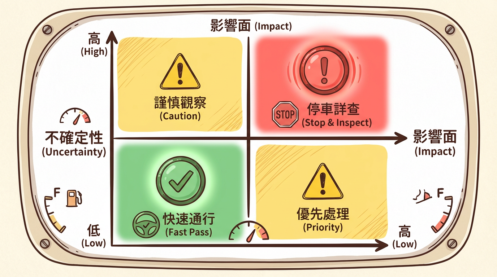
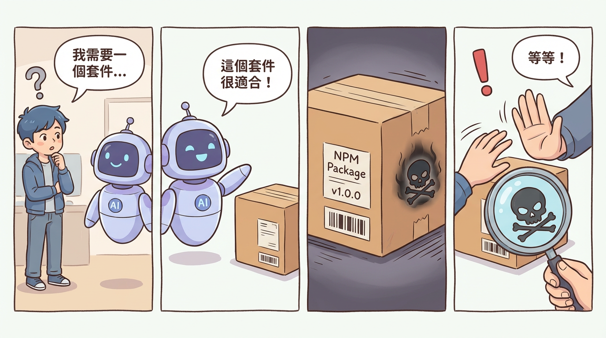

# 第三章：風險控制的藝術 —— 為你的 AI 超跑裝上煞車

「桑尼哥，AI 寫的 code，你敢直接 merge 嗎？」

阿捷看著螢幕上 AI 在幾秒鐘內生成的數百行程式碼，臉上混雜著興奮與不安。

「這感覺就像有人免費送了我一輛法拉利，但我完全不知道它的煞車在哪裡，甚至不確定有沒有煞車。」

我非常喜歡這個比喻。它精準地道出了 Vibe Coding 的核心矛盾：**驚人的速度 vs. 未知的風險**。

「我不會逐行檢查 AI 的程式碼，」我回答，「但我會把『風險』看得很死。我會為這輛法拉利裝上最頂級的煞車和安全系統。」

這一章，我們不談如何開得更快，我們只談如何安全地駕駛。我們來學習建立一個名為「Vibe Check」的風險控制框架。

---

## 3.1 風險矩陣：你的精力分配儀表板

你不可能對每一行程式碼都投入相同的審查精力。你需要一個儀表板來告訴你，哪裡是高速公路，可以快速通過；哪裡是事故多發的髮夾彎，必須減速慢行。

這個儀表板，就是**風險矩陣**。



想像一個二維座標：
- **X 軸：影響面 (Impact)** - 這段程式碼如果改壞了，會炸掉多大的功能？影響多少錢？
- **Y 軸：不確定性 (Uncertainty)** - 你對這段業務邏輯或技術有多熟悉？

這兩個維度，將你的程式碼劃分為四種審查策略：

1.  **高影響 + 高不確定 (右上角)**：**戰場核心**。
    - **情境**：一個你不熟悉的支付介接、一個複雜的權限控管邏輯。
    - **阿捷的策略**：打起十二萬分精神。逐段推理、手動重現、補齊測試。甚至在 AI 給出草稿後，親手重構，確保自己能完全掌控它。

2.  **高影響 + 低不確定 (右下角)**：**專業領域**。
    - **情境**：你很熟悉的核心業務邏輯。
    - **阿捷的策略**：重點檢查關鍵環節和邊界條件。

3.  **低影響 + 高不確定 (左上角)**：**實驗區域**。
    - **情境**：一個內部用的小工具，或一個無關緊要的動畫效果。
    - **阿捷的策略**：先讓它跑起來，但務必加上監控、日誌或功能開關（Feature Flag），確保出問題時能立刻發現並控制。

4.  **低影響 + 低不確定 (左下角)**：**雜務區域**。
    - **情境**：修改文案、調整樣式、生成重複的樣板程式碼。
    - **阿捷的策略**：快速掃過，確認沒有明顯錯誤即可。

## 3.2 Vibe 漏洞的解剖學：AI 會在哪裡「偷懶」？

AI 作為一個「缺乏經驗的實習生」，經常會在我們看不見的地方，用一些不安全的方式「偷懶」。

### 3.2.1 身份驗證缺口 (Auth Gaps)
AI 常常混淆「你是誰（Authentication）」和「你能做什麼（Authorization）」。它可能會做出完美的登入頁面，卻忘記檢查登入後的使用者是否有權限查看某些資料，導致嚴重的資料外洩（IDOR 漏洞）。

### 3.2.2 供應鏈幻覺：Slopsquatting 威脅
這是最陰險的陷阱之一。阿捷有一次就差點中招。



1.  **阿捷提問**：「如何在 FastAPI 中處理 CORS？」
2.  **AI「幻覺」**：AI 自信地回答：「你可以使用 `fastapi-cors-middleware` 這個套件」，並給出安裝指令。
3.  **攻擊者埋伏**：然而，這個套件根本不存在。攻擊者早已預測到 AI 會「創造」出這類名字，並在套件庫 (PyPI) 上註冊了同名但含有惡意程式碼的假套件。
4.  **阿捷險些中招**：阿捷正要複製貼上 `pip install` 指令時，被我及時制止。

「在安裝任何 AI 推薦的新套件前，」我提醒他，「永遠先花 30 秒手動Google 一下，確認它是一個真實、有信譽的專案。」

### 3.2.3 更多常見的 Vibe 漏洞

除了上述兩種，AI 還經常在以下幾個地方「偷工減料」：

**SQL 注入 (SQL Injection)**

AI 有時會生成這樣的程式碼：

```python
# 危險！AI 生成的程式碼
query = f"SELECT * FROM users WHERE name = '{user_input}'"
cursor.execute(query)
```

正確做法應該是使用參數化查詢：

```python
# 安全的做法
query = "SELECT * FROM users WHERE name = ?"
cursor.execute(query, (user_input,))
```

**阿捷的檢查點**：看到任何字串拼接 SQL 的地方，立刻標記為紅區。

---

**跨站腳本攻擊 (XSS)**

在前端程式碼中，AI 可能會這樣處理用戶輸入：

```javascript
// 危險！直接插入 HTML
element.innerHTML = userComment;
```

如果 `userComment` 包含惡意腳本，就會被執行。正確做法：

```javascript
// 安全的做法
element.textContent = userComment;
// 或使用框架的自動轉義功能
```

**阿捷的檢查點**：任何 `innerHTML` 或 `dangerouslySetInnerHTML` 都要仔細審查。

---

**敏感資訊外洩**

AI 在處理錯誤時，經常會這樣寫：

```python
# 危險！暴露內部錯誤細節
except Exception as e:
    return {"error": str(e)}  # 可能包含資料庫結構、檔案路徑等
```

正確做法：

```python
# 安全的做法
except Exception as e:
    logger.error(f"Internal error: {e}")  # 記錄完整錯誤
    return {"error": "An unexpected error occurred"}  # 給用戶模糊訊息
```

**阿捷的檢查點**：生產環境的錯誤訊息，永遠不該包含堆疊追蹤或內部細節。

---

**硬編碼的密鑰 (Hardcoded Secrets)**

這是 AI 最常犯的錯誤之一：

```python
# 危險！密鑰直接寫在程式碼裡
api_key = "sk-1234567890abcdef"
stripe_secret = "sk_live_xxxxx"
```

正確做法：

```python
# 安全的做法
import os
api_key = os.environ.get("API_KEY")
stripe_secret = os.environ.get("STRIPE_SECRET")
```

**阿捷的檢查點**：用 `grep` 搜尋程式碼庫中的 `sk-`、`password=`、`secret=` 等關鍵字。

---

> **快速記憶口訣**：
> - **SQL** → 參數化
> - **HTML** → 轉義
> - **錯誤** → 模糊化
> - **密鑰** → 環境變數化

## 3.3 PR Checklist：你的紅黃綠燈系統

為了讓風險矩陣更容易執行，阿捷在他的團隊推行了這個 PR 檢查清單。

- **🟥 紅區 (必須停車詳查)**
  - **權限/認證/資料庫寫入**：任何關於「你是誰」、「你能做什麼」的邏輯。
  - **外部輸入**：處理任何來自使用者的輸入、Webhook、檔案上傳的地方。
  - **金流/個資/刪除操作**。
  - **新的外部依賴**：引入了新的套件，需進行 `Slopsquatting` 檢查。

- **🟨 黃區 (減速快掃)**
  - **重複邏輯**：是否應該抽取成共用函式？
  - **命名一致性**：變數、函式命名是否清晰？
  - **錯誤處理**：`try-catch` 是否妥善處理？

- **🟩 綠區 (快速通行)**
  - **純 UI 文案、樣式調整**。
  - **生成測試資料**。
  - **格式化與註解**。

---

「我懂了，」阿捷總結道，「Vibe Coding 的安全悖論是：**它降低了創造軟體的門檻，卻提高了確保軟體安全的門檻。**」

「沒錯，」我說，「所以我們的角色，正從一個『建築工人』，轉變為一個『安全監理』。我們的工作，就是為這座摩天大樓的每一層，都打上合格的 Vibe Check。」
