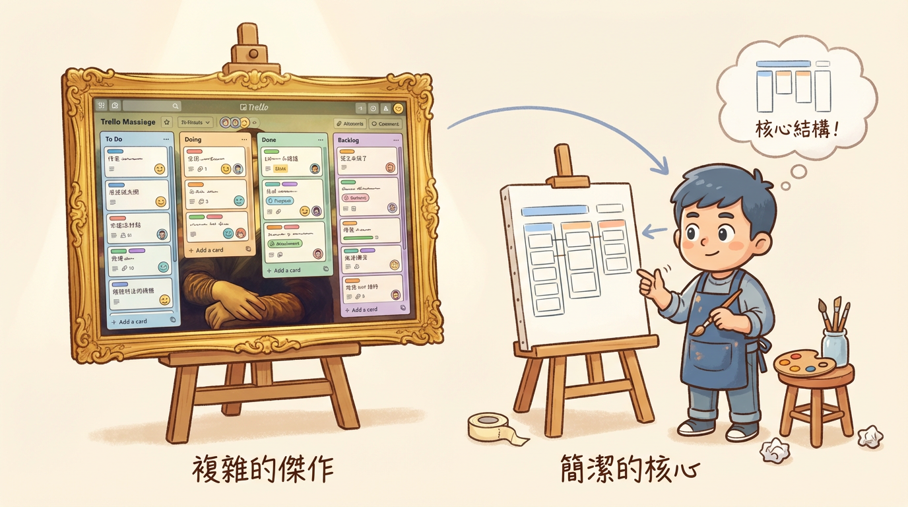

# 第四章：最快的成長路線 —— 從「仿製」到「系統」

「好了，桑尼哥，」阿捷在理解了風險控制後，顯得更有信心了，「我現在知道如何安全地『Vibe』了。但下一個問題是，我該如何『Vibe』得更好？我應該去上什麼課？背誦更多的 Prompt 技巧嗎？」

「都不是。」我搖搖頭，「學游泳最好的方式，不是在岸上背誦游泳姿勢，而是直接下水。Vibe Coding 也一樣。與其研究一堆抽象的名詞，不如直接動手，做一個能按的東西。」

> **一句話心法：不要先研究名詞，先做一個能按的東西。**

---

## 4.1 最快的起手式：仿製 + 介面化

「做什麼呢？」阿捷問。

「**仿製**一個你每天都在用的線上服務，」我建議，「例如 Trello, Notion, 或 Google Keep。但目標不是超越它，而是用 AI 快速做出一個只有其 10% 核心功能的版本。」

這個過程，我稱之為「**看豬走路，學會仿製**」。它會逼你思考真實世界的問題：
- 如何設計資料結構？
- 如何處理使用者狀態？
- 如何規劃 API？

「AI 沒用」的抱怨，很多時候不是 AI 的問題，而是我們沒有把它丟進一個真實的戰場。仿製，就是為 AI 搭建的最快、最有效的戰場。

當阿捷透過與 AI 的大量互動（**工作流交互**）完成仿製後，他得到了一系列有效的 prompt。

「接下來呢？」他問。

「**把互動變成系統**，」我說，「試著把這些成功的 prompt 整理、固化，然後把它們包裝成一個簡單的介面（**介面化**）。」

**口訣：先仿製再介面化，最後才談生態化。**

## 4.2 Vibe Coder 的三大能力支柱

在阿捷動手仿製他的第一個專案——一個極簡版的 Trello 的過程中，他逐漸發現，自己正在建立三種全新的能力。這不是他過去寫程式時所關注的，卻是在 Vibe Coding 時代至關重要的三大支柱。

### 支柱 1：上下文工程 (Context Engineering)
阿捷發現，他花最多時間的，不是寫程式碼，而是維護那幾份我們在第二章討論過的「AI 憲法」文件。他意識到，「提示工程」是一個暫時的技巧，而**上下文工程**才是真正持久的技能。他必須學會管理 AI 的「注意力」，決定什麼該讓 AI 知道，什麼不該。

### 支柱 2：系統素養與「Vibe Debugging」
當 AI 產生的卡片拖曳功能不如預期絲滑時，阿捷第一次打開了瀏覽器的開發者工具。他不需要親手寫複雜的前端程式碼，但他學會了看懂 Network Tab 裡的 API 請求，看懂 Console 裡的錯誤訊息。他學會了將這些錯誤訊息當作**新的線索**，餵給 AI，引導它找到正確的方向。這就是「**Vibe Debugging**」——在不深入程式碼細節的情況下，從系統層面除錯的能力。

### 支柱 3：品味與評估 (Taste & Evaluation)
AI 提供了三種不同的卡片新增動畫效果。哪一種感覺最流暢？哪個按鈕顏色最符合使用情境？AI 無法回答這個問題。阿捷意識到，他變成了專案的「**策展人**」。他需要拒絕 AI 輸出的 90% 的「垃圾」，只挑選那 10% 符合他心中「好軟體」直覺的方案。這就是**品味 (Taste)**。

---

「我好像明白了，」阿捷在完成他的迷你 Trello 後說，「Vibe Coding 時代的開發者，價值不再是『寫得多快』，而是『定義得多準』、『判斷得多好』。」

「完全正確，」我說，「你已經從一個 Coder，開始向一個 Architect（架構師）和 Product Manager（產品經理）的結合體進化了。」

## 4.3 練習項目清單：從入門到進階的實戰地圖

「說了這麼多，」阿捷拿出筆記本，「有沒有一個具體的練習清單？我想按部就班地練習。」

「當然有，」我說，「我幫你整理了一份從入門到進階的專案清單。每個專案都會訓練你不同的 Vibe Coding 能力。」

### 入門級（L1-L2）：建立信心

| 專案名稱 | 核心技能 | 預期成果 |
| :--- | :--- | :--- |
| **個人待辦清單** | 基礎 CRUD、狀態管理 | 能新增、刪除、標記完成的簡單 App |
| **計算機** | UI 邏輯、事件處理 | 具備基本運算功能的網頁計算機 |
| **個人履歷網站** | 靜態頁面、CSS 排版 | 可部署的個人作品展示頁 |
| **倒數計時器** | 時間處理、動態更新 | 支援自訂目標日期的倒數 App |

**阿捷的心得**：這些專案看起來簡單，但它們教會我如何**清楚地描述需求**。當我說「做一個待辦清單」時，AI 會問我一堆問題：要不要分類？要不要截止日期？這逼我思考產品的真正需求。

### 中階級（L2-L3）：掌握工作流

| 專案名稱 | 核心技能 | 預期成果 |
| :--- | :--- | :--- |
| **迷你 Trello** | 拖放互動、資料持久化 | 可拖曳卡片的看板系統 |
| **天氣查詢 App** | API 串接、錯誤處理 | 根據城市名稱顯示即時天氣 |
| **Markdown 編輯器** | 即時預覽、文字處理 | 左側編輯、右側即時渲染的編輯器 |
| **短網址服務** | 後端 API、資料庫設計 | 可產生短網址並追蹤點擊次數 |
| **聊天室** | WebSocket、即時通訊 | 多人即時聊天的網頁應用 |

**阿捷的心得**：中階專案開始涉及「系統間的溝通」。我學會了如何把錯誤訊息餵給 AI，讓它幫我除錯。這就是 **Vibe Debugging** 的實戰訓練。

### 進階級（L3-L4）：成為指揮家

| 專案名稱 | 核心技能 | 預期成果 |
| :--- | :--- | :--- |
| **個人部落格系統** | 全端整合、SEO、部署 | 含後台管理的完整部落格 |
| **電商購物車** | 複雜狀態、金流邏輯（模擬） | 完整的商品瀏覽、加入購物車、結帳流程 |
| **OAuth 登入整合** | 第三方認證、安全實踐 | 支援 Google/GitHub 登入的會員系統 |
| **AI 聊天機器人** | LLM API 串接、對話管理 | 整合 OpenAI API 的客服機器人 |
| **自動化儀表板** | 資料視覺化、排程任務 | 自動抓取數據並呈現圖表的 Dashboard |

**阿捷的心得**：進階專案讓我真正體會到「上下文工程」的威力。沒有好的 `CLAUDE.md` 和 `SPEC.md`，AI 會在複雜系統中完全迷失方向。

---

### 練習的黃金法則

「做這些專案時，有什麼要注意的嗎？」阿捷問。

「記住三個原則：」

1. **先 10% 再 100%**：不要一開始就想做完整版。先做出核心功能的 10%，確認 AI 理解你的需求，再逐步擴展。

2. **每個專案寫一份 CLAUDE.md**：即使是最簡單的計算機專案，也要練習寫專案說明。這是最重要的肌肉記憶。

3. **刻意製造錯誤**：故意給 AI 模糊的指令，觀察它如何「跑偏」，然後學習如何用更精確的上下文把它拉回來。

「最後，」我補充道，「**完成比完美更重要**。每完成一個專案，你的 Vibe Coding 直覺就會更敏銳一分。」
