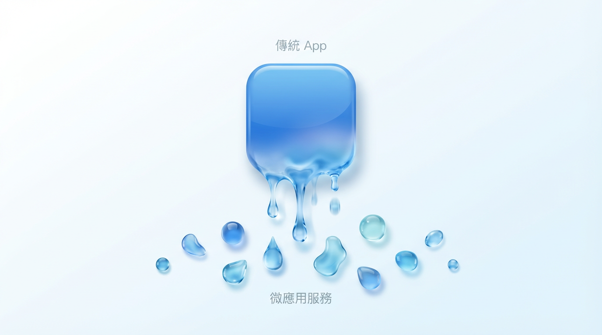

# 第五章：未來的地平線 —— 當程式碼免費，你的價值是什麼？

完成了幾個專案後，阿捷的 Vibe Coding 技術日漸純熟。但某天下午，他忽然陷入了沉思。

「桑尼哥，」他憂心忡忡地問，「我們花了這麼多力氣，去學習如何更好地『指揮』AI。但你有沒有想過，如果有一天，AI 不再需要我們指揮了呢？如果寫程式碼真的變得像呼吸一樣簡單，甚至免費，那我們這些開發者，還有什麼價值？」

這是一個深刻的問題，也是每一個身處這個時代的我們，都必須思考的終極問題。

「你的價值，」我回答，「將從『生產』轉移到『判斷』。當手搖飲的配方在網路上隨處可見時，勝負的關鍵早已不在『配方』，而在『品牌、通路、體驗』。」

程式碼就是未來的「配方」。它正在快速通往免費。

> **一句話心法：未來勝負不在 Code，在品味與擴散。**

---

## 5.1 「後軟體」時代的到來

我們正在走向一個「後軟體」（Post-Software）時代。在這個未來，「軟體」作為一個靜態的、打包的產品，將逐漸消解。

- **現狀**：我們下載一個 App，必須適應它的固定功能。
- **未來**：我們對 AI 說：「我需要一個卡路里追蹤器，但要專為生酮飲食設計，而且要能跟我的智慧冰箱連動。」AI 會為你即時生成一個專屬的、用完即逝的「微應用」。

軟體，將從一個「產品」，變成一種「按需生成的服務」。

## 5.2 Vibe Coding 悖論：速度與債務

「聽起來很美好，但似乎有哪裡不對勁。」阿捷皺起了眉頭。

「你感覺到的，就是 Vibe Coding 的核心悖論，」我說，「**承諾：Vibe Coding 使構建變得更快。現實：Vibe Coding 使維護變得更難。**」

那些在週末用 Vibe Coding 快速搭建起來的專案，如果沒有良好的架構意圖，很快就會變成難以維護的「義大利麵條式程式碼」。我預測，未來幾年會出現一波「**技術債清理熱潮**」，企業會高薪聘請人類工程師，來重構和拯救那些由創始人「Vibe」出來的 MVP。

## 5.3 你的新護城河：三個黃金能力

「所以，我的價值就在於當一個『清理工』嗎？」阿捷聽起來有點失望。

「不，」我笑著糾正他，「你的價值，在於從一開始就**避免製造需要被清理的垃圾**。你的價值，在於那些 AI 無法取代的能力。」

當生產（寫程式碼）成本趨近於零時，真正的稀缺資源，變成了以下三者：

1.  **洞察 (Insight)**：聽懂客戶沒說出口的需求，看見市場中未被滿足的渴望。這是「**做什麼**」的智慧。
2.  **品味 (Taste)**：在 AI 生成的無數種可能性中，懂得取捨，知道何為「好」，何時「足夠好」。這是在「**如何做**」的過程中，注入靈魂的能力。
3.  **擴散 (Distribution)**：將你創造的價值，用最有效的方式傳遞出去，讓市場看見、理解並願意買單。這是「**讓價值發生**」的能力。

---

### 給不同角色的你一句話

- **給工程師（像阿捷一樣的你）**：抬頭看市場，你的技術是實現洞察與品味的槓桿，但不是全部。
- **給創業者**：你最重要的能力是「翻譯」，將模糊的市場需求，精準地翻譯成 AI 能理解的規格。
- **給管理者**：別再只用演算法考題來招聘。去尋找那些對業務有感覺、對產品有品味、能跨界溝通的人。

「我明白了，」阿捷的眼神重新亮了起來，「當引擎（AI）本身變得唾手可得時，**方向盤（品味）和目的地（洞察）**，才變得至關重要。」

「正是如此。」我欣慰地說。
