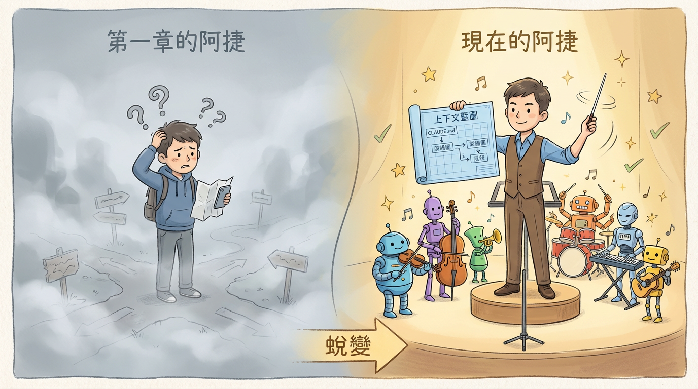

# 最終章：你的旅程，現在才開始

讀到這裡，你和阿捷一起，經歷了一場 Vibe Coding 的思想洗禮。

從一開始面對新名詞的**迷茫**，
到理解典範轉移後的**清醒**，
再到掌握上下文工程與風險控制的**自信**，
最後，在對未來的眺望中，找到了身為開發者的**新價值**。

這不僅是工具的升級，更是我們工程師思維的全面進化。

Vibe Coding 不是工程的終結；恰恰相反，它是工程的**擴展**。它將權力交還給了創造者，讓我們能將更多的精力，從繁瑣的語法細節中解放出來，投入到真正重要的事情上：**對需求的洞察、對架構的思考、以及對產品的品味。**

在這個新時代，程式碼本身變得廉價，而以下三者成為了你的核心資產：

1.  **對程式碼的規範 (Specification)**
2.  **上下文的管理 (Context Management)**
3.  **安全邊界的驗證 (Verification)**

對於像你和阿捷一樣的專業人士來說，前進的道路非常清晰：

> **擁抱「Vibe」的速度，同時，嚴格應用「Check」的審查。**

我們正在進入一個計算機終於開始理解我們的時代。
但我們必須確保，我們仍然理解計算機。

這本手冊即將結束，但你的旅程，現在才真正開始。

去 Vibe 吧，但請記住，要 Vibe 得聰明，Vibe 得安全。

---
*桑尼*
*寫於 Vibe Coding 元年*
