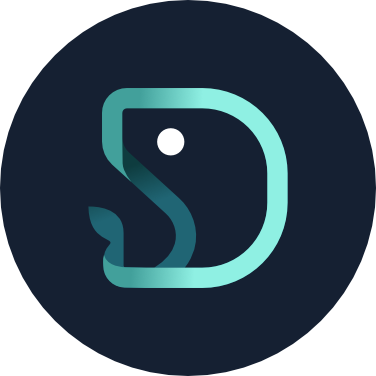
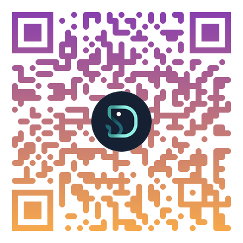
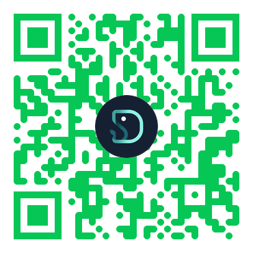

# 《VibeCoding 全心法：快不是重點，能收斂才是》

桑尼資料科學出品，必屬精品

---

## 前言：歡迎來到 Vibe Coding 的世界

「Vibe Coding」，這個詞充滿了自由與創造的氣息。它意味著我們能用更接近「人話」的方式，與 AI 一同构建軟體，將意圖（Intent）快速轉化為現實。

這是一個令人興奮的時代，但興奮的背後，也潛藏著混亂的風險。完全信任 AI，就如同閉著眼睛在高速公路上狂飆，爽，但極度危險。完全不信，又等於是放棄了這個時代最強大的加速器。

那麼，我們該如何自處？

這本手冊，不是一本空泛的哲學探討，而是一份務實的**行動指南**。我們將分三個部分，探討 Vibe Coding 時代下的生存法則：

1. **風險控管**：如何在享受速度的同時，不讓專案爆炸。
2. **成長路線**：如何最快地掌握與 AI 協作的精髓。
3. **未來趨勢**：當程式碼本身不再是壁壘，我們真正的價值在哪裡。

準備好了嗎？讓我們開始學習，如何在風暴中優雅地駕馭快艇。

---

---

## 第一篇：風險控管的藝術 —— AI 寫的程式碼，你敢全收嗎？

> **一句話心法：我不會逐行檢查 AI 的程式碼，但我會把「風險」看得很死。**

### 開場的拷問：「你敢把 AI 生成的 code 直接 merge 進主幹嗎？」

誠實地回答這個問題。

如果你不敢，恭喜你，你具備最基本的敬畏心。如果你敢，我更要恭喜你，因為你即將學會一套方法，讓你「敢」得有底氣，而不是盲目自信。

完全不看，爽個三天，專案就會長出義大利麵條般的程式碼，盤根錯節，直到有一天你發現，改一個小功能比登天還難。這不是危言聳聽，而是許多團隊正在經歷的災難。

我們的目標，是在「信任的速度」與「質疑的安全」之間，找到一個黃金平衡點。

### 風險矩陣：你的審查精力分配圖

時間是寶貴的，你不可能對每一行程式碼都投入相同的精力。你需要一個框架來決定哪裡詳查，哪裡快掃。這就是**風險矩陣**。

想像一個二維座標：

* **X 軸：影響面** (Impact) - 這段程式碼如果改壞了，會影響多少人、多少錢、多少核心資料？
* **Y 軸：不確定性** (Uncertainty) - 你對這段邏輯、這個業務領域、這個技術有多熟悉？

這兩個維度，將你的程式碼劃分為四個象限，對應四種不同的審查（Review）深度：

1. **高影響 + 高不確定 (右上角)**：這是**戰場核心**。例如，一個你不熟悉的支付介接或權限控管邏輯。

   * **策略**：逐段推理、手動重現、補齊單元測試，甚至在 AI 給出草稿後，親手重構，確保架構的可維護性。
2. **高影響 + 低不確定 (右下角)**：這是你的**專業領域**。例如，你很熟悉的核心業務邏輯。

   * **策略**：重點檢查關鍵環節，確保邊界條件被覆蓋，並補齊測試。
3. **低影響 + 高不確定 (左上角)**：這是**實驗區域**。例如，一個內部用的小工具，或是一個無關緊要的動畫效果。

   * **策略**：先讓它跑起來，但務必加上監控、日誌或功能開關（Feature Flag），確保出問題時能立刻發現並控制。
4. **低影響 + 低不確定 (左下角)**：這是**雜務區域**。例如，修改文案、調整樣式、或生成重複的樣板程式碼。

   * **策略**：快速掃過，確認沒有明顯錯誤即可。

### PR Checklist：可立即使用的紅黃綠燈系統

為了讓風險矩陣更容易執行，這裡提供一份可以直接用在每一次 Pull Request (PR) 的檢查清單。

* **🟥 紅區 (必須停車詳查)**

  * **權限/認證/資料庫寫入**：任何關於「你是誰」、「你能做什麼」的邏輯。
  * **外部輸入**：處理任何來自使用者的輸入、Webhook、檔案上傳的地方。
  * **金流/個資/刪除操作**：直接與錢、敏感資訊、不可逆操作相關的功能。
* **🟨 黃區 (減速快掃)**

  * **重複邏輯**：是否應該抽取成共用函式或類別？
  * **命名一致性**：變數、函式命名是否清晰且風格統一？
  * **錯誤處理**：是否妥善處理了 `try-catch` 和各種失敗情況？
  * **外部依賴**：是否引入了不必要的套件？
* **🟩 綠區 (快速通行)**

  * **純 UI 文案、樣式調整** (前提：不涉及核心流程)。
  * **生成測試資料**。
  * **格式化與註解**。

**口訣：分支先開，主幹別賭。紅區必查，黃區快掃，綠區放行。**

---

---

## 第二篇：最快的成長路線 —— 直接仿製一個能跑的系統

> **一句話心法：不要先研究名詞，先做一個能按的東西。**

### Vibe Coding 的五層進化論

與 AI 協作，不是一個「會」或「不會」的開關，而是一個逐步進化的過程。了解你所在的層級，才能規劃下一步。

* **第一層：單次問答**

  * **行為**：把 AI 當 Google 用，問完就走，對話沒有上下文。
  * **狀態**：AI 是你的**計算機**。
* **第二層：工作流交互**

  * **行為**：在一個持續的對話中，讓 AI 幫你除錯、重構、完成一個小功能。
  * **狀態**：AI 是你的**結對程式員 (Pair Programmer)**。
* **第三層：系統化運作**

  * **行為**：將一系列成功的 prompt 固化下來，形成可重複執行的 SOP，用來完成特定任務。
  * **狀態**：AI 是你的**生產線**。
* **第四層：自動化與介面化**

  * **行為**：將固化的 SOP 包裝成一個按鈕、一個 API、一個工具，讓不懂技術的人也能使用。
  * **狀態**：AI 成了你的**產品**。
* **第五層：生態整合**

  * **行為**：你創造的多個 AI 工具（產品）開始互相串連，形成一個自動化的軍團，解決複雜的系統性問題。
  * **狀態**：AI 成了你的**生態系統**。

**幻想與現實**：「我能直接學習第五層嗎？」 **不能。** 因為第五層的能力，來自於前四層大量「真實情境」的肌肉記憶。

### 最快的起手式：仿製 + 介面化

那如何最快地積累「真實情境」？答案不是上課，而是**仿製**。

「AI 沒用」的抱怨，很多時候不是 AI 的問題，而是我們沒有把它丟進一個真實的戰場。

1. **看豬走路，學會仿製**：找一個你每天都在用的、成功的線上服務（例如 Trello, Notion, Google Keep）。不要想著超越它，先想著「用 AI 快速做一個只有其 10% 核心功能的版本」。這個過程會逼你思考真實世界的問題：如何設計資料結構？如何處理用戶狀態？
2. **把互動變成系統**：當你透過與 AI 的大量互動（第二層）完成仿製後，你會得到一系列有效的 prompt。這時，試著把這些 prompt 整理、固化（第三層），然後把它們包裝成一個簡單的介面（第四層）。

**熟練的開發者與新手的最大差距，往往不是寫程式碼的能力，而是將「模糊的互動」轉化為「穩定的系統」的能力。** 仿製，是鍛鍊這種能力最快的道場。

**口訣：先仿製再介面化，最後才談生態化。**

---

---

## 第三篇：未來的地平線 —— 當程式碼免費，你的價值是什麼？

> **一句話心法：未來勝負不在 Code，在品味與擴散。**

想像一下，手搖飲的配方在網路上隨處可見，幾乎免費。但為什麼有些品牌能開遍全球，有些卻無人問津？

因為勝負的關鍵早已不在「配方」，而在「品牌、通路、體驗」。

程式碼就是未來的「配方」，它正在快速通往免費。當任何人都能輕易生成功能的骨架時，身為創造者的你，真正的護城河在哪裡？

### 三個黃金能力

1. **洞察 (Insight)**：聽懂客戶沒說出口的需求，看見市場中未被滿足的渴望。這是「做什麼」的智慧。
2. **品味 (Taste)**：在無數種可能性中，懂得取捨，知道何為「好」，何時「足夠好」。這是在「如何做」的過程中，注入靈魂的能力。
3. **擴散 (Distribution)**：將你創造的價值，用最有效的方式傳遞出去，讓市場看見、理解並願意買單。這是「讓價值發生」的能力。

### 給不同角色的你一句話

* **給工程師**：抬頭看市場，你的技術是實現洞察與品味的槓桿，但不是全部。
* **給創業者**：你最重要的能力是「翻譯」，將模糊的市場需求，精準地翻譯成 AI 能理解的規格。
* **給管理者**：別再只用演算法考題來招聘。去尋找那些對業務有感覺、對產品有品味、能跨界溝通的人。

我們並非唱衰技術，而是提醒：當引擎本身變得唾手可得時，**方向盤和目的地**，才變得至關重要。

---

---

## 關於作者

**桑尼資料科學 (Sunny Data Science)**

我們不只探索資料，更探索資料背後的洞見與人性。
專注於將複雜的技術，轉化為清澈的智慧與可行的策略。

願我們的分享，能成為你獨行路上的一盞微光。

**追蹤我們，獲取更多心法與實戰分享：**

|                  Instagram                  |                Line                |
| :------------------------------------------: | :--------------------------------: |
|  |  |
