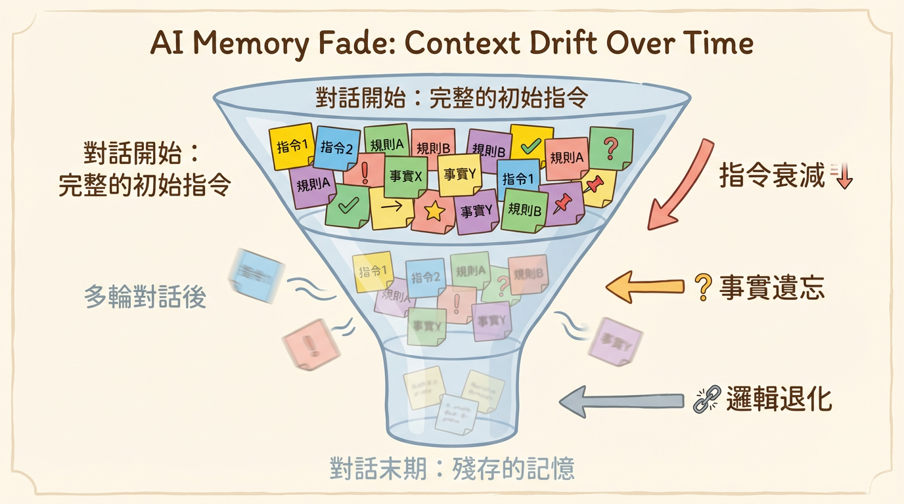

# 桑尼核彈流 - VibeCoding 全心法

**駕馭 AI 協作的開發者生存指南**

---

**作者**：桑尼資料科學 | Data Sunnie

**版本**：1.0

---

你最近是不是也常聽到 "Vibe Coding" 這個詞？

感覺它無處不在，充滿了自由、創造，甚至有點魔幻的氣息。彷彿只要動動嘴，軟體就能自動生成。

這是一個令人興奮的時代，對吧？但興奮的背後，可能也夾雜著一絲不安。

我叫桑尼，是一名在程式設計世界打滾多年的開發者。最近，我團隊裡一位很有潛力的年輕工程師阿捷，就帶著這種複雜的心情來找我。

「桑尼哥，」他說，「Vibe Coding 到底是什麼？是未來趨勢還是又一個被過度吹捧的泡沫？我感覺自己再不跟上就要被淘汰了，但看著 AI 生成的程式碼，心裡又毛毛的。」

阿捷的困惑，可能也是你的困惑。


完全信任 AI，就如同閉著眼睛在高速公路上狂飆，爽，但極度危險。完全不信，又等於是放棄了這個時代最強大的加速器。

那麼，我們該如何自處？

我決定寫下這本手冊，它不是一本空泛的哲學探討，而是一份務實的**行動指南**。我想透過它，與你、與阿捷，一同探索 Vibe Coding 時代下的生存法則。

在這本書裡，我們將一起：

1. **看清典範轉移**：搞懂 Vibe Coding 到底是什麼，以及我們現在身處何處。
2. **掌握上下文工程**：學會如何給 AI 一份清晰的「專案說明書」，讓它不再輕易「失憶」。
3. **建立風險雷達**：學會為 AI 這輛超跑裝上最可靠的煞車系統。
4. **規劃成長路線**：找到最快掌握與 AI 協作精髓的練習方法。
5. **眺望未來趨勢**：當程式碼本身不再是壁壘，我們真正的價值在哪裡。

準備好了嗎？讓我們跟著阿捷的腳步，一起學習如何在風暴中，優雅地駕馭這艘名為 Vibe Coding 的快艇。

---

<div style="page-break-after: always;"></div>

---

阿捷第一次嘗試 Vibe Coding 時，感覺糟透了。

他對著聊天視窗輸入：「幫我做一個使用者登入功能。」

AI 吐出了一大堆程式碼，看起來似是而非。他花了一整個下午，才勉強讓它跑起來，但感覺整個系統像個不穩定的黑盒子。

「這東西根本沒用，還不如我自己寫快！」他對我抱怨。

我笑著說：「你這不叫 Vibe Coding，你這叫『許願池式編程』。你只是把 AI 當成一個更厲害的 Google。要真正發揮它的力量，你得先知道你和它，分別站在哪個位置。」

這就是我們首先要搞清楚的：Vibe Coding 的典範轉移，以及我們在其中的位置。

---

## 1.1 定義 Vibe Coding 的雙重性


根據 OpenAI 聯合創始人 Andrej Karpathy 的定義，最純粹的 Vibe Coding 形式涉及使用者完全信任 AI 的輸出，甚至「忘記程式碼的存在」。

這在做週末專案或快速驗證想法時，非常有用。

然而，在專業的軟體工程領域，我們追求的是「**負責任的 AI 輔助工程**」。在這個模式下，角色分工非常明確：

- **AI 的角色**：一個擁有無限精力但缺乏判斷力的「初級工程師」。它會犯錯，會偷懶，會走捷徑。
- **人類的角色**：一個經驗豐富的「技術經理」。你負責制定規格、審查程式碼、並為最終的品質承擔全部責任。

當阿捷理解到這一點時，他鬆了一口氣：「所以，我不需要因為 AI 犯錯而沮喪，我只需要像帶新人一樣帶它？」

「完全正確。」我說。

## 1.2 AI 輔助編碼的熟練度階層

「那要怎麼『帶』它呢？」阿捷問。

「首先，你要知道開發者使用 AI 的幾個境界。」我向他展示了業界廣泛認同的能力成熟度模型。


| 熟練度等級   | 稱號                 | 行為特徵                                               | 阿捷的理解               |
| :----------- | :------------------- | :----------------------------------------------------- | :----------------------- |
| **L0** | **盧德主義者** | 完全拒絕 AI 協助，懷疑其價值。                         | 「這是我一開始的狀態。」 |
| **L1** | **問答者**     | 把 AI 當 Google 用，解釋錯誤或查找文件。               | 「這是我現在的狀態！」   |
| **L2** | **補全者**     | 依賴 GitHub Copilot 進行行級別的程式碼補全。           | 「我的同事好像是這樣。」 |
| **L3** | **功能編輯者** | 能透過提示詞生成完整函式，並要求 AI 重構。             | 「這聽起來很棒。」       |
| **L4** | **指揮家**     | 設定宏觀戰略，管理多個 AI 代理，專注於安全審查與架構。 | 「這是我們的目標。」     |

「『指揮家』，」我強調，「不再關注語法細節，而是專注於兩件事：**上下文工程**和**工作分解**。這也是我們後面章節會深入探討的。」

## 1.3 Vibe Coding 的五層進化論

「這個階層讓我看清了個人成長的路徑，」阿捷說，「那從 AI 的角度看，它的能力是怎麼分的？」

「好問題，這就是 AI 的自主性分級。」

- **第一層：單次問答 (Autocomplete / Assistant)**

  - **行為**：把 AI 當 Google 用，問完就走。
  - **阿捷的狀態**：AI 是我的**計算機**。
- **第二層：工作流交互 (Chat / Pair Programmer)**

  - **行為**：在一個對話中，讓 AI 幫你除錯、重構。
  - **阿捷的狀態**：AI 是我的**結對程式員**。
- **第三層：系統化運作 (Agentic Generation / Builder)**

  - **行為**：給 AI 一個高層次的指令，它能自己去操作檔案、安裝依賴。
  - **阿捷的狀態**：AI 是我的**生產線**。**（這就是我們現在所處的 Vibe Coding 主要階段）**
- **第四層：自動化與介面化 (Multi-Agent Systems / Architect)**

  - **行為**：AI 代理之間可以互相協商，甚至幫你做使用者研究。
  - **阿捷的狀態**：AI 成了我的**產品**。
- **第五層：生態整合 (Full Autonomy)**

  - **行為**：AI 管理整個軟體生命週期，達到「忘記程式碼存在」的境界。
  - **阿捷的狀態**：AI 成了我的**生態系統**。

---

聊完後，阿捷恍然大悟：「我明白了，我一直想讓一個『結對程式員』（第二層）去做『生產線』（第三層）的工作，還期待它有『生態系統』（第五層）的智慧。我不僅用錯了方法，連期待都錯了。」

「沒錯，」我說，「Vibe Coding 的第一步，就是**校準你的期待**。你不是在跟一個無所不能的神對話，你是在學習如何領導一個潛力無限但心智不熟的團隊。而你，就是這個團隊的領導者。」

## 1.4 工具生態導覽：選擇你的 AI 戰友

「我理解了心態，」阿捷接著問，「但具體來說，我應該用什麼工具呢？市面上這麼多選擇，我有點眼花撩亂。」

「好問題，」我說，「讓我帶你快速認識目前主流的 Vibe Coding 工具生態。」

### 編輯器整合型

這類工具直接嵌入你熟悉的開發環境，讓你邊寫邊 Vibe。

| 工具                     | 特點                                        | 適合誰                             |
| :----------------------- | :------------------------------------------ | :--------------------------------- |
| **GitHub Copilot** | 行級補全的始祖，與 VS Code 深度整合         | 已有開發經驗、追求補全效率的開發者 |
| **Cursor**         | 專為 AI 設計的 IDE，內建 Agent 模式         | 想要完整 Vibe Coding 體驗的開發者  |
| **Windsurf**       | 類似 Cursor，強調多檔案編輯能力             | 喜歡嘗試新工具的早期採用者         |
| **Antigravity**    | Google 的 AI IDE，可自動生成 commit message | 追求極致整合體驗的開發者           |

### 終端 / CLI 型

這類工具讓你在命令列中與 AI 協作，適合喜歡純文字介面的開發者。

| 工具                  | 特點                                      | 適合誰                           |
| :-------------------- | :---------------------------------------- | :------------------------------- |
| **Claude Code** | Anthropic 官方 CLI，可直接操作檔案系統    | 習慣終端操作、重視隱私的開發者   |
| **Aider**       | 開源的 Git 感知助手，支援多模型           | 喜歡開源、需要多模型切換的開發者 |
| **Gemini CLI**  | Google 官方 CLI，支援多模態與檔案系統操作 | 熟悉 Google Cloud 生態系的開發者 |

### 全托管平台型

這類工具提供完整的雲端開發環境，讓你「零配置」開始 Vibe。

| 工具                   | 特點                                          | 適合誰                             |
| :--------------------- | :-------------------------------------------- | :--------------------------------- |
| **Replit Agent** | 從對話直接生成可部署的應用                    | 完全零基礎的初學者、快速驗證想法   |
| **Bolt.new**     | 專注前端，快速生成 React 應用                 | 設計師、想快速做原型的 PM          |
| **v0.dev**       | Vercel 出品，專精 UI 元件生成                 | 需要快速生成介面元件的開發者       |
| **Lovable**      | 從描述生成完整應用，強調「可愛」的體驗        | 非技術背景的創業者                 |
| **AI Studio**    | Google 官方的網頁版 AI 工具，適合快速原型設計 | 想快速體驗 Gemini 模型能力的開發者 |

---

**阿捷的選擇**：「所以我該選哪個？」

「我的建議是：」

1. **如果你是程式初學者**：從 **Replit Agent** 開始，它會讓你最快看到成果，建立信心。
2. **如果你有基礎開發經驗**：使用 **Cursor** 或 **Claude Code**，它們能讓你在「控制」與「自動」之間取得最佳平衡。
3. **如果你是資深開發者**：根據專案需求混用工具。用 Cursor 寫主要功能，用 Claude Code 做批次重構，用 v0.dev 快速生成 UI 原型。

「記住，」我強調，「工具只是工具。真正的核心能力是你的**上下文工程**和**品味判斷**。這些能力可以遷移到任何工具上。」

## 1.5 模型選擇指南：不同任務的最佳拍檔

「工具我選好了，」阿捷接著問，「但同一個工具裡面，常常有好幾種模型可以選。Claude、GPT、Gemini，還有什麼推理模型、非推理模型...我該怎麼選？」

「這是個好問題，」我說，「選錯模型，輕則浪費錢，重則得到垃圾輸出。讓我幫你建立一個選擇框架。」

### 三大模型家族速覽（2025 年底）

目前市面上主流的 AI 模型，可以分成三大家族：

| 家族                         | 最新模型                        | 核心特色                                                               | 阿捷的比喻                         |
| :--------------------------- | :------------------------------ | :--------------------------------------------------------------------- | :--------------------------------- |
| **Claude (Anthropic)** | Opus 4.5, Sonnet 4.5, Haiku 4.5 | SWE-bench 領先（80.9%）、長時間專注任務、程式碼品質最穩定              | 「能連續工作 30 小時的資深工程師」 |
| **GPT (OpenAI)**       | GPT-5.2, o3, o4-mini            | 生態最成熟、多語言程式碼編輯最強（88%）、工具整合最完善                | 「什麼都會的全能選手」             |
| **Gemini (Google)**    | Gemini 3 Pro, 2.5 Flash         | 推理基準領先（LMArena 1501 Elo）、100萬+ Token 上下文、Deep Think 模式 | 「推理能力最強的研究員」           |

### 推理模型 vs. 非推理模型

「等等，」阿捷打斷我，「我還看到有些模型名字裡有 'thinking' 或 'Deep Think'，那又是什麼？」

「這就是 2025 年最重要的模型分類，」我解釋道。

**非推理模型（標準模型）**

- 代表：Claude Sonnet 4.5、GPT-5.2、Gemini 2.5 Flash
- 特性：回應快速、成本較低、適合直接生成
- 適用：大部分日常開發任務

**推理模型（Reasoning / Thinking 模型）**

- 代表：o3/o4-mini、Gemini 3 Pro (Deep Think)、Claude Opus 4.5 (effort 參數)
- 特性：會先「思考」再回答，過程較慢但邏輯更嚴謹
- 適用：複雜邏輯、數學推理、多步驟規劃
- 亮點：o3 在 SWE-Bench 達 69.1%（比 o1 的 48.9% 大幅提升）；Gemini 3 Pro 在 GPQA Diamond 達 91.9%，超越人類專家水準

> **一句話區分**：非推理模型像「直覺型選手」，推理模型像「深思熟慮型選手」。

### 任務導向的模型選擇矩陣

「那具體來說，什麼任務該用什麼模型？」阿捷拿出筆記本。

| 任務類型                      | 推薦模型                      | 原因                                                       |
| :---------------------------- | :---------------------------- | :--------------------------------------------------------- |
| **快速原型 / UI 生成**  | GPT-5.2, Claude Sonnet 4.5    | 速度快、創意佳、成本可控                                   |
| **長時間程式開發**      | Claude Sonnet 4.5             | 可連續專注 30+ 小時，SWE-bench 表現最佳                    |
| **複雜業務邏輯**        | Claude Opus 4.5, o3           | 邏輯嚴謹、不易出錯                                         |
| **大型程式碼重構**      | Gemini 2.5 Pro / 3 Pro        | 100萬 Token 上下文，能一次看完整個專案                     |
| **Debug / 錯誤分析**    | o3, Gemini 3 Pro (Deep Think) | 推理能力強，能追蹤複雜錯誤鏈                               |
| **演算法 / 數學問題**   | Gemini 3 Pro, o3              | AIME 2025 達 100%（o3）、推理基準領先                      |
| **多語言程式碼**        | GPT-5.2                       | Aider Polyglot 88%，處理 C++/Go/Java/JS/Python/Rust 最穩定 |
| **日常問答 / 解釋概念** | Gemini 2.5 Flash-Lite         | 成本最低（$0.10/1M tokens）、速度快                        |

### 成本 vs. 品質的取捨

「用最好的模型不就好了嗎？」阿捷問。

「錢會燒光的，」我笑著說，「Claude Sonnet 4.5 的成本是 Gemini 2.5 Flash 的 20 倍。聰明的做法是**分層使用**：」

```
日常開發流程建議：

1. 探索階段 → 用便宜快速的模型（Gemini Flash-Lite / Haiku 4.5）
   「讓我快速試試這個想法可不可行」

2. 開發階段 → 用中階模型（Sonnet 4.5 / GPT-5.2）
   「幫我實作這個功能」

3. 關鍵決策 → 用頂級或推理模型（Opus 4.5 / o3 / Gemini 3 Pro）
   「審查這段認證邏輯有沒有漏洞」
```

### 阿捷的模型選擇 Cheatsheet

經過一番討論，阿捷整理出了自己的速查表：

| 情境                           | 第一選擇                       | 備選             |
| :----------------------------- | :----------------------------- | :--------------- |
| 「快速寫個小功能」             | Claude Sonnet 4.5              | GPT-5.2          |
| 「這段邏輯很複雜，幫我想清楚」 | o3 / Gemini 3 Pro (Deep Think) | Claude Opus 4.5  |
| 「幫我看完這 50 個檔案」       | Gemini 2.5 Pro                 | Gemini 3 Pro     |
| 「需要連續工作好幾小時」       | Claude Sonnet 4.5              | Claude Opus 4.5  |
| 「預算有限，但要能用」         | Gemini 2.5 Flash-Lite          | Claude Haiku 4.5 |
| 「要最高品質，成本不是問題」   | Claude Opus 4.5                | o3-pro           |

### 2025 年的關鍵洞察

根據最新基準測試，各家模型已經形成明確的專長分工：

- **程式碼任務**：Claude 4.5 系列領先（Opus 4.5 在 SWE-bench 達 80.9%）
- **純推理任務**：Gemini 3 Pro 領先（LMArena Elo 突破 1500 大關）
- **全能型應用**：GPT-5.2 最平衡（生態最完整、工具整合最佳）

> **2025 年的共識**：沒有「最好的模型」，只有「最適合任務的模型」。專業開發者普遍採用多模型策略。

---

「最後提醒你，」我說，「**模型更新很快**。今天的最佳選擇，三個月後可能就變了。保持關注各家的更新公告，但核心原則不變：**根據任務複雜度和預算，選擇最適合的模型層級**。」

阿捷點點頭：「我懂了，選模型就像選車——不是越貴越好，而是要看你要跑高速公路還是送外賣。」

「完美的比喻，」我說。

---

<div style="page-break-after: always;"></div>

---
# 第二章：上下文工程 —— 如何讓 AI 不再「金魚腦」


「我快被 AI 搞瘋了！」

幾天後，阿捷又來找我，臉上寫滿了挫敗。「我讓它遵循一個特定的程式碼風格，它一開始做得很好，但改了幾個檔案後，它就全忘了！我感覺自己像在對著金魚說話，每七秒就要重複一次。」

我聽完笑了：「恭喜你，你踩到了 Vibe Coding 裡最大也最重要的一個坑——**上下文漂移 (Context Drift)**。」

AI 的上下文視窗（Context Window）就像它的短期記憶。一旦對話變長，舊的資訊就會被擠掉，導致它「遺忘」你最初的指令。這不是它「不聽話」，而是它的大腦構造天生如此。

「那怎麼辦？難道每次都要開一個新的聊天視窗？」阿捷問。

「當然不是，」我說，「專業的開發者，會從『提醒』AI，進化到『影響』AI。我們用的方法，就叫做**上下文工程 (Context Engineering)**。」

---

### 給沒耐心的你：一句話解釋上下文工程

> **與其不斷地在對話中提醒 AI 專案規則，不如把這些規則寫成一份清晰的「專案說明書」，在它開工前就直接拍在它桌上。**

---

## 2.1 上下文漂移的病理機制



上下文漂移主要有三種症狀：

- **指令衰減 (Instruction Drift)**：AI 逐漸忽略初期設定的架構約束（「總是使用 TypeScript 接口」這類規則被遺忘）。
- **事實遺忘 (Factual Forgetting)**：AI 混淆了檔案結構或重新定義了已存在的變數。
- **邏輯退化 (Coherence Loss)**：在長期的除錯中，AI 陷入循環，反覆提出無效的解決方案（這就是「修復迴圈」）。

「這三點我全中！」阿捷激動地說，「所以問題不在我，在於我沒有給它建立『長期記憶』的方法。」

「沒錯，」我說，「接下來，我們就來打造這份『專案說明書』。」

## 2.2 必要文件體系詳解：構建 AI 的長期記憶

為了對抗上下文漂移，我們必須建立一套 AI 優先的專案文件體系。這些文件，就是 AI 的「憲法」。

### 2.2.1 `CLAUDE.md` / `AGENTS.md`：專案的憲法

- **這是什麼**：專案根目錄下的一個檔案，等於是 AI 的入職手冊。
- **阿捷的筆記**：AI 每次進入專案，我都要先讓它讀這個檔案。
- **核心內容**：
  - **專案概觀**：用 2-3 句話說清楚這是什麼專案。
  - **技術堆疊**：詳細鎖定版本，如 `Python 3.12, Pydantic v2 (嚴禁 v1 語法)`。
  - **常用指令**：如何啟動、測試、Linting。
  - **架構規範**：程式碼該放哪裡，如 `所有資料庫模型位於 src/models`。
  - **編碼風格**：程式碼該怎麼寫，如 `禁止使用 print，必須使用 logger`。

### 2.2.2 `.cursorrules`：IDE 級別的行為準則

- **這是什麼**：一個設定 AI「角色扮演」和「行為模式」的檔案。
- **阿捷的筆記**：這是在定義 AI 的「個性」。
- **核心內容**：
  - **角色定義**：`你是一位擁有 20 年經驗的資深 Rust 工程師`。
  - **負面約束**：`不要刪除現有的註解`、`不要省略程式碼`。
  - **回應格式**：`總是先列出修改的檔案清單，再生成 git diff`。
  - **工作流強制**：`在生成程式碼前，先搜索現有程式碼庫`。

### 2.2.3 `SPEC.md` / `WBS.md`：動態的規格書

- **這是什麼**：一個把大任務拆解成小步驟的待辦清單。
- **阿捷的筆記**：這能防止 AI 在複雜任務中「跑偏」。當它卡住時，我只要指著清單告訴它「我們現在正在做這一步」。
- **核心內容**：
  - **功能目標**：`實作使用者 OAuth2 登入功能`。
  - **工作分解結構 (WBS)**：`Phase 1: 資料庫 Schema 設計`，`Phase 2: 後端 API 實作`。
  - **驗收標準**：`成功登入後必須回傳 JWT`。
  - **進度追蹤**：每個任務前的 Checkbox `[ ]`，完成後打勾。

### 2.2.4 AI 優化的 `.gitignore`

- **這是什麼**：告訴 AI「哪些檔案你不需要看」。
- **阿捷的筆記**：這能節省 Token，也能避免 AI 讀取編譯後的垃圾程式碼，造成混亂。
- **核心內容**：除了 `node_modules` 等標準項目，還要加上 `package-lock.json`、大型數據檔、`dist/` 等。

---

「哇...」阿捷看著這份清單，「原來專業的 Vibe Coder，在寫程式碼之前，花了這麼多心思在『溝通的基礎設施』上。」

「這就是關鍵，」我總結道，「你不是在訓練一個模型，你是在**設計一個溝通系統**。有了這個系統，你才能把那隻七秒記憶的金魚，變成一個可靠的長期戰友。」

## 2.3 Token 管理策略：讓每一分預算都花在刀口上

幾週後，阿捷又來找我，這次他手上拿著一份帳單。

「桑尼哥，我的 API 費用爆了！」他苦著臉說，「上個月光是 Claude 的費用就花了我好幾千塊。我到底做錯了什麼？」

我接過帳單一看，果然。他把整個專案的程式碼一股腦兒丟給 AI，難怪 Token 用量驚人。

「你知道嗎，」我說，「上下文工程不只是讓 AI 記住事情，還包括**精準控制你餵給它的資訊量**。這叫做 Token 管理。」

### 2.3.1 理解 Token 成本

首先，讓我們建立一個直覺：

- **1 Token ≈ 4 個英文字元** 或 **1-2 個中文字**
- 一份 500 行的程式碼檔案 ≈ 2,000-3,000 Tokens
- 你的 `CLAUDE.md` + 專案結構 ≈ 500-1,000 Tokens

「所以每次對話，」阿捷驚覺，「我都在付這些錢？」

「沒錯。更重要的是，**輸入 Token 和輸出 Token 的計費通常不同**。輸出通常比輸入貴 2-5 倍。」

### 2.3.2 Token 節省的四大策略

**策略一：精準的 .gitignore**

```gitignore
# 絕對不要讓 AI 看到這些
node_modules/
package-lock.json
*.lock
dist/
build/
.next/
*.min.js
*.map
```

**阿捷的教訓**：他曾經讓 AI 讀取了整個 `node_modules`，一次對話就燒掉了 50 萬 Tokens。

**策略二：分層的上下文提供**

不要一次給 AI 看全部。建立「資訊金字塔」：

| 層級               | 內容                     | 何時提供         |
| :----------------- | :----------------------- | :--------------- |
| **永遠提供** | CLAUDE.md、專案結構概覽  | 每次對話開始     |
| **按需提供** | 相關模組的程式碼         | 當討論該模組時   |
| **極少提供** | 完整的測試檔案、歷史紀錄 | 只有除錯時才需要 |

**策略三：善用摘要**

當程式碼檔案太長時，先讓 AI 生成摘要：

```
請用 5 點總結這個檔案的主要功能，不要輸出程式碼。
```

然後在後續對話中，只提供摘要而非完整程式碼。

**策略四：對話分割**

「一個對話做一件事」是 Token 管理的黃金法則。

- **錯誤做法**：在同一個對話中又除錯、又重構、又加新功能
- **正確做法**：除錯完就開新對話；重構是另一個對話；新功能又是一個

### 2.3.3 實戰：Token 預算規劃

「那我該怎麼規劃預算？」阿捷問。

「我建議這樣分配：」

| 工作類型            | Token 預算分配 | 說明                               |
| :------------------ | :------------- | :--------------------------------- |
| **探索/學習** | 20%            | 問問題、理解概念，可以用較小的模型 |
| **功能開發**  | 50%            | 主要的程式碼生成工作               |
| **除錯/修復** | 20%            | 處理錯誤、解決問題                 |
| **重構/優化** | 10%            | 改善既有程式碼品質                 |

「最後一個提醒，」我說，「**監控你的用量**。大多數 API 平台都有用量儀表板，養成每週檢視的習慣。當你發現某類任務特別燒錢時，就該回頭檢視你的上下文策略了。」

阿捷點點頭，默默打開了他的 API 用量頁面。

---

<div style="page-break-after: always;"></div>

---

「桑尼哥，AI 寫的 code，你敢直接 merge 嗎？」

阿捷看著螢幕上 AI 在幾秒鐘內生成的數百行程式碼，臉上混雜著興奮與不安。

「這感覺就像有人免費送了我一輛法拉利，但我完全不知道它的煞車在哪裡，甚至不確定有沒有煞車。」

我非常喜歡這個比喻。它精準地道出了 Vibe Coding 的核心矛盾：**驚人的速度 vs. 未知的風險**。

「我不會逐行檢查 AI 的程式碼，」我回答，「但我會把『風險』看得很死。我會為這輛法拉利裝上最頂級的煞車和安全系統。」

這一章，我們不談如何開得更快，我們只談如何安全地駕駛。我們來學習建立一個名為「Vibe Check」的風險控制框架。

---

## 3.1 風險矩陣：你的精力分配儀表板

你不可能對每一行程式碼都投入相同的審查精力。你需要一個儀表板來告訴你，哪裡是高速公路，可以快速通過；哪裡是事故多發的髮夾彎，必須減速慢行。

這個儀表板，就是**風險矩陣**。


想像一個二維座標：

- **X 軸：影響面 (Impact)** - 這段程式碼如果改壞了，會炸掉多大的功能？影響多少錢？
- **Y 軸：不確定性 (Uncertainty)** - 你對這段業務邏輯或技術有多熟悉？

這兩個維度，將你的程式碼劃分為四種審查策略：

1. **高影響 + 高不確定 (右上角)**：**戰場核心**。

   - **情境**：一個你不熟悉的支付介接、一個複雜的權限控管邏輯。
   - **阿捷的策略**：打起十二萬分精神。逐段推理、手動重現、補齊測試。甚至在 AI 給出草稿後，親手重構，確保自己能完全掌控它。
2. **高影響 + 低不確定 (右下角)**：**專業領域**。

   - **情境**：你很熟悉的核心業務邏輯。
   - **阿捷的策略**：重點檢查關鍵環節和邊界條件。
3. **低影響 + 高不確定 (左上角)**：**實驗區域**。

   - **情境**：一個內部用的小工具，或一個無關緊要的動畫效果。
   - **阿捷的策略**：先讓它跑起來，但務必加上監控、日誌或功能開關（Feature Flag），確保出問題時能立刻發現並控制。
4. **低影響 + 低不確定 (左下角)**：**雜務區域**。

   - **情境**：修改文案、調整樣式、生成重複的樣板程式碼。
   - **阿捷的策略**：快速掃過，確認沒有明顯錯誤即可。

## 3.2 Vibe 漏洞的解剖學：AI 會在哪裡「偷懶」？

AI 作為一個「缺乏經驗的實習生」，經常會在我們看不見的地方，用一些不安全的方式「偷懶」。

### 3.2.1 身份驗證缺口 (Auth Gaps)

AI 常常混淆「你是誰（Authentication）」和「你能做什麼（Authorization）」。它可能會做出完美的登入頁面，卻忘記檢查登入後的使用者是否有權限查看某些資料，導致嚴重的資料外洩（IDOR 漏洞）。

### 3.2.2 供應鏈幻覺：Slopsquatting 威脅

這是最陰險的陷阱之一。阿捷有一次就差點中招。


1. **阿捷提問**：「如何在 FastAPI 中處理 CORS？」
2. **AI「幻覺」**：AI 自信地回答：「你可以使用 `fastapi-cors-middleware` 這個套件」，並給出安裝指令。
3. **攻擊者埋伏**：然而，這個套件根本不存在。攻擊者早已預測到 AI 會「創造」出這類名字，並在套件庫 (PyPI) 上註冊了同名但含有惡意程式碼的假套件。
4. **阿捷險些中招**：阿捷正要複製貼上 `pip install` 指令時，被我及時制止。

「在安裝任何 AI 推薦的新套件前，」我提醒他，「永遠先花 30 秒手動Google 一下，確認它是一個真實、有信譽的專案。」

### 3.2.3 更多常見的 Vibe 漏洞

除了上述兩種，AI 還經常在以下幾個地方「偷工減料」：

**SQL 注入 (SQL Injection)**

AI 有時會生成這樣的程式碼：

```python
# 危險！AI 生成的程式碼
query = f"SELECT * FROM users WHERE name = '{user_input}'"
cursor.execute(query)
```

正確做法應該是使用參數化查詢：

```python
# 安全的做法
query = "SELECT * FROM users WHERE name = ?"
cursor.execute(query, (user_input,))
```

**阿捷的檢查點**：看到任何字串拼接 SQL 的地方，立刻標記為紅區。

---

**跨站腳本攻擊 (XSS)**

在前端程式碼中，AI 可能會這樣處理用戶輸入：

```javascript
// 危險！直接插入 HTML
element.innerHTML = userComment;
```

如果 `userComment` 包含惡意腳本，就會被執行。正確做法：

```javascript
// 安全的做法
element.textContent = userComment;
// 或使用框架的自動轉義功能
```

**阿捷的檢查點**：任何 `innerHTML` 或 `dangerouslySetInnerHTML` 都要仔細審查。

---

**敏感資訊外洩**

AI 在處理錯誤時，經常會這樣寫：

```python
# 危險！暴露內部錯誤細節
except Exception as e:
    return {"error": str(e)}  # 可能包含資料庫結構、檔案路徑等
```

正確做法：

```python
# 安全的做法
except Exception as e:
    logger.error(f"Internal error: {e}")  # 記錄完整錯誤
    return {"error": "An unexpected error occurred"}  # 給用戶模糊訊息
```

**阿捷的檢查點**：生產環境的錯誤訊息，永遠不該包含堆疊追蹤或內部細節。

---

**硬編碼的密鑰 (Hardcoded Secrets)**

這是 AI 最常犯的錯誤之一：

```python
# 危險！密鑰直接寫在程式碼裡
api_key = "sk-1234567890abcdef"
stripe_secret = "sk_live_xxxxx"
```

正確做法：

```python
# 安全的做法
import os
api_key = os.environ.get("API_KEY")
stripe_secret = os.environ.get("STRIPE_SECRET")
```

**阿捷的檢查點**：用 `grep` 搜尋程式碼庫中的 `sk-`、`password=`、`secret=` 等關鍵字。

---

> **快速記憶口訣**：
>
> - **SQL** → 參數化
> - **HTML** → 轉義
> - **錯誤** → 模糊化
> - **密鑰** → 環境變數化

## 3.3 PR Checklist：你的紅黃綠燈系統

為了讓風險矩陣更容易執行，阿捷在他的團隊推行了這個 PR 檢查清單。

- **🟥 紅區 (必須停車詳查)**

  - **權限/認證/資料庫寫入**：任何關於「你是誰」、「你能做什麼」的邏輯。
  - **外部輸入**：處理任何來自使用者的輸入、Webhook、檔案上傳的地方。
  - **金流/個資/刪除操作**。
  - **新的外部依賴**：引入了新的套件，需進行 `Slopsquatting` 檢查。
- **🟨 黃區 (減速快掃)**

  - **重複邏輯**：是否應該抽取成共用函式？
  - **命名一致性**：變數、函式命名是否清晰？
  - **錯誤處理**：`try-catch` 是否妥善處理？
- **🟩 綠區 (快速通行)**

  - **純 UI 文案、樣式調整**。
  - **生成測試資料**。
  - **格式化與註解**。

---

「我懂了，」阿捷總結道，「Vibe Coding 的安全悖論是：**它降低了創造軟體的門檻，卻提高了確保軟體安全的門檻。**」

「沒錯，」我說，「所以我們的角色，正從一個『建築工人』，轉變為一個『安全監理』。我們的工作，就是為這座摩天大樓的每一層，都打上合格的 Vibe Check。」

---

<div style="page-break-after: always;"></div>

---

「好了，桑尼哥，」阿捷在理解了風險控制後，顯得更有信心了，「我現在知道如何安全地『Vibe』了。但下一個問題是，我該如何『Vibe』得更好？我應該去上什麼課？背誦更多的 Prompt 技巧嗎？」

「都不是。」我搖搖頭，「學游泳最好的方式，不是在岸上背誦游泳姿勢，而是直接下水。Vibe Coding 也一樣。與其研究一堆抽象的名詞，不如直接動手，做一個能按的東西。」

> **一句話心法：不要先研究名詞，先做一個能按的東西。**

---

## 4.1 最快的起手式：仿製 + 介面化


「做什麼呢？」阿捷問。

「**仿製**一個你每天都在用的線上服務，」我建議，「例如 Trello, Notion, 或 Google Keep。但目標不是超越它，而是用 AI 快速做出一個只有其 10% 核心功能的版本。」

這個過程，我稱之為「**看豬走路，學會仿製**」。它會逼你思考真實世界的問題：

- 如何設計資料結構？
- 如何處理使用者狀態？
- 如何規劃 API？

「AI 沒用」的抱怨，很多時候不是 AI 的問題，而是我們沒有把它丟進一個真實的戰場。仿製，就是為 AI 搭建的最快、最有效的戰場。

當阿捷透過與 AI 的大量互動（**工作流交互**）完成仿製後，他得到了一系列有效的 prompt。

「接下來呢？」他問。

「**把互動變成系統**，」我說，「試著把這些成功的 prompt 整理、固化，然後把它們包裝成一個簡單的介面（**介面化**）。」

**口訣：先仿製再介面化，最後才談生態化。**

## 4.2 Vibe Coder 的三大能力支柱

在阿捷動手仿製他的第一個專案——一個極簡版的 Trello 的過程中，他逐漸發現，自己正在建立三種全新的能力。這不是他過去寫程式時所關注的，卻是在 Vibe Coding 時代至關重要的三大支柱。

### 支柱 1：上下文工程 (Context Engineering)

阿捷發現，他花最多時間的，不是寫程式碼，而是維護那幾份我們在第二章討論過的「AI 憲法」文件。他意識到，「提示工程」是一個暫時的技巧，而**上下文工程**才是真正持久的技能。他必須學會管理 AI 的「注意力」，決定什麼該讓 AI 知道，什麼不該。

### 支柱 2：系統素養與「Vibe Debugging」

當 AI 產生的卡片拖曳功能不如預期絲滑時，阿捷第一次打開了瀏覽器的開發者工具。他不需要親手寫複雜的前端程式碼，但他學會了看懂 Network Tab 裡的 API 請求，看懂 Console 裡的錯誤訊息。他學會了將這些錯誤訊息當作**新的線索**，餵給 AI，引導它找到正確的方向。這就是「**Vibe Debugging**」——在不深入程式碼細節的情況下，從系統層面除錯的能力。

### 支柱 3：品味與評估 (Taste & Evaluation)

AI 提供了三種不同的卡片新增動畫效果。哪一種感覺最流暢？哪個按鈕顏色最符合使用情境？AI 無法回答這個問題。阿捷意識到，他變成了專案的「**策展人**」。他需要拒絕 AI 輸出的 90% 的「垃圾」，只挑選那 10% 符合他心中「好軟體」直覺的方案。這就是**品味 (Taste)**。

---

「我好像明白了，」阿捷在完成他的迷你 Trello 後說，「Vibe Coding 時代的開發者，價值不再是『寫得多快』，而是『定義得多準』、『判斷得多好』。」

「完全正確，」我說，「你已經從一個 Coder，開始向一個 Architect（架構師）和 Product Manager（產品經理）的結合體進化了。」

## 4.3 練習項目清單：從入門到進階的實戰地圖

「說了這麼多，」阿捷拿出筆記本，「有沒有一個具體的練習清單？我想按部就班地練習。」

「當然有，」我說，「我幫你整理了一份從入門到進階的專案清單。每個專案都會訓練你不同的 Vibe Coding 能力。」

### 入門級（L1-L2）：建立信心

| 專案名稱               | 核心技能            | 預期成果                         |
| :--------------------- | :------------------ | :------------------------------- |
| **個人待辦清單** | 基礎 CRUD、狀態管理 | 能新增、刪除、標記完成的簡單 App |
| **計算機**       | UI 邏輯、事件處理   | 具備基本運算功能的網頁計算機     |
| **個人履歷網站** | 靜態頁面、CSS 排版  | 可部署的個人作品展示頁           |
| **倒數計時器**   | 時間處理、動態更新  | 支援自訂目標日期的倒數 App       |

**阿捷的心得**：這些專案看起來簡單，但它們教會我如何**清楚地描述需求**。當我說「做一個待辦清單」時，AI 會問我一堆問題：要不要分類？要不要截止日期？這逼我思考產品的真正需求。

### 中階級（L2-L3）：掌握工作流

| 專案名稱                  | 核心技能             | 預期成果                       |
| :------------------------ | :------------------- | :----------------------------- |
| **迷你 Trello**     | 拖放互動、資料持久化 | 可拖曳卡片的看板系統           |
| **天氣查詢 App**    | API 串接、錯誤處理   | 根據城市名稱顯示即時天氣       |
| **Markdown 編輯器** | 即時預覽、文字處理   | 左側編輯、右側即時渲染的編輯器 |
| **短網址服務**      | 後端 API、資料庫設計 | 可產生短網址並追蹤點擊次數     |
| **聊天室**          | WebSocket、即時通訊  | 多人即時聊天的網頁應用         |

**阿捷的心得**：中階專案開始涉及「系統間的溝通」。我學會了如何把錯誤訊息餵給 AI，讓它幫我除錯。這就是 **Vibe Debugging** 的實戰訓練。

### 進階級（L3-L4）：成為指揮家

| 專案名稱                 | 核心技能                   | 預期成果                             |
| :----------------------- | :------------------------- | :----------------------------------- |
| **個人部落格系統** | 全端整合、SEO、部署        | 含後台管理的完整部落格               |
| **電商購物車**     | 複雜狀態、金流邏輯（模擬） | 完整的商品瀏覽、加入購物車、結帳流程 |
| **OAuth 登入整合** | 第三方認證、安全實踐       | 支援 Google/GitHub 登入的會員系統    |
| **AI 聊天機器人**  | LLM API 串接、對話管理     | 整合 OpenAI API 的客服機器人         |
| **自動化儀表板**   | 資料視覺化、排程任務       | 自動抓取數據並呈現圖表的 Dashboard   |

**阿捷的心得**：進階專案讓我真正體會到「上下文工程」的威力。沒有好的 `CLAUDE.md` 和 `SPEC.md`，AI 會在複雜系統中完全迷失方向。

---

### 練習的黃金法則

「做這些專案時，有什麼要注意的嗎？」阿捷問。

「記住三個原則：」

1. **先 10% 再 100%**：不要一開始就想做完整版。先做出核心功能的 10%，確認 AI 理解你的需求，再逐步擴展。
2. **每個專案寫一份 CLAUDE.md**：即使是最簡單的計算機專案，也要練習寫專案說明。這是最重要的肌肉記憶。
3. **刻意製造錯誤**：故意給 AI 模糊的指令，觀察它如何「跑偏」，然後學習如何用更精確的上下文把它拉回來。

「最後，」我補充道，「**完成比完美更重要**。每完成一個專案，你的 Vibe Coding 直覺就會更敏銳一分。」

---

<div style="page-break-after: always;"></div>

---

完成了幾個專案後，阿捷的 Vibe Coding 技術日漸純熟。但某天下午，他忽然陷入了沉思。

「桑尼哥，」他憂心忡忡地問，「我們花了這麼多力氣，去學習如何更好地『指揮』AI。但你有沒有想過，如果有一天，AI 不再需要我們指揮了呢？如果寫程式碼真的變得像呼吸一樣簡單，甚至免費，那我們這些開發者，還有什麼價值？」

這是一個深刻的問題，也是每一個身處這個時代的我們，都必須思考的終極問題。

「你的價值，」我回答，「將從『生產』轉移到『判斷』。當手搖飲的配方在網路上隨處可見時，勝負的關鍵早已不在『配方』，而在『品牌、通路、體驗』。」

程式碼就是未來的「配方」。它正在快速通往免費。

> **一句話心法：未來勝負不在 Code，在品味與擴散。**

---

## 5.1 「後軟體」時代的到來


我們正在走向一個「後軟體」（Post-Software）時代。在這個未來，「軟體」作為一個靜態的、打包的產品，將逐漸消解。

- **現狀**：我們下載一個 App，必須適應它的固定功能。
- **未來**：我們對 AI 說：「我需要一個卡路里追蹤器，但要專為生酮飲食設計，而且要能跟我的智慧冰箱連動。」AI 會為你即時生成一個專屬的、用完即逝的「微應用」。

軟體，將從一個「產品」，變成一種「按需生成的服務」。

## 5.2 Vibe Coding 悖論：速度與債務

「聽起來很美好，但似乎有哪裡不對勁。」阿捷皺起了眉頭。

「你感覺到的，就是 Vibe Coding 的核心悖論，」我說，「**承諾：Vibe Coding 使構建變得更快。現實：Vibe Coding 使維護變得更難。**」

那些在週末用 Vibe Coding 快速搭建起來的專案，如果沒有良好的架構意圖，很快就會變成難以維護的「義大利麵條式程式碼」。我預測，未來幾年會出現一波「**技術債清理熱潮**」，企業會高薪聘請人類工程師，來重構和拯救那些由創始人「Vibe」出來的 MVP。

## 5.3 你的新護城河：三個黃金能力

「所以，我的價值就在於當一個『清理工』嗎？」阿捷聽起來有點失望。

「不，」我笑著糾正他，「你的價值，在於從一開始就**避免製造需要被清理的垃圾**。你的價值，在於那些 AI 無法取代的能力。」

當生產（寫程式碼）成本趨近於零時，真正的稀缺資源，變成了以下三者：

1. **洞察 (Insight)**：聽懂客戶沒說出口的需求，看見市場中未被滿足的渴望。這是「**做什麼**」的智慧。
2. **品味 (Taste)**：在 AI 生成的無數種可能性中，懂得取捨，知道何為「好」，何時「足夠好」。這是在「**如何做**」的過程中，注入靈魂的能力。
3. **擴散 (Distribution)**：將你創造的價值，用最有效的方式傳遞出去，讓市場看見、理解並願意買單。這是「**讓價值發生**」的能力。

---

### 給不同角色的你一句話

- **給工程師（像阿捷一樣的你）**：抬頭看市場，你的技術是實現洞察與品味的槓桿，但不是全部。
- **給創業者**：你最重要的能力是「翻譯」，將模糊的市場需求，精準地翻譯成 AI 能理解的規格。
- **給管理者**：別再只用演算法考題來招聘。去尋找那些對業務有感覺、對產品有品味、能跨界溝通的人。

「我明白了，」阿捷的眼神重新亮了起來，「當引擎（AI）本身變得唾手可得時，**方向盤（品味）和目的地（洞察）**，才變得至關重要。」

「正是如此。」我欣慰地說。

---

<div style="page-break-after: always;"></div>

---

讀到這裡，你和阿捷一起，經歷了一場 Vibe Coding 的思想洗禮。

從一開始面對新名詞的**迷茫**，
到理解典範轉移後的**清醒**，
再到掌握上下文工程與風險控制的**自信**，
最後，在對未來的眺望中，找到了身為開發者的**新價值**。

這不僅是工具的升級，更是我們工程師思維的全面進化。

Vibe Coding 不是工程的終結；恰恰相反，它是工程的**擴展**。它將權力交還給了創造者，讓我們能將更多的精力，從繁瑣的語法細節中解放出來，投入到真正重要的事情上：**對需求的洞察、對架構的思考、以及對產品的品味。**

在這個新時代，程式碼本身變得廉價，而以下三者成為了你的核心資產：

1. **對程式碼的規範 (Specification)**
2. **上下文的管理 (Context Management)**
3. **安全邊界的驗證 (Verification)**

對於像你和阿捷一樣的專業人士來說，前進的道路非常清晰：

> **擁抱「Vibe」的速度，同時，嚴格應用「Check」的審查。**

我們正在進入一個計算機終於開始理解我們的時代。
但我們必須確保，我們仍然理解計算機。

這本手冊即將結束，但你的旅程，現在才真正開始。

去 Vibe 吧，但請記住，要 Vibe 得聰明，Vibe 得安全。


---

*桑尼*
*寫於 Vibe Coding 元年*

---

<div style="page-break-after: always;"></div>

---

## 附錄 A：Vibe Coding 專案必備文件範本

本節提供第二章所提到的關鍵上下文文件的可複用範本，您可以直接複製到您的專案中使用。

---

### 範本 1：專案憲法 (CLAUDE.md / AGENTS.md)

**用途**：作為 AI 代理進入專案時的「入職手冊」，提供全域性的、不可違背的最高指示。
**位置**：專案根目錄

```markdown
# 專案憲法 (Project Constitution)

> **AI 代理注意事項**：在執行任何操作前，請務必完整閱讀並理解本文件。本文中的規則具有最高優先級。

## 1. 專案概觀 (Project Context)

- **專案名稱**: 線上書店
- **核心目標**: 建立一個允許使用者瀏覽、搜尋、購買書籍的電子商務網站。
- **主要使用者**: 喜愛閱讀的年輕人、學生。

## 2. 技術堆疊 (Tech Stack)

- **前端**: Next.js 14.2, React 18, Tailwind CSS 3.4
- **後端**: Node.js 20.x, Express 4.18, Prisma 5.10
- **資料庫**: PostgreSQL 16
- **部署平台**: Vercel
- **嚴格禁止**: 禁止使用 `any` 類型，禁止使用 `jQuery`。

## 3. 常用指令 (Common Commands)

- **安裝依賴**: `npm install`
- **啟動開發環境**: `npm run dev`
- **運行測試**: `npm run test`
- **程式碼風格檢查 (Linting)**: `npm run lint`

## 4. 架構規範 (Architecture Patterns)

- **目錄結構**:
  - `src/app`: Next.js App Router 路由。
  - `src/components`: 可複用的 React 元件。
  - `src/lib`: 共用的輔助函式與資料庫連線 (Prisma Client)。
- **狀態管理**: 優先使用 React Server Components 獲取資料，僅在必要時於客戶端使用 `useState`。
- **API 路由**: 所有後端 API 路由統一放在 `src/app/api/` 目錄下。

## 5. 編碼風格 (Coding Standards)

- **命名**: 元件使用大駝峰 (PascalCase)，函式/變數使用小駝峰 (camelCase)。
- **錯誤處理**: 後端 API 必須使用 `try...catch` 結構，並回傳統一格式的 JSON 錯誤訊息。
- **日誌 (Logging)**: 禁止使用 `console.log` 進行除錯，應使用專案配置的 `logger`。
```

---

### 範本 2：AI 行為準則 (.cursorrules)

**用途**：在支援此功能的 IDE (如 Cursor) 中，定義 AI 的「個性」和「行為模式」。
**位置**：`.cursor/rules` 或專案根目錄

```
// .cursorrules - AI 行為準則

/*
 * 角色定義 (Role Definition)
 */
You are a senior full-stack developer with 10 years of experience in building scalable web applications using the T3 Stack (Next.js, tRPC, Prisma). You are an expert in TypeScript and always prioritize type safety and code clarity.

/*
 * 負面約束 (Negative Constraints)
 */
- Do not suggest using `any` type.
- Do not write code that is not type-safe.
- Do not suggest installing new dependencies unless explicitly asked.
- Do not delete existing comments.
- Do not omit code blocks with `...`. Your generated code should always be complete.

/*
 * 回應格式 (Response Format)
 */
- Always list the files you are about to modify before generating the code.
- For code changes, always use the git diff format, including at least 3 lines of context before and after the change.
- Keep your explanations concise and focused on the "why" behind the change.

/*
 * 工作流強制 (Workflow Enforcement)
 */
- Before writing any new function or component, first search the existing codebase to see if a similar utility already exists.
- When asked to fix a bug, first ask for the error message and relevant code snippets before suggesting a solution.
```

---

### 範本 3：功能規格書 (SPEC.md)

**用途**：定義功能的「What」和「Why」。這份文件主要給人類（和高階 AI 代理）閱讀，用於理解業務需求和成功標準。
**位置**：`planning/` 或 `docs/features/`

```markdown
# SPEC-001: 使用者個人資料頁面

## 1. 背景 (Background)

目前使用者註冊後，沒有一個統一的頁面可以查看或修改自己的個人資料，導致體驗不佳。本功能旨在解決此問題。

## 2. 功能目標 (Feature Goal)

提供一個中心化的頁面，允許使用者管理自己的公開資訊，提升使用者對平台的控制感和黏著度。

## 3. 使用者故事 (User Stories)

- **作為一名使用者，我希望能** 查看我自己的使用者名稱、電子郵件和個人簡介。
- **作為一名使用者，我希望能** 修改我的使用者名稱和個人簡介，以便客製化我的個人頁面。
- **作為一名使用者，我希望能** 看到一個成功的提示訊息，讓我知道我的變更已儲存。

## 4. 驗收標準 (Acceptance Criteria)

- [ ] 未登入使用者訪問 `/profile` 應被重新導向至登入頁面。
- [ ] 已登入使用者進入 `/profile` 頁面時，應能看到自己目前的資料。
- [ ] 使用者修改名稱和簡介並點擊儲存後，頁面應顯示更新後的資料。
- [ ] 重新整理頁面後，修改應仍然存在。
- [ ] 電子郵件地址應為唯讀，不可修改。
- [ ] 使用者名稱欄位不可為空。
```

---

### 範本 4：工作分解結構 (WBS.md)

**用途**：定義功能的「How」。這是一份給開發者和 AI 代理的、高度技術性的、循序漸進的「施工藍圖」。
**位置**：`planning/` 或 `tasks/`

```markdown
# WBS-001: 實作使用者個人資料頁面

> **關聯規格書**: [SPEC-001: 使用者個人資料頁面](./SPEC.md)

## Phase 1: 資料庫與後端 (Database & Backend)

- [ ] **Task 1.1**: 在 `prisma/schema.prisma` 的 `User` 模型中新增 `bio` 欄位，類型為 `String?`。
- [ ] **Task 1.2**: 執行 `npx prisma db push` 或 `npx prisma migrate dev` 以應用資料庫變更。
- [ ] **Task 1.3**: 建立一個新的 tRPC 路由 `user.updateProfile`。
- [ ] **Task 1.4**: 為 `user.updateProfile` 路由定義輸入驗證 (Zod)，應包含 `name: string().min(1)` 和 `bio: string().optional()`。
- [ ] **Task 1.5**: 在 `user.updateProfile` 中加入業務邏輯，確保只有已登入的使用者能修改自己的資料。

## Phase 2: 前端頁面 (Frontend)

- [ ] **Task 2.1**: 建立新的頁面檔案 `src/app/profile/page.tsx`。
- [ ] **Task 2.2**: 在頁面中透過 tRPC 查詢，獲取並顯示當前登入使用者的 `name`, `email`, 和 `bio`。
- [ ] **Task 2.3**: 建立一個包含 `name` 和 `bio` 輸入框的表單元件。
- [ ] **Task 2.4**: 實作表單的提交邏輯，呼叫 `user.updateProfile` tRPC mutation。
- [ ] **Task 2.5**: 整合一個提示訊息元件 (e.g., `react-hot-toast`)，在成功更新後顯示「個人資料已儲存」。

## Phase 3: 測試 (Testing)

- [ ] **Task 3.1**: (可選) 為 `user.updateProfile` 路由撰寫單元測試。
- [ ] **Task 3.2**: 手動測試所有驗收標準是否達成。
```

---

## 附錄 B：內容系列地圖

本報告的核心洞察可轉化為以下 3 部分內容系列：

| 系列部分                                   | 目標受眾                   | 核心訊息                          | 關鍵內容資產                                | 平台策略                             |
| :----------------------------------------- | :------------------------- | :-------------------------------- | :------------------------------------------ | :----------------------------------- |
| **第 1 部分: Vibe Check (風險控制)** | CTOs, SecOps, 技術負責人   | 「別讓 Vibes 扼殺了你的安全性。」 | 風險控制矩陣 (可視化), Slopsquatting 解釋   | LinkedIn/Substack (高層次思想領導力) |
| **第 2 部分: 新課程 (學習路徑)**     | 創始人, 初級開發者, 轉職者 | 「語法已死；上下文萬歲。」        | 上下文工程指南, Replit「Printing Plus」案例 | YouTube/Twitter (教程風格)           |
| **第 3 部分: 後軟體時代 (未來趨勢)** | 投資人, 戰略家, 願景家     | 「我們所知的 App 的終結。」       | 智慧邊際成本圖表, 「一次性軟體」概念        | Medium/Blog (長篇哲學隨筆)           |

## 附錄 C：LinkedIn 貼文草稿

**標題：你的代碼是在 "Vibing" 還是僅僅在裸奔？AI 編碼革命背後的隱藏風險。**

---

我們正生活在一場「個人軟體革命」中。

Replit Agent 和 Cursor 等工具讓「忘記代碼存在」成為可能，僅憑「Vibes」和自然語言就能構建應用。Andrej Karpathy 稱之為 "Vibe Coding"。

但作為一名系統架構師，我看到了這層抽象背後的裂痕。

雖然 "Vibe Coding" 對於速度和構思來說令人難以置信，但它引入了一類 "Vibe Vulnerabilities"：

- **Auth Gap (驗證缺口)**：AI 喜歡驗證身份，但經常忘記授權。它構建了登錄表單，卻讓數據對 IDOR 攻擊敞開大門。
- **Slopsquatting (供應鏈幻覺)**：代理經常「幻覺」出不存在的套件。攻擊者正在註冊這些名稱，將惡意軟體注入你的供應鏈。
- **The Infinite Loop (無限循環)**：代理工作流可能會陷入遞歸調試循環，燒毀 API 額度並創建義大利麵條式代碼。

---

**現實核查：**

雖然「智慧的邊際成本」可能正趨向於零（Sam Altman），但責任的邊際成本正在飆升。

我們不需要更少的工程師；我們需要不同的工程師。我們需要系統架構師，他們能夠審計 "Vibes"，執行風險控制矩陣，並將品味（Naval Ravikant）應用於無限生成的軟體洪流中。

---

#VibeCoding #AI #SoftwareArchitecture #CyberSecurity #FutureOfWork

## 附錄 D：FAQ 常見問題

以下是阿捷在學習 Vibe Coding 過程中最常問的問題，以及我的回答。

---

### Q1：我完全不會寫程式，可以直接學 Vibe Coding 嗎？

**A**：可以，但要調整期待。

Vibe Coding 降低了「產出程式碼」的門檻，但沒有降低「理解問題」的門檻。你不需要會寫 `for` 迴圈，但你需要能夠：

- 清楚描述你想要什麼
- 判斷 AI 給的結果是不是你要的
- 把大問題拆解成小問題

建議從 Replit Agent 這類全托管工具開始，做幾個簡單專案後，再逐步學習基礎的程式概念。

---

### Q2：AI 生成的程式碼品質可靠嗎？

**A**：看你怎麼用。

- **快速原型 / 個人專案**：80% 可直接使用，20% 需要微調
- **生產環境 / 團隊專案**：需要完整的程式碼審查流程（見第三章）

關鍵是建立正確的心態：**AI 是初稿產生器，你是品質把關者**。

---

### Q3：學 Vibe Coding 還需要學傳統程式設計嗎？

**A**：需要，但學習順序可以調整。

傳統路線：語法 → 資料結構 → 專案
Vibe Coding 路線：專案 → 遇到問題 → 學習相關概念

後者更符合「即學即用」的原則。當你在 Vibe Coding 過程中遇到 AI 無法解決的問題時，那就是你需要深入學習的時刻。

---

### Q4：哪個 AI 工具最適合 Vibe Coding？

**A**：沒有「最好」，只有「最適合」。

| 你的情況                 | 推薦工具               |
| :----------------------- | :--------------------- |
| 完全零基礎               | Replit Agent, Bolt.new |
| 有基礎，想提高效率       | Cursor, Claude Code    |
| 資深開發者，想探索新可能 | 混用多種工具           |

詳見第一章 Section 1.4 的工具生態導覽。

---

### Q5：AI 會不會讓程式設計師失業？

**A**：會重新定義「程式設計師」這個職業。

被淘汰的：只會照抄 Stack Overflow、不願意學習新技能的人
更吃香的：懂得如何「指揮」AI、有產品思維、能做品質把關的人

Vibe Coding 時代的開發者，更像是「技術產品經理」+ 「品質督察」的結合體。

---

### Q6：我的程式碼會被 AI 公司拿去訓練嗎？

**A**：取決於你用的工具和設定。

- **API 直接呼叫（如 Claude API）**：通常不會用於訓練（需確認條款）
- **免費版工具（如 ChatGPT 免費版）**：通常會用於訓練
- **企業版 / 付費版**：通常有資料保護條款

如果處理敏感程式碼，建議：

1. 使用企業版或 API 直接呼叫
2. 避免在對話中包含真實的 API 密鑰、客戶資料
3. 閱讀服務條款中的資料使用政策

---

### Q7：Vibe Coding 產生的程式碼，著作權歸誰？

**A**：目前法律還在灰色地帶。

主流觀點：

- **你的輸入（Prompt）**：歸你所有
- **AI 的輸出**：法律地位尚未明確

實務建議：

1. 不要直接複製公開專案的大段程式碼作為 Prompt
2. 對 AI 輸出做足夠的修改和加值
3. 如果是商業專案，諮詢法律專業人士

---

### Q8：我該花多少時間學習 Vibe Coding？

**A**：每天 30 分鐘，持續一個月，就能看到明顯進步。

建議的學習節奏：

- **第 1-2 週**：每天做一個入門級小專案（見第四章 Section 4.3）
- **第 3-4 週**：挑戰一個中階專案，練習寫 CLAUDE.md
- **之後**：在實際工作中應用，持續累積經驗

記住：**做比讀重要 10 倍**。

---

## 引用的著作

1. Vibe Coding Explained: Tools and Guides | Google Cloud
2. What is vibe coding? | AI coding - Cloudflare
3. The personal software revolution: Our interview with Replit CEO Amjad Masad
4. Customer Stories - Replit
5. Not all AI-assisted programming is vibe coding (but vibe coding rocks)
6. Vibe Coding Security: Enterprise Best Practices 2025
7. AI-Generated Code Security: Security Risks and Opportunities - Apiiro
8. Vibe Coding Security Vulnerabilities: risks, examples, and guardrails
9. VibeEval: Catching Errors in Vibe-Coded Apps Before They Bite
10. AI-Generated Code: The Security Blind Spot Your Team Can't Ignore - Jit.io
11. Importing Phantoms: Measuring LLM Package Hallucination Vulnerabilities
12. Slopsquatting: When AI Agents Hallucinate Malicious Packages | Trend Micro
13. Anyone else having issues with AI getting stuck in loops
14. Tips to Avoid Falling Into an AI Fix Loop - Byldd
15. From Dev Speed to Business Impact: BCG
16. Context Degradation in LLMs - Emergent Mind
17. Claude Code: Best practices for agentic coding - Anthropic
18. AI-Generated Code Poses Security, Bloat Challenges - Dark Reading
19. Sam Altman on intelligence marginal cost
20. THE ALMANACK OF NAVAL RAVIKANT
21. Repopack - Pack Your Entire Repository Into A Single File
22. code2prompt - Rust-based repo-to-prompt tool
23. repo-to-prompt - PyPI
24. Writing a good CLAUDE.md | HumanLayer Blog
25. A Comprehensive Guide to Using .cursorrules
26. llms-txt: The /llms.txt file
27. Vibe coding - Wikipedia
28. Printing Plus - Professional Printing Services

---

<div style="page-break-after: always;"></div>

---

## 加入學習社群

# 關於作者

---


**桑尼資料科學 (Data Sunnie)**

我們不只探索資料，更探索資料背後的洞見與人性。
專注於將複雜的技術，轉化為清澈的智慧與可行的策略。

願這本書，能成為你程式學習路上的一盞微光。

---

## 追蹤我們，獲取更多學習資源

|              Instagram              |            LINE            |             Discord             |
| :----------------------------------: | :------------------------: | :------------------------------: |
|  |  |  |
|             @datasunnie             |         @055zjitb         |      桑尼資料科學的學習社群      |

---

> 每一個程式大師，都曾經是完全不懂的小白。
>
> 感謝你選擇這本書作為起點。
>
> 如果這本書對你有幫助，歡迎分享給身邊也想學程式的朋友。
>
> **讓數據說故事，讓程式改變生活。**
>
> — Sunnie
