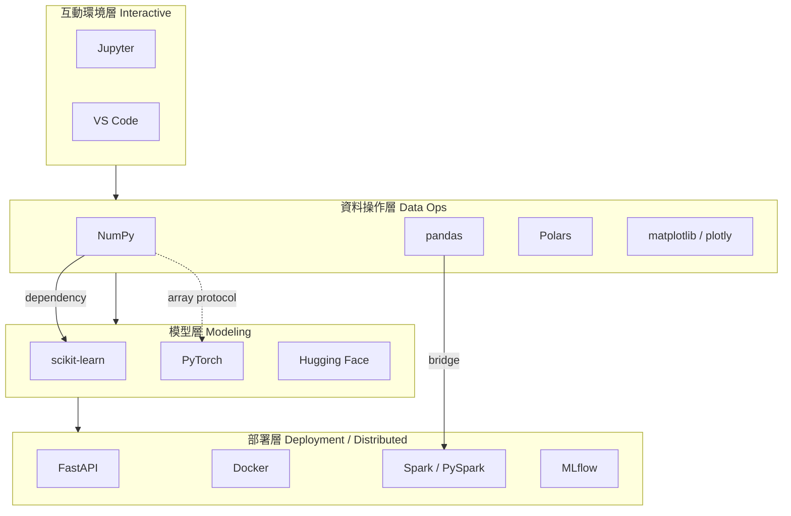
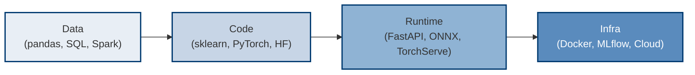
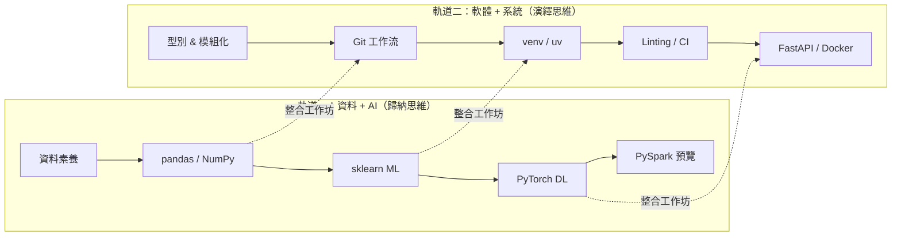
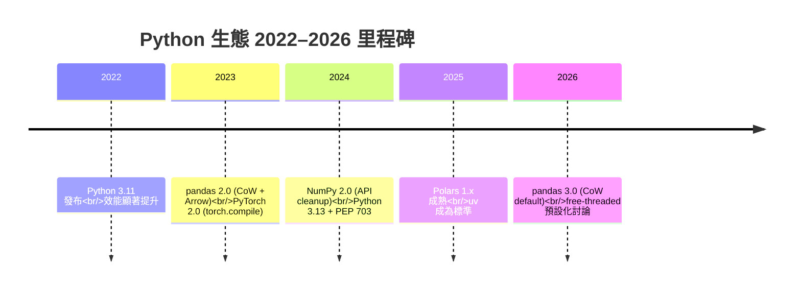
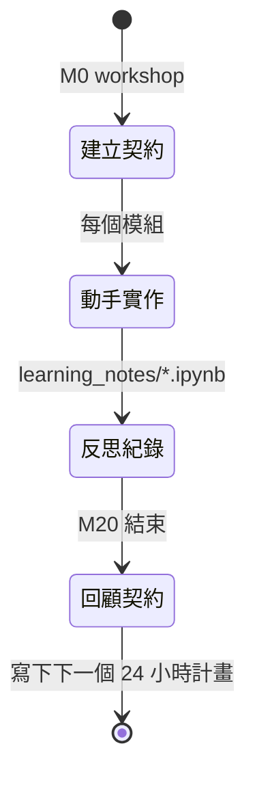
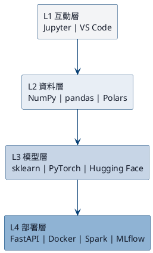

# M0 排版與視覺化規格

> **本文件定位**：給視覺設計師、簡報製作者、排版編輯看的**執行級**規格文件。不是美學建議，是可直接落地的 spec。
> **讀者**：簡報設計師、書籍美編、Figma 工作者、排版執行者。
> **使用情境**：交稿給美編前的 design brief；跨頁風格統一的 reference；美術 review 的驗收標準。
> **語氣**：精確、可量化、可驗證；每個建議附 hex / px / pt 具體數值。

---

## 1. 整體視覺語言定位

- **視覺類型**：consulting-grade（BCG / McKinsey 風）+ 技術手冊（O'Reilly-ish 精確性）
- **禁忌**：無意義裝飾圖、漸層濫用、emoji 散落、手寫風字體、Comic Sans 類字體
- **原則**：資訊密度 > 視覺華麗；每個 pixel 都要為 takeaway 服務

---

## 2. 版面網格系統

### 2.1 簡報模式（16:9, 1920×1080）
- **Grid**：12 欄 + 6 列，gutter 24 px
- **邊距**：top 72 / bottom 56 / left 96 / right 96（安全區 1728×952）
- **主要分割**：黃金比 ≈ 1:1.618（用於 split-screen 佈局，左 730px / 右 1190px）

### 2.2 書籍模式（A4 / 8.5×11 印刷版）
- **Grid**：對稱 12 欄，外邊距 20mm / 內邊距 25mm（預留裝訂）
- **Baseline grid**：4pt
- **圖文比例**：正文 ≤ 65 characters per line（可讀性上限）

### 2.3 S01 / S09（Emotional Anchor slide）特例
- 全螢幕單欄置中
- 垂直中央偏上 2/5（視覺黃金位置）
- 主文字占版面高度 15%，左右留白 > 20%

---

## 3. 字體階層

### 3.1 字型選擇
- **英文**：Inter（UI）/ IBM Plex Sans（正文）/ JetBrains Mono（code）
- **中文**：Noto Sans TC（思源黑體）全系列；code 中文為 Noto Sans Mono CJK
- **避免**：微軟正黑體（字重不全）、Arial（無中日韓支援）、DFKai-SB（過於傳統）

### 3.2 字級階層表（簡報）

| 層級 | 用途 | 字級 | 字重 | 行高 | 字距 |
|------|------|------|------|------|------|
| H0 | 金句頁主文字 | 64 pt | 700 Bold | 1.2 | -0.02em |
| H1 | Slide title | 40 pt | 600 SemiBold | 1.3 | -0.01em |
| H2 | Section header | 28 pt | 600 SemiBold | 1.3 | 0 |
| H3 | Sub-bullet lead | 20 pt | 500 Medium | 1.4 | 0 |
| Body | 內文 / bullet | 18 pt | 400 Regular | 1.5 | 0 |
| Caption | 圖說 / footnote | 14 pt | 400 Regular | 1.4 | 0.01em |
| Code | 程式碼 | 16 pt | 400 Regular | 1.5 | 0 |

### 3.3 字級階層表（書籍）

| 層級 | 字級 | 字重 | 行高 |
|------|------|------|------|
| H1 章名 | 28 pt | 700 Bold | 1.25 |
| H2 節名 | 20 pt | 600 SemiBold | 1.3 |
| H3 小節 | 16 pt | 600 SemiBold | 1.4 |
| Body 正文 | 11 pt | 400 Regular | 1.6 |
| Caption | 9 pt | 400 Regular | 1.4 |
| Code | 10 pt | 400 Regular | 1.5 |

---

## 4. 色票系統（Consulting Palette）

### 4.1 核心色

| 角色 | 用途 | HEX | RGB |
|------|------|-----|-----|
| Primary Deep Blue | 標題、強調、H1/H2 | `#003A70` | 0, 58, 112 |
| Primary Mid Blue | 次級強調、link、icon | `#1E6FBF` | 30, 111, 191 |
| Neutral 900 | 正文黑 | `#111827` | 17, 24, 39 |
| Neutral 600 | 次級文字 | `#4B5563` | 75, 85, 99 |
| Neutral 300 | border、divider | `#D1D5DB` | 209, 213, 219 |
| Neutral 100 | 淺背景 block | `#F3F4F6` | 243, 244, 246 |
| Canvas | 主背景白 | `#FFFFFF` | 255, 255, 255 |
| Accent Amber | **唯一** accent（警示/里程碑） | `#E89B00` | 232, 155, 0 |

### 4.2 輔助語意色（用於圖表）

| 用途 | HEX |
|------|-----|
| Success / 軌道一 | `#0F8A5F` |
| Info / 軌道二 | `#2563EB` |
| Warning | `#D97706` |
| Error / 反例 | `#B91C1C` |

### 4.3 使用規範
- 一張 slide 最多 **3 種** 主色 + 1 種 accent
- Accent Amber **只出現在** 里程碑標記、FutureWarning 區塊、critical 提醒
- 漸層僅用於四層架構圖的「深度梯度」，禁止裝飾性漸層

---

## 5. 資訊圖轉換建議（逐 Slide）

### S01 — 開場引言頁
- **處理方式**：極簡引言卡（Pull Quote Slide）
- **版面**：全黑底 (`#111827`) + 白字 H0 + 下方細線 + 作者署名 caption
- **插圖建議**：右下角極小 icon（書籍：鑰匙圖示 12×12 mm；簡報：32px key icon）

### S02 — 2026 Python 數據報告
- **處理方式**：**資料儀表板**（dashboard-style）
- **佈局**：上方 3 張 KPI 卡片（三份報告 + 一個關鍵數字），下方 1 張折線圖
- **折線圖**：x 軸 2019–2025，y 軸排名 1–10，**反向**座標軸（1 在上）
- **標註**：2023–2024 區間用 Amber 高亮「Python 3.13 + PEP 703」

### S03 — 生態系地圖
- **處理方式**：**分層架構圖**（Stacked Layer Diagram）
- **佈局**：4 層從下到上 — 互動層 / 資料層 / 模型層 / 部署層
- **配色**：由下到上，Primary Deep Blue → Primary Mid Blue 漸淡
- **工具標示**：實心圓 = 深入教、空心圓 = 概念介紹
- **箭頭**：只保留**真實依賴**箭頭，虛線表示「協議相容」

### S04 — 里程碑版本時間軸
- **處理方式**：**水平時間軸**（Horizontal Timeline）
- **佈局**：2022 → 2026 橫軸，每個里程碑一個節點卡片
- **節點卡片**：含 版本號 / 發布日期 / 一行關鍵變化 / Amber 標籤（如有 breaking change）
- **預告框**：最右側虛線框「2026+ 預計方向」

### S05 — AI 產品解剖圖
- **處理方式**：**堆疊四層 + 側邊 callout**
- **佈局**：中央主圖 4 層堆疊（Infra 最底、Data 最上，或反之），右側 callout「本課程覆蓋範圍」用括號標記覆蓋 Data + Code
- **配色**：四層用 Primary Deep Blue 的 4 個明度（100%, 75%, 50%, 25%）

### S06 — 課程雙軌設計
- **處理方式**：**DNA 雙螺旋圖**（取代原稿的「鐵路圖」）
- **理由**：鐵路是平行的，DNA 是交織的 — 後者更準確表達「雙軌交互」
- **若設計師不便做螺旋**：退化為 2×5 matrix，軌道一頂列、軌道二底列，中間有連接豎線表示「整合工作坊」

### S07 — 24 小時路線圖
- **處理方式**：**甘特式橫條圖**（Gantt-style）
- **佈局**：x 軸為小時（0–24），y 軸為模組群，每個模組群為彩色條塊
- **里程碑檢查點**：M6 和 M14 用倒三角 flag 標示

### S08 — 學習方法論
- **處理方式**：**對比雙欄**（Before / After Table）
- **佈局**：左欄「被動聽課」、右欄「主動學習」，各 5 列對應手段
- **禁用**：學習金字塔（scientific validity 有問題）

### S09 — 收尾
- **處理方式**：同 S01 極簡引言卡，呼應開場

---

## 6. Icon System 建議

### 6.1 Icon 風格
- **選擇**：Lucide Icons（open source、線條一致、中性）或 Phosphor Icons
- **線粗**：1.5 px（簡報 32 px size）、1 px（書籍 16 px size）
- **角度**：stroke-linecap: round, stroke-linejoin: round

### 6.2 Icon 語意對應表（M0 專屬）

| 概念 | Icon | 用途 |
|------|------|------|
| 互動環境層 | `terminal` / `notebook` | S03 |
| 資料操作層 | `database` / `table` | S03 |
| 模型層 | `brain` / `sparkles` | S03 |
| 部署層 | `server` / `cloud` | S03 |
| 里程碑 | `flag` | S04 |
| 警示 / breaking change | `alert-triangle` | S04 |
| 軌道一 | `chart-line` | S06 |
| 軌道二 | `code-2` | S06 |
| 時間 | `clock` | S07 |
| 學習契約 | `file-pen` | S09 / workshop |

### 6.3 使用規範
- 每張 slide icon 數量 ≤ 6 個
- 同一語意在全課程統一用同一 icon（建立視覺慣例）
- Icon 顏色從色票中擷取，禁用彩色 icon

---

## 7. 圖表工具建議

| 圖表類型 | 建議工具 | 理由 |
|----------|----------|------|
| 分層架構圖 | Figma | 複用性高，可 component 化 |
| 時間軸 | Figma 或 Keynote magic move | 動畫效果強 |
| 流程圖 / DAG | **Mermaid** | 版本化、可 diff、可直接嵌 markdown |
| 快速 sketch | Excalidraw | 討論會、白板感 |
| 資料儀表板 | Observable / Plotly | 真實數據互動 |
| 書籍印刷圖 | Figma → PDF export | 向量、印刷安全 |

---

## 8. 可直接複製的 Mermaid 片段（共 6 個）

### 8.1 生態系分層地圖（S03）

### 8.2 AI 產品四層（S05）

### 8.3 課程雙軌（S06，取代鐵路比喻）

### 8.4 24 小時路線圖 Gantt（S07）

```mermaid
gantt
    title 24 小時課程路線圖
    dateFormat X
    axisFormat %s h
    section 地基期
    M0 開場           :done, m0, 0, 2
    M1-M3 Python 核心 :active, m13, 2, 8
    M4-M6 資料操作    :m46, 8, 14
    section 進階期
    M7-M9 EDA         :m79, 14, 18
    M10-M14 ML 基礎   :m1014, 18, 22
    M15-M17 DL 入門   :m1517, 22, 24
    section 預覽期
    M18-M20 工程化預覽 :milestone, m1820, 24, 0
```

### 8.5 里程碑時間軸（S04）

### 8.6 學習契約閉環（工作坊 + S09）

---

## 9. PlantUML 片段（分層架構書籍印刷版）

---

## 10. 排版品質 Checklist（交稿前必檢）

### 10.1 每張 slide
- [ ] Title 是完整句子（不是名詞短語）
- [ ] Takeaway 只有一個
- [ ] 使用色數 ≤ 3 主色 + 1 accent
- [ ] 字級階層正確（H1/H2/Body 有明顯視覺落差）
- [ ] 行長不超過 65 characters
- [ ] Icon 使用符合語意對應表

### 10.2 全套 deck
- [ ] 金句頁在第一頁和最後一頁呼應
- [ ] 所有數字引用有可追溯來源
- [ ] 里程碑 / 警示統一用 Amber `#E89B00`
- [ ] 四層架構圖在 S03 和 S05 視覺一致
- [ ] 所有 code block 用 JetBrains Mono
- [ ] 中文使用 Noto Sans TC 全頁

### 10.3 印刷書籍
- [ ] 出血 3mm
- [ ] 主要色 CMYK 轉換後無明顯偏色（Primary Deep Blue 轉 CMYK 會偏紫，需人工校正）
- [ ] Body 字級 11 pt，行距 1.6，中英混排留 0.25 em spacing
- [ ] 圖表導出為 300 dpi 向量 PDF

---

## 11. 錯誤範例（Anti-Pattern Gallery）

### 11.1 不要做的事
- ❌ 在學習金字塔上標具體百分比（無實證）
- ❌ 在 S06 用鐵路平行線（誤導「可以只走一邊」）
- ❌ 在 S05 四層圖使用彩虹色（失去資訊階層）
- ❌ 用 emoji 代替 icon（視覺密度失控）
- ❌ 同一張 slide 出現超過 2 種字型
- ❌ 在時間軸上用毛筆字體（與 consulting 風格衝突）

### 11.2 Accent Amber 濫用警示
- Amber 全課程出現次數應 ≤ 20 次
- 若一張 slide 出現 ≥ 2 個 Amber 元素，降級其中一個為 Neutral

---

*— End of Layout & Visual Spec —*
