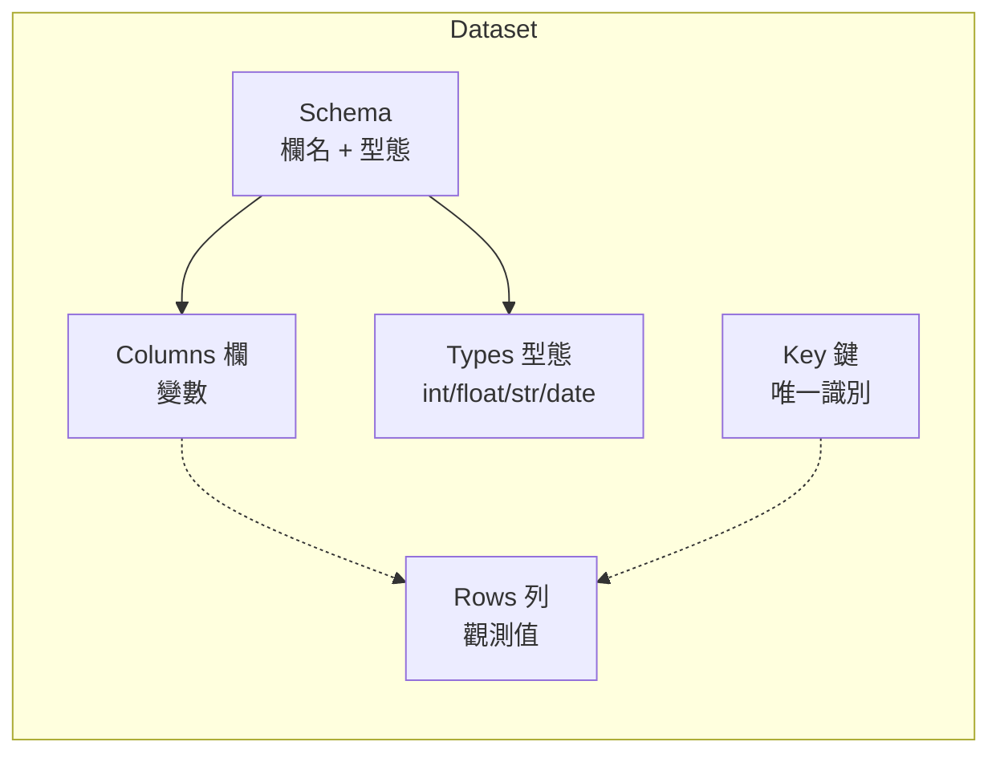
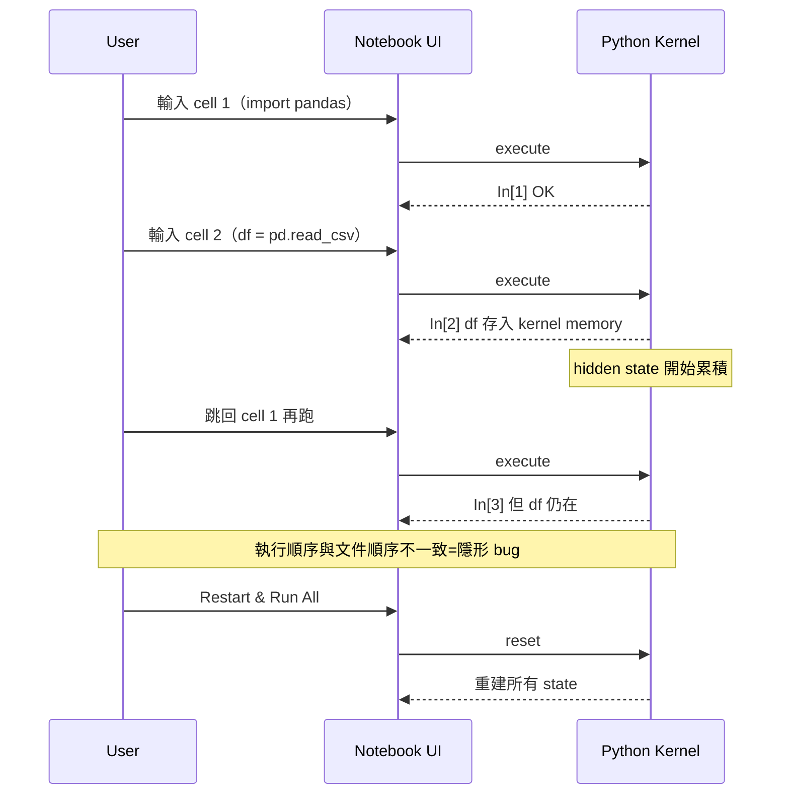
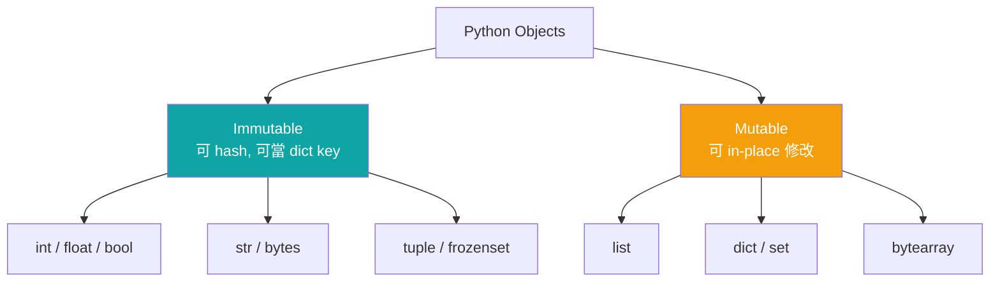
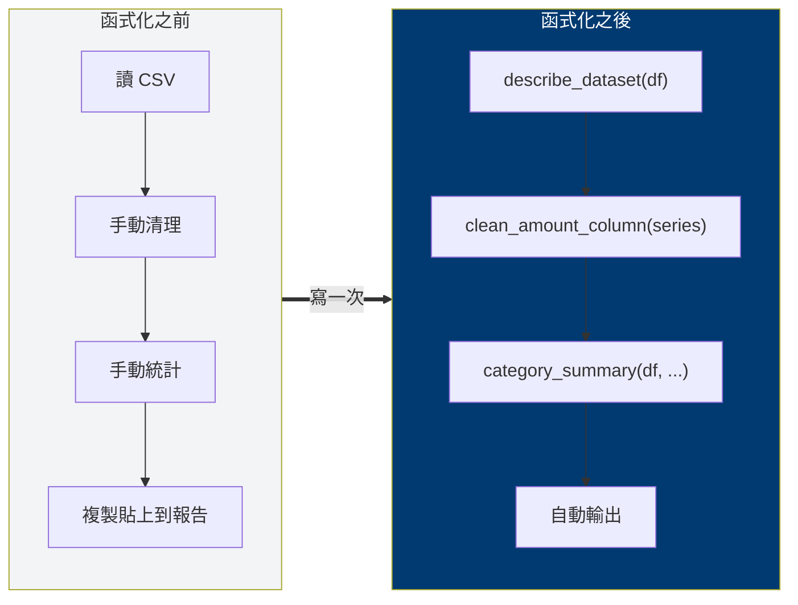
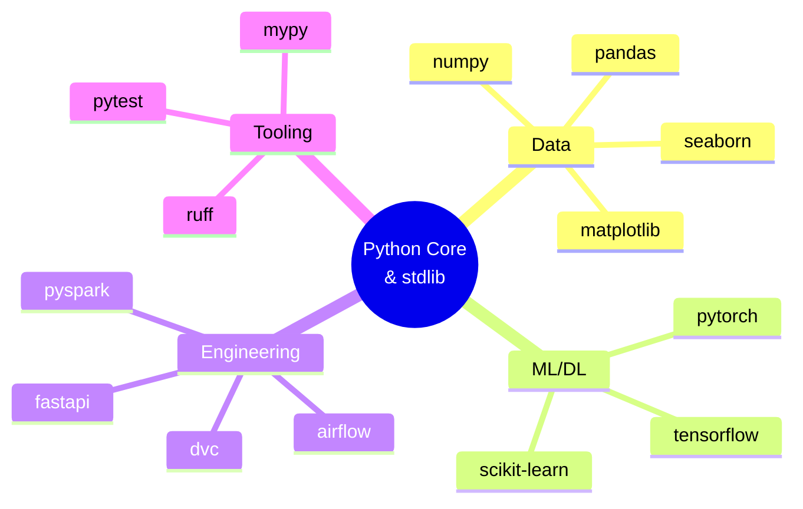

# M1 排版與視覺化規範 — Layout & Visual Spec

> **本文件定位：** M1 課程簡報與講義的視覺系統定義，含 grid、字體、色票、資訊圖建議、mermaid 片段庫。
> **讀者：** 簡報設計者、課程講師（自行調整 slide 時參考）、品牌一致性 reviewer。
> **使用情境：** 製作 M1 deck（16:9）、講義 PDF（A4）、線上學習平台的 section header 時的統一視覺規範。

---

## 1. Grid 系統

### 1.1 Slide（16:9，1920×1080 pt）

- **外邊距（margin）**：64 pt 上下，96 pt 左右。視覺呼吸感最大化。
- **欄數**：12-column grid，gutter 24 pt，可降為 8-col / 4-col。
- **Header zone**：top 64-160 pt，放標題 + 投影片序號。
- **Content zone**：160-960 pt，正文主視覺。
- **Footer zone**：1000-1040 pt，放 logo、模組名、頁碼（例：`M1 · Python 基礎與資料思維 · 07 / 14`）。
- **Safety area**：所有關鍵資訊必須落在距邊界 ≥ 64 pt 的區域，保證投影到不同 projector 不被切邊。

### 1.2 講義 PDF（A4，210×297 mm）

- 外邊距：上 25 mm、下 25 mm、左 30 mm、右 20 mm（給裝訂邊預留）。
- 單欄為主；程式碼區全寬、說明文字可縮排 5 mm。
- 行距 1.45，段距 6 pt。

### 1.3 Modular spacing scale（8-pt baseline）

所有間距為 8 的倍數：`4 / 8 / 16 / 24 / 32 / 48 / 64 / 96 / 128`。禁止出現 13、17、25 這類「自由值」。

---

## 2. 字體階層

### 2.1 字體選擇

| 用途 | 英文 | 中文 | 備註 |
|---|---|---|---|
| Display（封面、金句） | **Inter Display** / **Sora** | **思源黑體 Heavy** | 字重 700-900 |
| Heading | **Inter** | **思源黑體 Bold** | 字重 600-700 |
| Body | **Inter** | **思源黑體 Regular** | 字重 400 |
| Mono（程式碼） | **JetBrains Mono** / **Fira Code** | —（mono 通常僅英數） | 支援 ligature |
| Numeric（數字頁） | **Inter Tabular** | — | 啟用 tabular figures |

### 2.2 字級階層（slide）

| 層級 | 字級 | 字重 | 行距 | 用途 |
|---|---|---|---|---|
| H0 Display | 72 pt | 800 | 1.1 | 金句頁 |
| H1 標題 | 44 pt | 700 | 1.2 | 投影片標題 |
| H2 副標 | 28 pt | 600 | 1.25 | 區塊分隔 |
| H3 項目 | 22 pt | 600 | 1.3 | bullet 強調 |
| Body | 20 pt | 400 | 1.5 | 正文 |
| Caption | 14 pt | 400 | 1.4 | 圖說 / 來源 |
| Code | 18 pt | 400 | 1.4 | 程式碼區 |
| Footer | 12 pt | 400 | 1.3 | 頁碼 / logo |

### 2.3 字級階層（講義 PDF）

H1 22 pt / H2 18 pt / H3 14 pt / Body 11 pt / Code 10 pt。

### 2.4 對齊

- 標題永遠靠左對齊（不置中，除金句頁例外）。
- 正文靠左，不兩端對齊（中文兩端對齊易產生字距怪異）。
- 數字欄位 tabular 右對齊。

---

## 3. 色票（顧問藍系統）

### 3.1 Primary — 顧問藍

| Token | Hex | 用途 |
|---|---|---|
| `brand/primary` | `#003A70` | 標題、主視覺、logo |
| `brand/primary-dark` | `#002347` | 深色底、hover |
| `brand/primary-light` | `#2E6BA8` | 次級標題、link |

### 3.2 Neutral — 中性灰

| Token | Hex | 用途 |
|---|---|---|
| `neutral/900` | `#111827` | 正文 |
| `neutral/700` | `#374151` | 次級文字 |
| `neutral/500` | `#6B7280` | caption、說明 |
| `neutral/300` | `#D1D5DB` | 分隔線 |
| `neutral/100` | `#F3F4F6` | 區塊背景 |
| `neutral/50`  | `#F9FAFB` | 頁面底色 |
| `neutral/0`   | `#FFFFFF` | 純白 |

### 3.3 Accent — 強調色（節制使用）

| Token | Hex | 用途 |
|---|---|---|
| `accent/amber` | `#F59E0B` | 警告、污染標記、關鍵轉折 |
| `accent/teal`  | `#0EA5A4` | 成功、正確、clean data |
| `accent/coral` | `#EF4444` | 錯誤、離群值、anti-pattern |
| `accent/violet`| `#7C3AED` | 工作坊、互動區塊 |

### 3.4 資料污染語義色（S03 專用）

- 缺失值：`neutral/300` 灰
- 重複值：`accent/amber`
- 離群值：`accent/coral`
- 型態錯誤：`#F97316` 橘

### 3.5 使用原則（60 / 30 / 10）

- 60% neutral（白 + 灰）作底
- 30% brand primary（顧問藍）
- 10% accent（橘 / 紅 / 青 / 紫 擇一，整份 deck 不超過兩色）

---

## 4. 資訊圖建議

### 4.1 S01「你以為 vs 實際」— 冰山對比圖

- 水平線切割畫面。上方淡藍（顧問藍 tint 10%），標「你以為的」：單箭頭「資料 → 圖表 → 結論」。
- 下方深藍（顧問藍 primary），標「實際在做的」：多個子步驟 + 迭代雙向箭頭。
- 金句：「80% of the work is below the waterline.」

### 4.2 S02「五元素」— 標註式資料表截圖

- 主視覺為訂單表格（6 欄 × 5 列）。
- 五條不同顏色箭頭，從表格外部指向：
  - 橫向一列 → 紅色 → `row = 一筆觀測`
  - 縱向一欄 → 藍色 → `column = 一個變數`
  - 整體 → 紫色框 → `schema = 欄名 + 型態`
  - 型態名在欄標題下 → 青色 → `type = 資料類型`
  - ID 欄 → 琥珀色 → `key = 唯一識別`

### 4.3 S03「四種污染」— 2×2 矩陣

- 四格，各一張被標記的同一張表格。
- 四色語義色（見 3.4）分別高亮出四種問題。
- 每格標題 + 一句處理策略。

### 4.4 S04「Excel vs Python」— 雙軌時間軸

- 上軌 Excel：6 個節點（下載 / 開檔 / 篩選 / 刪行 / 公式 / 複製），每個節點一個手的 icon。尾端紅字：「下次全部重來」。
- 下軌 Python：3 個節點（`clean.py` / `analyze.py` / `report`），終端機 icon。尾端綠字：「下次改一行檔名」。
- 兩軌中央共享時間刻度。

### 4.5 S05「Notebook 四合一」— 四象限 + 真實截圖

- 放真實 `.ipynb` 截圖於中央。
- 四個角落分別標註：`Markdown / Code / Output / Chart`。
- 用細線從標註連到截圖對應區塊。

### 4.6 S07「型態與容器」— Venn-like 家族圖

- 大圓「Python Objects」內切兩個子群：
  - **Immutable**（`int / float / str / tuple / frozenset / bytes`）
  - **Mutable**（`list / dict / set / bytearray`）
- 兩子群交界寫 `hashable 必為 immutable`。
- 右側表格對映「資料世界例子」。

### 4.7 S08「流程三式」— 程式碼並排 + 高亮

- 左右 60/40 split，左為 for loop 版本、右為 comprehension 版本。
- 中央箭頭 + 標籤「equivalent · more Pythonic」。
- 下方一行條形圖顯示「性能 / 可讀性 / 向量化程度」三軸比較（for vs comp vs pandas vs numpy）。

### 4.8 S09「函式三要素」— black-box 圖

- 中央大方框 `function`，左 input 箭頭（參數），右 output 箭頭（回傳）。
- 上方標籤「名稱 = 流程的名字」；下方標籤「單一職責 / 純度優先」。

### 4.9 S10「生態系」— 圓心輻射地圖

- 同心圓三環：
  - 中心：Python Core + Standard Library
  - 第一環：資料分析（`pandas`, `numpy`, `matplotlib`, `seaborn`）
  - 第二環：ML/DL（`scikit-learn`, `pytorch`, `tensorflow`）
  - 第三環：系統 / 工程（`fastapi`, `pyspark`, `airflow`, `dvc`）
- 每個套件下方一行用途（8-10 字）。
- 用顧問藍深淺表達層級，不用彩虹色。

### 4.10 Notebook 工作流 — swimlane

- 三泳道：**User / Notebook / Kernel**（見下方 mermaid 片段 3）。
- 顯示 cell 執行的往返與 hidden state 風險。

### 4.11 課程地圖 — 水平 roadmap

- M0 → M7 水平節點。M1 目前位置高亮。
- 節點上方標時數，下方標交付物（deliverable）。

---

## 5. Mermaid 片段庫（至少 5 個）

### 片段 1 — 資料分析工作流（S01）

### 片段 2 — 結構化資料五元素（S02）

### 片段 3 — Notebook 執行流（S05 / 工作坊）

### 片段 4 — 可變性分類（S07 補強）

### 片段 5 — 函式化前後對比（S09 / 工作坊 B）

### 片段 6 — 課程地圖（S12）

### 片段 7 — Python 生態輻射（S10）

---

## 6. 程式碼區塊樣式

- 背景：`neutral/100`（淺灰底），圓角 8 pt，內距 16 pt。
- 字體：JetBrains Mono 18 pt（slide）/ 10 pt（PDF）。
- Syntax highlight：用 One Light theme 的 token 色，但把 keyword 改為顧問藍 `#003A70`、string 改為 teal `#0EA5A4`、comment 改為 `neutral/500`。
- 檔名 / 語言標籤：右上角，字級 12 pt，顧問藍半透明。
- 高亮重點行：左側加 4 pt 琥珀色 bar（`accent/amber`）。

---

## 7. 圖示系統

- 全 deck 統一用 **Phosphor Icons** 或 **Lucide**（開源、風格一致）。
- 線條粗細 1.5 pt、圓角 2 pt。
- 圖示不填色，僅描邊（顧問藍或 neutral/700）。
- 最常用 5 個：`table`, `database`, `function-square`, `git-branch`, `notebook`。

---

## 8. 無障礙與可讀性（Accessibility）

- 文字與底色對比度 ≥ 4.5:1（WCAG AA）。顧問藍 `#003A70` 於白底對比 10.3:1，通過。
- 色彩不獨立傳達語義：污染類型用顏色 + 圖示 + 文字三重編碼。
- 最小字級 14 pt（slide）/ 9 pt（PDF）。

---

## 9. 視覺節奏 checklist（講師自檢）

- [ ] 每 3-4 張內容頁夾一張金句頁（呼吸）
- [ ] 每張 slide 最多 1 個主視覺
- [ ] 整份 deck 同一種 accent color，不超過兩色
- [ ] 程式碼頁不超過 15 行；超過則拆頁或刪減
- [ ] 每個 mermaid 圖執行過驗證（mermaid.live）
- [ ] footer 的「M1 · 標題 · 頁碼」完整
- [ ] 轉場時 accent 色作為進度條，顯示「支柱 1 / 2 / 3」位置
