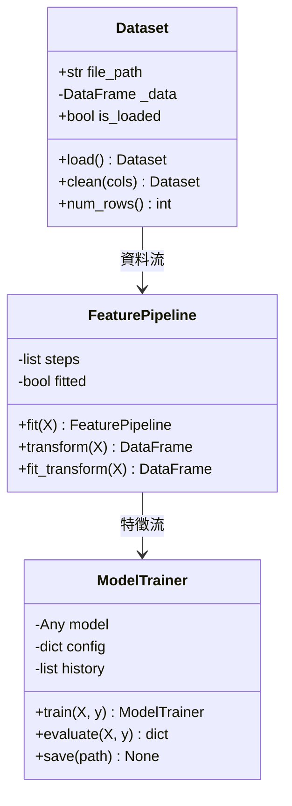
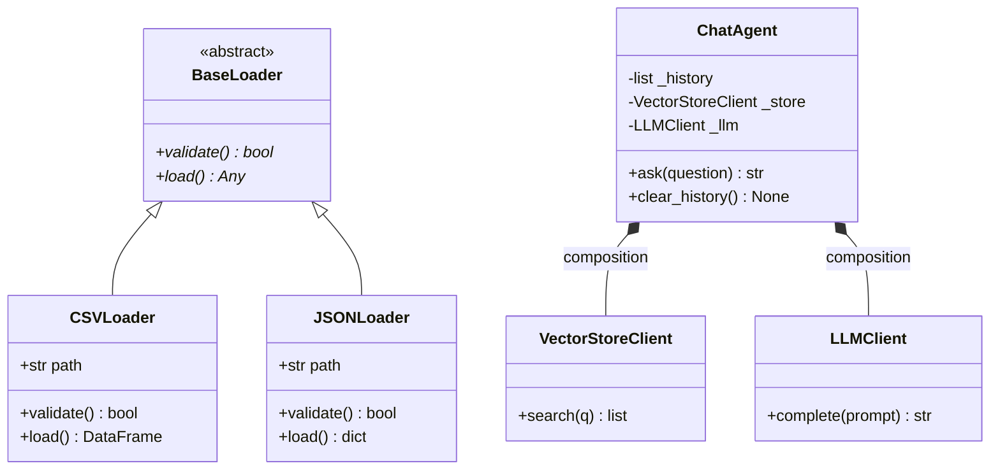
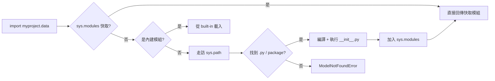
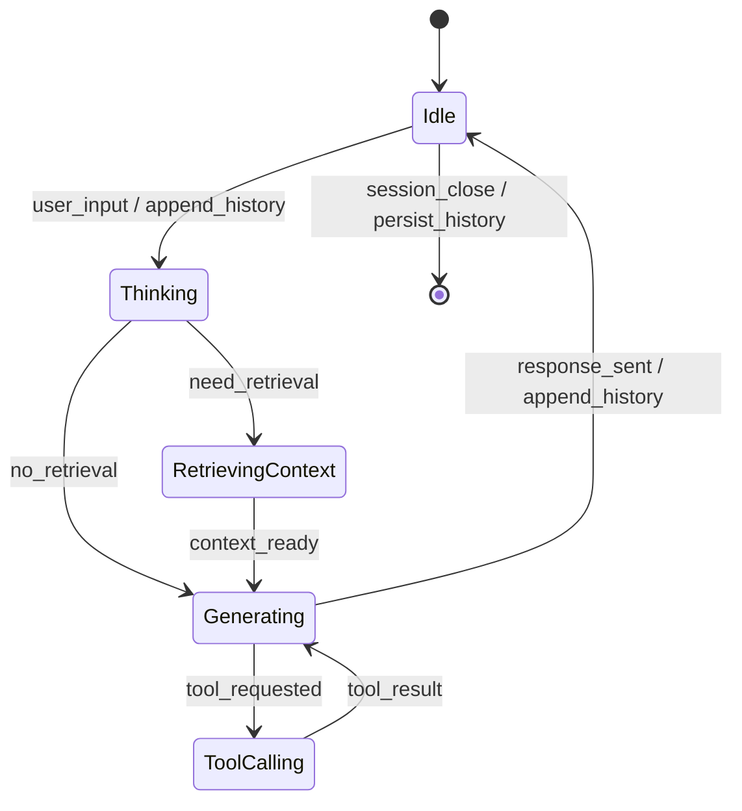
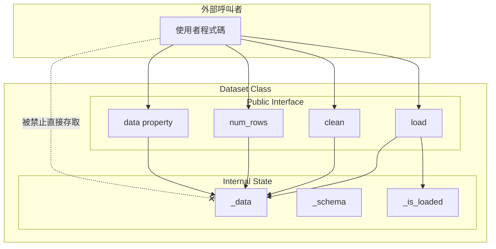

# 04 — M2 版面與視覺規格（Layout & Visual Spec）

> **文件定位**：提供 M2 投影片、書籍版面、視覺資訊圖（UML / 樹狀圖 / 狀態機）的統一規格。
> **對象**：設計師、排版助理、簡報製作人員、Mermaid 圖維護者。
> **立場**：不靠美感靠規格；任何人拿到此規格能還原同一視覺語言。
> **使用方式**：依序套用 Grid → 字體 → 色票 → 組件 → Mermaid 片段。

---

## 1. Grid 系統

### 1.1 投影片（16:9，1920×1080）

- 12 欄 grid，gutter 24px，左右邊界各 96px。
- 基準行高 8px（所有垂直間距為 8 的倍數）。
- Safe area：上下各 80px，左右各 96px。
- 標題區：上方 160px 固定帶。
- 內容區：從 y=180 起，高度 760px。
- Footer 區：下方 80px，顯示「M2｜OOP 與程式抽象｜Slide n/12」。

### 1.2 書籍版面（A4，或 B5 印刷）

- 單欄，內文寬度 100mm，左右留白 30mm/25mm（內側寬，方便裝訂）。
- 每章首頁：章標佔頁面上方 1/3，下方留白。
- 程式碼區塊：縮排 8mm，背景 #F5F7FA，左側 3px 色條（語言不同顏色不同）。
- 資訊圖位於章節中央，最大寬度 120mm（可微超欄，但不貼邊）。

### 1.3 書本內 mermaid 圖輸出

- SVG 輸出，最大寬度 120mm。
- 預設以白底深字渲染，印刷版友善。

---

## 2. 字體系統

| 用途 | 字體（中 / 英） | 字重 | 字級 |
|---|---|---|---|
| 主標題 | 思源黑體 Bold / Inter Bold | 700 | 48pt（簡報）/ 24pt（書） |
| 次標題 | 思源黑體 SemiBold / Inter SemiBold | 600 | 32pt / 16pt |
| 內文 | 思源黑體 Regular / Inter Regular | 400 | 20pt / 11pt |
| 強調 | 思源黑體 Medium / Inter Medium | 500 | 同內文 |
| 程式碼 | JetBrains Mono | 400 | 18pt / 10pt |
| 金句 | 思源宋體 Bold / Fraunces Bold | 700 | 40pt / 20pt |
| 註腳 | 思源黑體 Regular / Inter Regular | 400 | 14pt / 9pt |

- 行距：內文 1.5、標題 1.2、程式碼 1.4。
- 數字一律用 tabular figures（等寬數字），表格對齊乾淨。

---

## 3. 顧問色票（Consulting Palette）

仿 BCG/McKinsey 冷調專業色，避開過飽和。

| 名稱 | Hex | 用途 |
|---|---|---|
| Ink | `#0B1F33` | 主文字、標題 |
| Slate | `#4A5A6A` | 次文字、註腳 |
| Mist | `#E5EAF0` | 淺背景、分隔線 |
| Paper | `#FAFBFC` | 頁面底色 |
| Accent Navy | `#1F3A5F` | 主 accent、圖表主色 |
| Accent Teal | `#3A7A8C` | 輔助色、second series |
| Accent Amber | `#C28A2C` | 強調、警示（非紅） |
| Alert Red | `#B23A48` | reviewer 警示、反模式標示 |
| Success Green | `#3A7D5C` | 正確示範、通過項 |
| Code Bg | `#F5F7FA` | 程式碼背景 |

**使用規則**：
- 任何單頁最多 4 個顏色（Ink、Paper 不計）。
- 資訊圖主體用 Accent Navy + Accent Teal；Amber 只用於 <10% 面積的強調。
- 紅色僅用於反模式或 reviewer 警示，不能用作裝飾。

---

## 4. 組件規格

### 4.1 定位區塊（每份文件頭部）

```
┌────────────────────────────────────────────────┐
│  文件定位：<一句話>                              │
│  對象：<誰會讀>                                  │
│  立場：<用什麼語氣、什麼基準>                    │
│  使用方式：<如何搭配其他文件>                    │
└────────────────────────────────────────────────┘
```

- 樣式：Mist 底色、Ink 文字、無外框、上下 16px 內距。

### 4.2 Reviewer 警示框

- 左側 4px Alert Red 色條。
- 圖示：⚠️（Unicode，不用 emoji 圖片）。
- 背景：`#FDF2F4`（Alert Red 10%）。

### 4.3 程式碼區塊

- 背景 `#F5F7FA`，左側 3px 色條：Python 用 Accent Navy、Shell 用 Accent Teal。
- 不加圓角（顧問風偏方正）。
- Inline code 用 `code` 標記，背景 Mist，內距 2px。

### 4.4 資料表（Reviewer 表格）

- Header 列：Accent Navy 底、白字。
- 隔列：Paper / Mist 交替。
- 無外框，只有 header 底線（1px Ink）。

---

## 5. 資訊圖（Information Graphics）

### 5.1 Class 關係圖（UML class diagram）

- 元件：實線繼承箭頭（空心三角）、實心菱形組合箭頭、虛線依賴箭頭。
- 每個 class 格：標題列 Accent Navy 底白字、屬性列 Paper 底、方法列 Mist 底。
- 標示 `+ public` / `- private` / `# protected`（Python 以 `_` / `__` 映射）。

### 5.2 Module / Package 樹狀圖

- 用檔案系統風格（`├──` / `└──`），JetBrains Mono 字體。
- 標示三種節點：
  - 📦 Package（加粗，Accent Navy）
  - 📄 Module（Ink）
  - 🔖 `__init__.py`（Slate 小字）
  - 不用 emoji 替換時用 `[pkg]` / `[mod]` / `[init]` 文字標記。

### 5.3 AI Chatbot 狀態機

- 橢圓節點表狀態，矩形節點表動作。
- 初始狀態粗框，終止狀態雙框。
- 轉移邊標示事件 / 動作（`user_input / append_history`）。

### 5.4 記憶體示意圖（Slide 4 用）

- 頂部一個虛線框：class 模板。
- 下方兩個實線框：instance ds1、ds2。
- 從模板到 instance 的箭頭標 `instantiation`。
- 每個 instance 內列出 `self.x = ...`。

### 5.5 進化路徑圖（Slide 8 用）

- 水平五階段，階段間用箭頭連接。
- 每階段下方標「解決的問題 / 帶來的新需求」雙欄註。

---

## 6. Mermaid 片段（至少 5 份）

> 所有片段可直接貼入 `.md`，渲染前確認 theme 為 `neutral` 或 `default`。

### 6.1 Class Diagram — 資料管線核心物件



### 6.2 Class Diagram — Inheritance vs Composition 對照



### 6.3 Flowchart — Python Import 搜尋順序



### 6.4 Flowchart — 腳本進化路徑


### 6.5 State Diagram — ChatAgent 對話狀態機



### 6.6 Flowchart — Encapsulation 邊界示意



### 6.7 Package 樹狀圖（以 code block 呈現，非 mermaid）

```text
ml_project/
├── __init__.py              [pkg init：re-export 對外介面]
├── data/
│   ├── __init__.py          [pkg init：from .dataset import Dataset]
│   ├── dataset.py           [Dataset class]
│   └── loader.py            [CSVLoader, JSONLoader]
├── features/
│   ├── __init__.py
│   └── pipeline.py          [FeaturePipeline class]
├── models/
│   ├── __init__.py
│   └── trainer.py           [ModelTrainer class]
└── agents/
    ├── __init__.py
    ├── chat_agent.py        [ChatAgent class，內嵌 VectorStoreClient]
    └── vector_store.py      [VectorStoreClient]
```

---

## 7. 視覺規格檢查清單（交付前必過）

- [ ] 每張投影片主色不超過 4 色。
- [ ] 所有標題使用思源黑體 Bold / Inter Bold。
- [ ] 所有程式碼使用 JetBrains Mono 且有 `#F5F7FA` 背景。
- [ ] 反模式／警示僅用 Alert Red，不作裝飾。
- [ ] 每張資訊圖有文字說明或標題，能脫離語境閱讀。
- [ ] 所有 Mermaid 片段能在 VS Code 預覽與 GitHub 渲染無誤。
- [ ] Footer 正確標示 `M2｜OOP 與程式抽象｜Slide n/12`。
- [ ] 定位區塊出現在本份及其餘四份文件頂部。
- [ ] 程式碼行長 ≤ 80 字元（印刷不換行）。
- [ ] 所有圖可黑白列印仍可讀（不依賴顏色辨識）。
