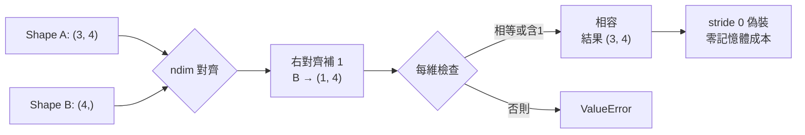
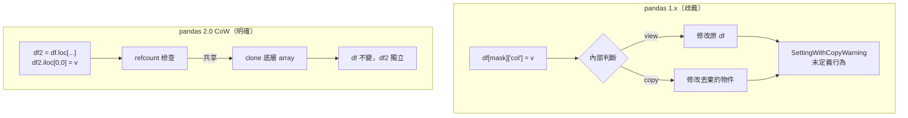
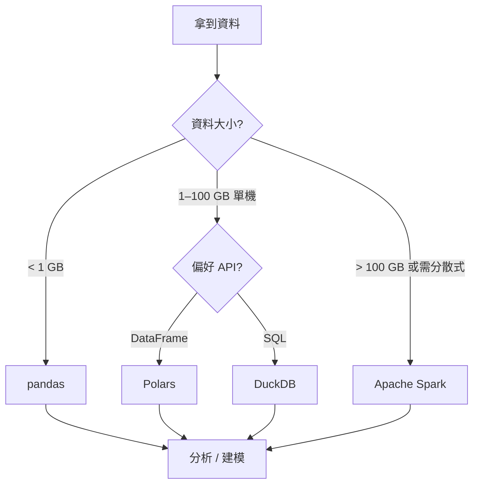

# M3 版面與視覺規格書

> **文件定位**：本文件為 M3「NumPy 與 pandas」技術簡報的版面與視覺設計規格，供簡報設計師、插畫師、Figma 協作者、投影片模板開發者使用。所有尺寸以 16:9（1920×1080）為基準，所有色票以 hex 表示。配套投影片為 03_bcg_narrative.md 的 15 頁腳本。
> **設計語言**：工程技術風格（Engineering-first），低飾、高密度、可列印、深淺模式皆可。
> **對標**：Stripe Press、Pragmatic Engineer、CS 教科書的插圖風格。

---

## 一、版面系統（Grid System）

### 1.1 基底格線

- 畫布：1920 × 1080 px（16:9）
- 頁邊距（margin）：上 72 px、下 72 px、左 96 px、右 96 px
- 內容區：1728 × 936 px
- 欄（column）：12 欄網格，間距（gutter）24 px，單欄寬 120 px
- 基線網格（baseline grid）：8 px，所有文字與元件對齊 8 的倍數

### 1.2 常用版型（5 種）

| 版型 | 用途 | 欄位配置 |
|------|------|----------|
| **T1 標題頁** | Page 1、Closing 金句頁 | 12 欄滿版，垂直置中 |
| **T2 金字塔** | Executive Summary | 12 欄，頂部 Governing Thought 區（6 欄寬置中）+ 下方三欄支柱 |
| **T3 主題展開** | 支柱深入頁（Page 3–12） | 左 4 欄（標題 + 金句 + 論述 bullet） + 右 8 欄（視覺主體） |
| **T4 對照頁** | NumPy vs list、pandas 1.x vs 2.0、SQL vs pandas | 左 6 欄 + 右 6 欄，中間分隔線 |
| **T5 金句頁** | Page 13 單句全版 | 12 欄滿版，字級最大 |

---

## 二、字體系統

### 2.1 字體選擇（繁體中文 + 英文技術詞）

| 用途 | 中文字體 | 英文字體 | 權重 |
|------|---------|---------|------|
| 主標題 | 思源黑體 / Noto Sans TC | Inter | Bold (700) |
| 副標題 | 思源黑體 / Noto Sans TC | Inter | SemiBold (600) |
| 內文 | 思源黑體 / Noto Sans TC | Inter | Regular (400) |
| 引文 / 金句 | 思源黑體 / Noto Sans TC | Inter | Medium (500) + Italic |
| 程式碼 | — | JetBrains Mono | Regular (400) |
| 圖示標註 | 思源黑體 / Noto Sans TC | Inter | Medium (500) |

### 2.2 字級階層（Type Scale）

| Token | 字級 | 行高 | 使用場景 |
|-------|------|------|----------|
| `display` | 72 px | 88 px | Page 1 / 13 金句 |
| `h1` | 48 px | 60 px | 每頁主標 |
| `h2` | 32 px | 44 px | 區塊標 |
| `h3` | 24 px | 36 px | 子標 |
| `body` | 18 px | 28 px | 內文 |
| `caption` | 14 px | 20 px | 圖說 |
| `code` | 16 px | 24 px | 程式碼 |

### 2.3 字距（letter-spacing）

- 中文：0
- 英文標題：-0.01 em
- 程式碼：0（等寬無需調整）

---

## 三、色票（Color Palette）

### 3.1 主色系（Primary）

| Token | Hex | 用途 |
|-------|-----|------|
| `ink-900` | `#0B1221` | 主文字、深色背景 |
| `ink-700` | `#2A3342` | 次級文字 |
| `ink-500` | `#5B6472` | 輔助文字、圖說 |
| `paper` | `#FAFAF7` | 淺色背景（微米白） |
| `paper-alt` | `#F0EFE9` | 區塊底色 |

### 3.2 強調色（Accent）— 對應三支柱

| Token | Hex | 對應 |
|-------|-----|------|
| `array-blue` | `#1F6FEB` | 陣列思維（NumPy 側） |
| `table-amber` | `#D97706` | 表格思維（pandas 側） |
| `perf-emerald` | `#10B981` | 效能思維（規模 / 記憶體） |

### 3.3 語意色（Semantic）

| Token | Hex | 用途 |
|-------|-----|------|
| `warn` | `#DC2626` | SettingWithCopyWarning、錯誤示範 |
| `ok` | `#059669` | 正確示範、金句 tick |
| `neutral` | `#94A3B8` | 箭頭、弱化元件 |
| `code-bg` | `#111827` | 程式碼區塊背景（暗色） |
| `code-fg` | `#E5E7EB` | 程式碼前景 |

### 3.4 色票使用規則

- 每頁最多 3 個強調色（三支柱最多同時出現）。
- 程式碼區塊一律用 `code-bg` + `code-fg`，不用淺底。
- 箭頭、分隔線用 `neutral`，不用黑。
- warn 色只在對比頁的「錯誤示範」側使用，不在內文出現。

---

## 四、核心資訊圖（Information Graphics）

以下 5 張圖為 M3 簡報的關鍵視覺資產，每張附設計規格。

### 4.1 IG-01：ndarray 記憶體佈局圖

**用途**：A2「ndarray vs list」的核心對比。

**構圖**：左 6 欄（list）+ 右 6 欄（ndarray），中間分隔線 + 標題「同樣 100 萬個 float，ndarray 用 list 的 1/8 記憶體」。

**左側 Python list**：
- 一排 6 格，標示為「list 物件指標陣列」，每格內有箭頭指向散落的物件。
- 每個物件框內寫：`PyObject { type, refcount, value }`，三段灰階色。
- 用 `neutral` 虛線指向「每格 28 bytes」的標註。

**右側 ndarray**：
- 一排連續緊密的 6 格，不分割，顏色 `array-blue` 漸層。
- 底下標 `dtype=float64, itemsize=8 bytes`。
- 右上角標 `strides=(8,)`，`C_CONTIGUOUS=True`。

**字級**：標題 `h2`，標註 `caption`。

---

### 4.2 IG-02：Broadcasting 四步驟視覺化

**用途**：A4 broadcasting 規則頁的主視覺。

**構圖**：水平四格，每格一個步驟，用大箭頭連接。

1. **原始 shape**：`(3, 4)` 藍色矩陣 + `(4,)` 橙色向量並排。
2. **自動補 1**：橙色向量變成 `(1, 4)`，視覺上加一個外框。
3. **stride 0 偽裝**：`(1, 4)` 的第一維被虛擬複製成 `(3, 4)`，用半透明虛線繪製（示意未真正複製）。
4. **逐元素運算**：兩個 `(3, 4)` 矩陣對齊相加，結果為綠色 `(3, 4)`。

**底部附規則條**：四條 broadcasting 規則文字版（`caption` 字級）。

**色票**：藍 `array-blue`、橙 `table-amber`、綠 `perf-emerald`。

---

### 4.3 IG-03：DataFrame 結構解剖圖

**用途**：B1 DataFrame 定義頁。

**構圖**：中央一個 5×4 表格，周圍用引線標註 5 個結構元素。

- 左側引線指向最左欄（index）：「Index：列的身份證，不是欄位」。
- 頂部引線指向欄名列（columns）：「Columns：也是 Index 物件」。
- 每欄下方（或側邊）標 dtype：`int64 | float64 | datetime64[ns] | string[pyarrow]`。
- 右側引線指向整欄：「每欄是一個 Series（帶 dtype 的一維陣列）」。
- 底部整體引線：「底層可選 BlockManager（1.x）或 Arrow backend（2.0）」。

**表格內部**：前 3 列顯示模擬資料（員工資料：id、name、hire_date、salary），最後一列用 `...` 省略。

**配色**：表格主體 `paper-alt`，每欄的 dtype 標籤用 `array-blue`、`table-amber`、`perf-emerald`、`ink-700` 輪替上色。

---

### 4.4 IG-04：Split-Apply-Combine 動畫分鏡

**用途**：B4 groupby 頁。

**構圖**：三格水平分鏡，每格一個動作階段，上方大字標示 1. SPLIT / 2. APPLY / 3. COMBINE。

**Frame 1 — SPLIT**：
- 一張完整銷售表（region 欄有 North/South/East），用三種顏色虛線框分組。
- 右側三個分離的子表（三色分明）。

**Frame 2 — APPLY**：
- 三個子表各自被套用 `sum` 函式（用 Σ 符號標示）。
- 每個子表右側得到一個單行結果（`revenue_sum`）。

**Frame 3 — COMBINE**：
- 三個單行結果被堆疊成一個最終的 3 列結果表。
- 結果表 index 為 region 名稱。

**配色**：三個 region 分別用 `array-blue`、`table-amber`、`perf-emerald`。
**字級**：階段標 `h2`，子圖說明 `caption`。

---

### 4.5 IG-05：工具規模感尺

**用途**：B7 工具選擇頁。

**構圖**：水平刻度尺，x 軸為資料量（MB → GB → TB → PB），四個工具用彩色橫條標示其適用範圍。

- `pandas`：綠條，覆蓋 1 MB – 10 GB
- `Polars`：紫條，覆蓋 10 MB – 100 GB
- `DuckDB`：橙條，覆蓋 100 MB – 500 GB
- `Spark`：深藍條，覆蓋 10 GB – PB 級

**每條下方**：一行關鍵特徵（`caption`）：
- pandas：「生態成熟、in-memory、單機」
- Polars：「Rust、lazy、expression API」
- DuckDB：「embedded SQL、zero-ETL、Arrow 原生」
- Spark：「分散式、集群、TB+」

**底部一行**：「選工具不是信仰，是工程決策。」（金句樣式）

---

## 五、ASCII / Mermaid 示意圖集（≥5 個）

供作者在 Markdown 原始檔中使用，或投影片註記。可與上節 IG 交替出現。

### 5.1 ndarray 記憶體佈局（ASCII）

```
Python list（異質容器）:
[ptr]─┐  [ptr]─┐  [ptr]─┐  [ptr]─┐
      ▼        ▼        ▼        ▼
  [hdr|1.0] [hdr|2.0] [hdr|3.0] [hdr|4.0]    ← 每個物件 28 bytes
   散落於 heap，cache miss 高

NumPy ndarray（同質連續）:
┌──────┬──────┬──────┬──────┐
│ 1.0  │ 2.0  │ 3.0  │ 4.0  │    ← 每元素 8 bytes，連續
└──────┴──────┴──────┴──────┘
   stride = (8,)，SIMD 友善
```

### 5.2 Broadcasting 規則（Mermaid）



### 5.3 DataFrame ↔ NumPy ↔ Tensor 資料流（Mermaid）

```mermaid
flowchart LR
    CSV[("CSV / Parquet")] -->|pd.read_csv| DF["pandas DataFrame<br/>(帶 dtype 與 index)"]
    DF -->|.to_numpy()| NP["NumPy ndarray<br/>(X, y)"]
    NP -->|torch.from_numpy| T["PyTorch Tensor<br/>(CPU, zero-copy)"]
    T -->|.to('cuda')| G["GPU Tensor<br/>(device transfer, copy)"]
    G --> M["Model forward/backward"]
```

### 5.4 Split-Apply-Combine（ASCII）

```
原始 DataFrame:
┌────────┬──────────┬─────────┐
│ region │ category │ revenue │
├────────┼──────────┼─────────┤
│ North  │ A        │ 100     │
│ South  │ A        │ 200     │
│ North  │ B        │ 150     │
│ East   │ B        │ 300     │
│ South  │ B        │ 120     │
└────────┴──────────┴─────────┘
        │
        ▼  [SPLIT by region]
┌─ North ────┬─ South ────┬─ East ─────┐
│ A 100      │ A 200      │ B 300      │
│ B 150      │ B 120      │            │
└────────────┴────────────┴────────────┘
        │
        ▼  [APPLY sum]
   North: 250   South: 320   East: 300
        │
        ▼  [COMBINE]
┌────────┬───────┐
│ region │ sum   │
├────────┼───────┤
│ North  │ 250   │
│ South  │ 320   │
│ East   │ 300   │
└────────┴───────┘
```

### 5.5 pandas 1.x vs 2.0 Copy-on-Write（Mermaid）



### 5.6 記憶體佈局對照（ASCII）

```
row-major (NumPy default):
  row0: [a0 a1 a2 a3]
  row1: [b0 b1 b2 b3]
  實體: a0 a1 a2 a3 b0 b1 b2 b3  ← 同列連續

BlockManager (pandas 1.x):
  同 dtype 欄位合併成 2D block
  block1 (float64): [col_a | col_c]
  block2 (int64):   [col_b]
  新增欄會觸發 consolidation

Arrow columnar (pandas 2.0 / Polars / DuckDB):
  col_a: [a0 a1 a2 a3 a4]   ← 同欄連續
  col_b: [b0 b1 b2 b3 b4]
  col_c: [c0 c1 c2 c3 c4]
  聚合與向量化友善
```

### 5.7 工具選型決策（Mermaid）



---

## 六、程式碼區塊樣式

### 6.1 一般程式碼

- 背景 `code-bg` (`#111827`)，前景 `code-fg` (`#E5E7EB`)
- 語法高亮：
  - Keyword (`import`, `def`, `for`): `#F472B6`
  - String: `#FCD34D`
  - Function: `#60A5FA`
  - Comment: `#6B7280` italic
- 內距（padding）：24 px
- 圓角：8 px
- 字級：`code` token (16 px / 24 px)

### 6.2 正確/錯誤對比程式碼

- 錯誤側：右上角標籤「❌ Anti-pattern」，標籤色 `warn` (`#DC2626`)，程式碼下方一行紅字說明問題。
- 正確側：右上角標籤「✓ Idiomatic」，標籤色 `ok` (`#059669`)，下方一行綠字說明優點。
- 兩框等寬、等高，視覺對稱。

---

## 七、圖示（Iconography）

- 線性圖示系統，2 px 線寬，圓角端點。
- 圖示大小：24 px、32 px、48 px 三級。
- 主要圖示集：
  - 陣列（格狀方塊）— 對應陣列思維
  - 表格（列欄交叉）— 對應表格思維
  - 記憶體條（直條）— 對應效能思維
  - 警告（三角形）— 對應 Anti-pattern
  - 勾（check）— 對應 Idiomatic

---

## 八、深淺主題（Light / Dark）

### 8.1 淺色主題（預設）

- 背景 `paper`、文字 `ink-900`、強調色飽和度不變。

### 8.2 深色主題（線上分享 / 投影機閱讀）

- 背景 `ink-900`、文字 `paper`、強調色亮度略增 +10%。
- 程式碼區塊保持相同暗色 `code-bg`。

### 8.3 色彩無障礙

- 所有前景/背景對比度 ≥ WCAG AA（4.5:1）。
- 強調色與白底對比：
  - `array-blue` #1F6FEB：6.9:1（通過 AA）
  - `table-amber` #D97706：4.7:1（通過 AA）
  - `perf-emerald` #10B981：3.2:1（僅通過 AA Large）—— 用於標題、圖示，不用於內文。
- 色盲友善：三支柱色（藍/橙/綠）在 deuteranopia 下仍可區分，但必要時加上 pattern/icon 輔助。

---

## 九、版本與維護

- Figma 檔案：`M3_NumPy_pandas_v1.fig`（待建立）
- 設計 token 以 JSON 同步：`/design-tokens/m3.json`
- 每次 release 前需檢查：
  - [ ] 所有圖示對齊 8 px grid
  - [ ] 所有色彩通過 WCAG AA
  - [ ] 所有程式碼區塊使用 JetBrains Mono
  - [ ] Mermaid 圖在暗底下仍可讀
  - [ ] 三支柱色在同頁不超過 1 個主導（避免色彩競爭）
