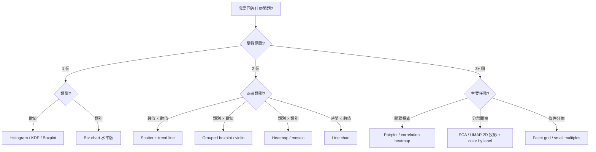

# 02 三鏡分析（Three-Lens Analysis）— M4 EDA、視覺化與統計直覺

> **文件定位**：用三支透鏡重新審視 M4 的知識結構——**First Principles**（第一性原理，回到物理與認知的根本）、**Fundamentals**（基本功，可操作的 checklist 與決策樹）、**Body of Knowledge**（BoK，對齊業界與學界的知識地圖）。這份文件給課程設計者與資深 mentor 用來判斷「這門課在不在正確的知識坐標上」。
> **語氣**：內部 review + 架構師視角。
> **輸出目標**：讓講師對每個知識點都能回答「為什麼要這樣教」而不是「別人都這樣教」。

---

## 一、First Principles：回到根本

### 1.1 視覺化的第一性原理：資料 → 視網膜通道

**核心命題**：視覺化不是「把數字畫成圖」，而是「把資料屬性映射到人眼能高效解碼的知覺通道」。

人眼對不同視覺屬性的解碼精度有明確階層（Cleveland & McGill 1984、Mackinlay 1986、Munzner 2014）：

```
       ┌─ 高精度 ─────────────────────────┐
       │  1. Position（位置，共同軸）     │
       │  2. Length（長度）                │
       │  3. Angle / Slope（角度、斜率）   │
       │  4. Area（面積）                  │
       │  5. Volume（體積）                │
       │  6. Color hue（色相）             │
       │  7. Color saturation（飽和度）    │
       └─ 低精度 ─────────────────────────┘
```

**推論**（這是第一性原理的直接結果，不是習慣）：
- **散佈圖 > 長條圖 > 圓餅圖**：位置 > 長度 > 角度。
- **quantitative 變數用 position，類別變數可以用 hue**：把連續數值塞到 hue 會損失精度。
- **圖表之所以贏過表格**，是因為表格要求眼睛逐格掃描（序列處理），圖表讓大腦一次接收結構（平行處理 / pre-attentive processing）。

**統計視覺化的第一性原理推論**：
- **為何 bar chart 畫均值是撒謊**：用 length 編碼一個被壓縮掉變異資訊的單點。
- **為何 boxplot 更誠實**：把位置、長度同時用來編碼中位數、IQR、whisker 四個統計量。
- **為何 heatmap 常被誤用**：用低精度的 hue 去編碼 quantitative 差異，應該只在「結構比精度重要」時使用（如相關矩陣）。

### 1.2 統計的第一性原理：在不確定下做決策

**核心命題**：統計不是數學的一支，而是「在資料永遠不完整的世界裡，用數學量化我們的無知程度」。

從這個命題推出所有核心概念：

1. **為何需要母體 / 樣本的區分**：因為我們永遠拿不到母體。所有結論都是從片段推全體，因此必然帶不確定性。
2. **為何需要變異數**：因為單一均值無法告訴你「這個均值有多可靠」。變異數衡量「無知的大小」。
3. **為何需要 CLT**：因為它告訴我們「即使不知道母體長什麼樣，樣本均值的不確定性也有可預測的形狀」。這是統計能從資料逆推母體的橋樑。
4. **為何需要假設檢定**：因為「我觀察到了差異」與「母體真有差異」是兩件事，中間隔著抽樣噪聲。假設檢定是這座橋。
5. **為何有 p-value**：它不是 truth 的度量，是 **surprise** 的度量——在 H0 世界觀下，我觀察到的資料有多令人意外。

**第一性原理的重大推論**：
- **p-value 絕對不是 H0 為真的機率**——那是貝氏後驗，需要先驗分佈才能計算。
- **統計顯著不等於實務顯著**——前者是 surprise 量度，後者是 impact 量度，兩回事。
- **A/B Test 的核心不是算 p-value，而是隨機化**——隨機化才讓因果推論成為可能，統計只是事後驗證工具。

---

## 二、Fundamentals：可操作的基本功

### 2.1 EDA 七步法（擴充版，取代原教材四步）

```
0. 【資料品質審視】   dtype 檢查、unique count、缺值 pattern、時間範圍、主鍵唯一性
1. 【看全貌】         describe()、分佈直方圖批次輸出、類別欄位 value_counts
2. 【單變量分析】     每一欄的分佈、偏態、極端值
3. 【雙變量分析】     數值×數值（scatter, corr）、類別×數值（boxplot）、類別×類別（crosstab）
4. 【多變量分析】     pairplot、降維投影（PCA/UMAP）、條件分佈（facet）
5. 【抓異常】         區分資料品質異常、統計離群、業務意義異常
6. 【形成假設】       符合 SMART-H：具體、可量化、可驗證、與業務相關、時效明確、可檢定
```

每一步的 **退出條件**（exit criteria）應明文化，否則學員會在第 1 步反覆打轉不肯往下。

### 2.2 圖表選擇決策樹



**選圖鐵律**：
1. 超過 5 個類別不用 pie chart。
2. 比例類指標（conversion rate、CTR）一定要畫 **CI 誤差棒**。
3. 時間序列 Y 軸是否從 0 起跳，取決於「相對變化 vs 絕對值」哪個重要，但 **截斷時必須明確標示**。
4. 兩條線用 dual axis 幾乎一定是誤導——改用 small multiples 或 index 到 100。

### 2.3 統計直覺 Checklist（上任何 p-value 之前必問）

| # | 問題 | 不通過的後果 |
|---|------|------------|
| 1 | 樣本是否為隨機抽樣（或隨機分組）？ | 選擇偏誤，結論無法外推 |
| 2 | 樣本數是否預先決定？還是看到好看就停？ | Peeking，false positive 暴增 |
| 3 | 母體分佈是否偏態？樣本數夠大嗎？（n>30 不一定夠） | CLT 不收斂，t-test 失效 |
| 4 | 有沒有同時測多個指標？ | Multiple testing，需 Bonferroni / FDR |
| 5 | 是否計算了 effect size？ | 統計顯著但實務不顯著，白忙 |
| 6 | H0 / H1 是否預先寫好？ | p-hacking 溫床 |
| 7 | 結論是在樣本期間內有效，還是外推到未來？ | concept drift 風險 |
| 8 | 分組比例是否符合預期（SRM 檢查）？ | 分流機制壞掉，結果全廢 |

**任何一項答「不確定」都不能下結論**。這份 checklist 應該印成卡片發給學員。

---

## 三、Body of Knowledge：對齊業界與學界知識地圖

### 3.1 對齊 ASA Data Science BoK

美國統計學會（ASA）Data Acumen 架構共 10 個領域，M4 直接覆蓋：

| ASA BoK 領域 | M4 對應章節 | 覆蓋深度 |
|-------------|------------|---------|
| 1. Analytical & Critical Thinking | Slide 3（好問題）、Slide 5（故事結構） | 完整 |
| 2. Computational & Statistical Thinking | Slide 7–11（統計直覺） | 入門完整 |
| 3. Data Visualization | Slide 1–6（EDA 與視覺化） | 入門完整 |
| 4. Mathematical Foundations | Slide 8（均值、變異數） | 極簡 |
| 5. Statistical Foundations | Slide 9–10（分佈、假設檢定） | 入門完整 |
| 6. Data Management | 未涵蓋（M3 已處理） | N/A |
| 7. Communication & Teamwork | Slide 5–6（業務故事） | 入門 |
| 8. Domain Knowledge | 練習 A/B 的零售情境 | 觸及 |
| 9. Ethical Problem Solving | **缺失** | **應補** |
| 10. Professionalism | 本身屬於軟技能 | N/A |

**Gap**：ASA BoK 第 9 項「Ethical Problem Solving」完全沒觸及——圖表說謊術、p-hacking、cherry-picking 都是資料倫理議題，**強烈建議 Slide 5 加入**。

### 3.2 對齊 SWEBOK Measurement（IEEE SWEBOK v3）

SWEBOK 軟體工程知識體系的 **Software Engineering Process > Measurement** 章節，對應到資料分析師在工程化情境的角色：

| SWEBOK Measurement 概念 | M4 對應 |
|----------------------|--------|
| Measurement theory（測量理論） | Slide 3 可觀察、Slide 8 操作型定義 |
| Scales of measurement（名目、順序、區間、比例） | **缺失**——應該補在 Slide 2 之前 |
| Data collection | Slide 11 A/B Test 分組 |
| Statistical analysis | Slide 8–11 |
| Measurement validation | Slide 11 SRM 檢查（隱含） |

**Gap**：測量尺度（Stevens 的 nominal / ordinal / interval / ratio）是選圖的根本依據之一（ordinal 不該用 scatter、interval 不該算 ratio 倍數），**建議在 Slide 2 之前加一張「變數類型」的前置頁**。

### 3.3 對齊 Wickham's R4DS / Python for Data Analysis 工作流

| Wickham 工作流步驟 | M4 覆蓋 |
|------------------|--------|
| Import | M3 已處理 |
| Tidy | M3 已處理 |
| Transform | M3 / M5 處理 |
| **Visualize** | **M4 Part A 核心** |
| **Model** | M4 Part B 入門（假設檢定是最簡單的 model） |
| Communicate | M4 Slide 5 業務故事 |

M4 位於 Wickham 工作流的 Visualize + Model + Communicate 樞紐，定位正確。

---

## 四、合流建議：三鏡合一的課程增修

### 4.1 短期增修（下次開課前）

1. **Slide 2 前插一張「測量尺度」**（對齊 SWEBOK）：名目 / 順序 / 區間 / 比例四種變數類型決定了後面所有選圖與統計方法的合法性。
2. **Slide 4 擴為七步法**（First Principles + Fundamentals 合流）：在原四步之前補資料品質、之後拆單/雙/多變量。
3. **Slide 5 加入資料倫理** （對齊 ASA BoK #9）：圖表說謊術四連擊（truncated axis / dual axis / 3D pie / cherry pick）。
4. **Slide 9 拆 CLT 誤用專頁**（First Principles）：從「大量獨立隨機事件相加」這個第一性原理重新推導，而不是死記公式。
5. **Slide 10 加 2×2 統計 vs 實務顯著矩陣 + Checklist**（Fundamentals）。

### 4.2 中期結構重設（下個改版）

課程重新依三鏡架構組織：

```
M4 EDA 視覺化與統計直覺（重組版）

Part A.0  認知根本：為什麼圖表有用？
  └─ Cleveland 階層、pre-attentive processing、Anscombe + Datasaurus

Part A.1  基本功：EDA 七步法 + 圖表選擇決策樹
  └─ 含資料倫理與圖表說謊術反面教材

Part A.2  實作：三段洞察簡報（維持現練習 A，加色盲友善配色硬要求）

Part B.0  認知根本：為什麼需要統計？
  └─ 不確定性、surprise 量度、從樣本到母體的橋

Part B.1  基本功：統計直覺 8 問 Checklist + A/B Test 地雷清單
  └─ 含 peeking、SRM、multiple testing

Part B.2  實作：業務問題翻譯機（維持現練習 B，加挑戰題）
```

### 4.3 長期對齊（跨模組）

- **M4 → M5**：EDA 的「找關係」直接對接 M5 的特徵工程（相關性、互資訊、分佈轉換）。M4 末尾應該預告「你在 M4 建立的統計直覺，會在 M5 變成特徵選擇與轉換的依據」。
- **M4 → M7**：假設檢定的思維對接 M7 的模型評估（confusion matrix、AUC、交叉驗證的 variance）。
- **M4 → 實驗組**：如果公司有 A/B testing platform，M4 的 Part B 應該和實驗平台團隊共備課，讓講師同時是 practitioner。

---

## 五、一句話結論

> **First Principles 告訴你為什麼**（視覺是認知通道、統計是不確定下的決策），
> **Fundamentals 告訴你怎麼做**（七步法、決策樹、Checklist），
> **BoK 告訴你在哪裡**（ASA Data Acumen、SWEBOK Measurement、Wickham 工作流）。
>
> 現版 M4 在 Fundamentals 層完整、在 First Principles 層隱晦、在 BoK 層未明說。下一版只要把三鏡顯性化，學員拿到的就不只是一堂課，而是一張能用五年的知識地圖。
