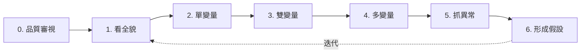

# 03 BCG 敘事腳本（Governing Thought Deck）— M4 EDA、視覺化與統計直覺

> **文件定位**：把 M4 的教學內容重新包裝為 **BCG 式簡報敘事**，供公司內部技術討論會（90 分鐘）使用。BCG 式敘事的核心是 **Governing Thought（統領思想）** + **MECE 支撐論點** + **Pyramid Principle 由上而下推進**。本稿為 12–18 頁腳本，含金句頁與 Closing ask。
> **語氣**：對公司中高階（工程總監、PM、資料團隊 lead）簡報。
> **會議目標**：讓非資料背景的技術 leadership 理解為什麼資料分析師需要「視覺化直覺 + 統計直覺」這兩項底層能力，並 buy-in 將 M4 列為公司新進資料相關角色的必修訓練。

---

## 統領思想（Governing Thought）

> ## **"A chart is an argument, not a decoration."**
> **圖表是一個論證，不是裝飾。**
> 資料分析師的價值，不在於畫得漂亮，而在於讓組織的每一個決策都有可被檢視的論證鏈。
> 當視覺化誠實、統計嚴謹，公司做的每一個決策就從「誰聲音大聽誰的」變成「誰證據強聽誰的」。

### MECE 三支柱

為了支撐這個統領思想，我們用三個互斥且完備（MECE）的問題來結構整份簡報：

```
A chart is an argument
        │
        ├── 支柱 1：看【分佈】 —— 一個變數長什麼樣？（Distribution）
        ├── 支柱 2：看【關係】 —— 兩個變數怎麼連動？（Relationship）
        └── 支柱 3：看【差異】 —— 兩群人真的不一樣嗎？（Comparison with inference）
```

這三個問題涵蓋了 95% 的業務分析情境。任何無法歸到這三類的問題，往往是問題本身還沒問清楚。

---

## 簡報頁流（15 頁版）

### P1｜封面

**標題**：A chart is an argument, not a decoration.
**副標**：為什麼視覺化直覺與統計直覺，是資料團隊的底層資產
**Presenter**：Data Foundations Track｜M4 Brief
**Date**：2026-04-14

### P2｜議題設定（Why are we here?）

**大標**：我們每週做幾個「看起來是數據驅動、其實是直覺驅動」的決定？

**內文**：
- 過去一季，組織內至少 **37 個產品決策** 引用了「數據顯示」
- 但其中有多少經得起兩個問題的追問？
  1. 這張圖是否誠實地呈現了資料？
  2. 這個差異是否超過了抽樣噪聲？
- 答案是：**我們不知道**。因為沒有人檢查。
- 今天這場討論，要讓每個 reviewer 都能在 5 分鐘內判斷一份分析「值不值得相信」。

### P3｜Governing Thought 揭露頁（金句頁）

*滿版留白，中央一行字——*

> # **A chart is an argument,**
> # **not a decoration.**

*底部小字：Every axis, every color, every p-value is a claim. Make it stand up in court.*

### P4｜MECE 結構綱要

**大標**：三個問題，涵蓋 95% 的業務分析

視覺：三欄卡片

| 支柱 1：分佈 | 支柱 2：關係 | 支柱 3：差異 |
|-------------|-------------|-------------|
| 「這筆資料長什麼樣？」 | 「X 變動時 Y 怎麼變？」 | 「A 組和 B 組真的不同嗎？」 |
| 代表情境：用戶 LTV 的形狀 | 代表情境：廣告花費與轉換率 | 代表情境：A/B Test 勝負 |
| 關鍵陷阱：只看均值 | 關鍵陷阱：相關 ≠ 因果 | 關鍵陷阱：統計顯著 ≠ 實務顯著 |

### P5｜支柱 1：看分佈 —— 均值是誠實的謊言

**大標**：均值告訴你中心，分佈告訴你真相。

**內文要點**：
- **Anscombe's Quartet + Datasaurus Dozen**：統計量完全相同的資料集，圖畫出來可以是線性、曲線、離群、甚至一隻恐龍。
- **業務翻譯**：「平均訂單金額 1,200 元」的底下可能是：
  - (A) 大多數人 1,000–1,400 元（穩健業務）
  - (B) 一半人 300 元、一半人 2,100 元（兩極化，需要分群經營）
  - (C) 99% 人 500 元、1% VIP 8,000 元（典型 Pareto，VIP 策略完全不同）
- **行動後果**：三種分佈同樣的均值，但對應的行銷、定價、庫存策略完全不同。**只用均值做決策，等於三個不同的世界你都在用同一套 playbook。**

**視覺**：三個直方圖並排，均值線同一位置，但形狀完全不同，標題「同樣的 1,200 元，不同的三家公司」。

### P6｜支柱 1 反面教材（Reviewer 警示頁）

**大標**：你上週那張長條圖，其實撒了三個謊。

**三連擊**：
1. **Y 軸截斷**：從 70% 起跳，把 2% 的差異畫成像天差地別。
2. **雙軸重疊**：兩條線看起來相關，其實是刻意縮放湊出來的。
3. **只畫均值不畫分佈**：把變異數藏起來，讓決策者誤以為結論很穩。

**底部金句**：
> Honesty in visualization is not a style choice. It is a professional obligation.

### P7｜支柱 2：看關係 —— 連動不等於因果

**大標**：相關係數 0.85 告訴你的比你想像得少。

**內文要點**：
- Pearson 相關係數只抓 **線性關係**。Spearman 抓單調、互資訊抓任意關聯。
- **反例**：Anscombe 第 2 組——完美的曲線，Pearson r = 0.82，看起來很相關，但線性模型完全錯誤。
- **業務翻譯**：
  - 「廣告花費與營收正相關 0.7」→ 不代表加廣告就一定增加營收（可能是季節、可能是同步成長）
  - 「用戶停留時間與購買正相關」→ 不代表讓用戶停久就會買（可能是本來就想買的人停比較久）
- **黃金原則**：**看到相關，永遠問三個問題**——有沒有第三變數？因果方向反了嗎？是不是抽樣偏誤造成的？

**視覺**：散佈圖矩陣，上方加一排 Pearson r，底下三張 r 相近但結構完全不同的圖（Anscombe quartet 前三圖）。

### P8｜支柱 3：看差異 —— 統計顯著的四種命運

**大標**：p < 0.05 不是結束，是審判的開始。

**2×2 矩陣**：

|                      | **實務顯著** | **實務不顯著** |
|---------------------|-------------|---------------|
| **統計顯著**         | ✅ 上線      | ⚠️ 大樣本陷阱，別做 |
| **統計不顯著**       | 🔁 加樣本或承認不確定 | ❌ 放棄 |

**內文要點**：
- 轉換率從 10.00% 提升到 10.05%，樣本數百萬 → p < 0.001 統計顯著，但 0.05% 的提升不值得改版。
- 相反，看似微小但落在關鍵動線的差異（如結帳跳出率下降 2%），即使 p = 0.08，也值得加樣本再測。
- **統計判斷與業務判斷是兩個不同的決策流**，不能合併為一。

### P9｜支柱 3 的四個地雷（Reviewer 必查）

**大標**：你的 A/B Test 報告，reviewer 先看這四件事。

**清單**：
1. **SRM（Sample Ratio Mismatch）**：分組比例是否真的 50/50？如果 49/51 且 p<0.001，分流壞了，結果全廢。
2. **Peeking**：是否偷看過中途結果？如果是，p-value 膨脹，false positive 率從 5% 飆到 30%。
3. **Multiple testing**：是否同時測 10 個指標？如果是，要 Bonferroni 或 FDR 校正。
4. **MDE（Minimum Detectable Effect）**：實驗前有沒有定「我在乎多大的差異」？沒有就是在 p-hacking。

**底部**：如果這四題任一項答「我沒檢查」，這份 A/B 報告不能進決策會議。

### P10｜轉折頁（金句頁）

*滿版留白，中央兩行——*

> # **Data doesn't speak.**
> # **You translate. And translation is responsibility.**

### P11｜EDA 七步法（操作化）

**大標**：每個分析師的標準動作，從「看資料」到「提假設」。



**Reviewer 看這個流程的用法**：當你收到一份分析，問對方「你在第幾步？」。如果對方在第 6 步卻跳過第 0 步，那份假設很可能建在流沙上。

### P12｜統計直覺 Checklist（8 問）

**大標**：上任何 p-value 之前，先過這 8 關。

| # | 問題 |
|---|------|
| 1 | 樣本是否隨機？ |
| 2 | 樣本數是否預先決定？ |
| 3 | 母體分佈是否偏態？n 夠大嗎？ |
| 4 | 有沒有多重檢定？ |
| 5 | 是否計算了 effect size？ |
| 6 | H0 / H1 是否預先寫好？ |
| 7 | 結論能外推到什麼範圍？ |
| 8 | SRM 檢查過了嗎？（如為 A/B Test） |

**任何一題答「不確定」就不簽字**。

### P13｜Case Study：上季的真實修正

**大標**：當我們用這套工具 review 上季的 A/B Test。

*（此頁由 presenter 帶入公司內部實際案例，示範三個常見修正：）*
- 案例 A：原結論「新 onboarding 提升留存 15%」→ 修正：SRM 失敗，結論作廢
- 案例 B：原結論「推播文案 B 優於 A」→ 修正：effect size 僅 0.3%，統計顯著但不值得改
- 案例 C：原結論「改版無效」→ 修正：MDE 過大，實驗根本沒 power 偵測真實差異

**結論**：三個案例，三個不同的失敗模式。過去我們沒有共同語言，今天我們有了。

### P14｜組織影響與導入建議

**大標**：把這套能力變成組織的預設值。

**三層導入**：
1. **個人層**：新進資料相關角色必修 M4，訓後通過一份練習 A + 練習 B 的 rubric。
2. **團隊層**：每份包含 A/B Test 或統計結論的文件，必須附上 8 問 Checklist 的簽核。
3. **平台層**：實驗平台內建 SRM 自動檢查、MDE 計算器、multiple testing 校正，把 checklist 變成系統強制。

**預估投入**：
- M4 訓練：每人 3 小時 + 1 小時練習批改
- 平台改動：2 週工程工作
- ROI：避免一個錯誤 launch 的成本就回本

### P15｜Closing Ask

**大標**：我們向 leadership 請求三件事。

1. **決策**：把 M4 列為公司所有資料相關新進角色的必修訓練（含 PM、成長、產品分析、資料工程、演算法）。
2. **資源**：核准 2 週工程資源升級實驗平台的 SRM / MDE / multiple testing 三項檢查。
3. **共識**：本季起，所有進入產品決策會議的 A/B 報告必須通過 8 問 Checklist，否則會議主席可退件。

**Closing 金句**（滿版）：
> # Every chart is a claim.
> # Every p-value is a verdict.
> # Let's make them worthy of the decisions they carry.

---

## 附錄：Presenter 口述腳本（關鍵橋段）

### P3 → P4 過場（30 秒）
「這句話聽起來像 slogan，但我接下來 12 頁，每一頁都會讓你看到它的成本。我們先把問題分成三類——分佈、關係、差異。每一類我都會給你一個組織裡正在發生的失敗案例。」

### P8 的核心話術（60 秒）
「p < 0.05 在學術上是發表門檻，在商業上只是審判的開始。因為商業不是 publish or perish，是 decide or lose money。所以我們要問的是這個 2×2：統計 × 實務。只有右上角，才值得投工程資源 launch。」

### P15 Closing（90 秒）
「今天我請你們決定的，不是一門課要不要開、一個功能要不要做。是組織要不要從『誰聲音大聽誰的』，變成『誰證據強聽誰的』。三年後當我們回頭看這個季度，我希望我們能說：從 M4 開始，我們學會了尊重資料。」

---

## 使用說明

- **時長**：15 頁 × 平均 5 分鐘 = 75 分鐘 + 15 分鐘 Q&A = 90 分鐘。
- **壓縮到 12 頁版**：刪 P6（合併進 P5）、P9（合併進 P8）、P13（改口述）。
- **擴充到 18 頁版**：P5 後加 distribution 實例頁；P7 後加 causal inference teaser；P12 後加 Bayesian 視角補充。
- **金句頁**：P3、P10、P15 三張滿版金句頁是敘事節拍器，**不可省略**。沒有留白的簡報沒有說服力。
