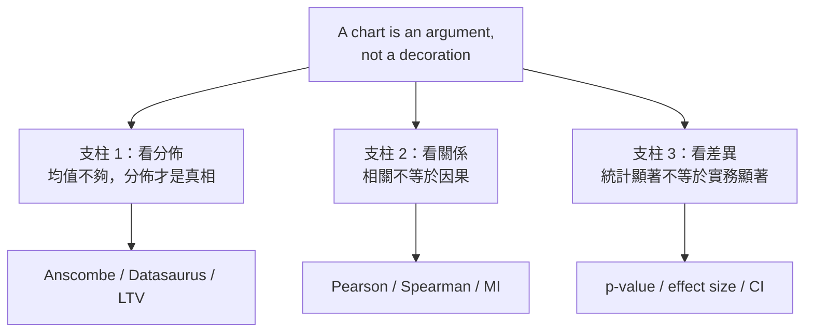
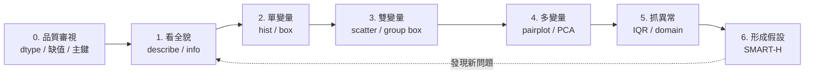
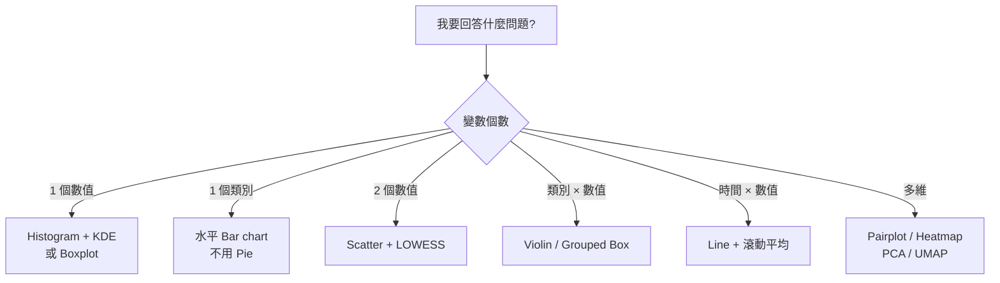
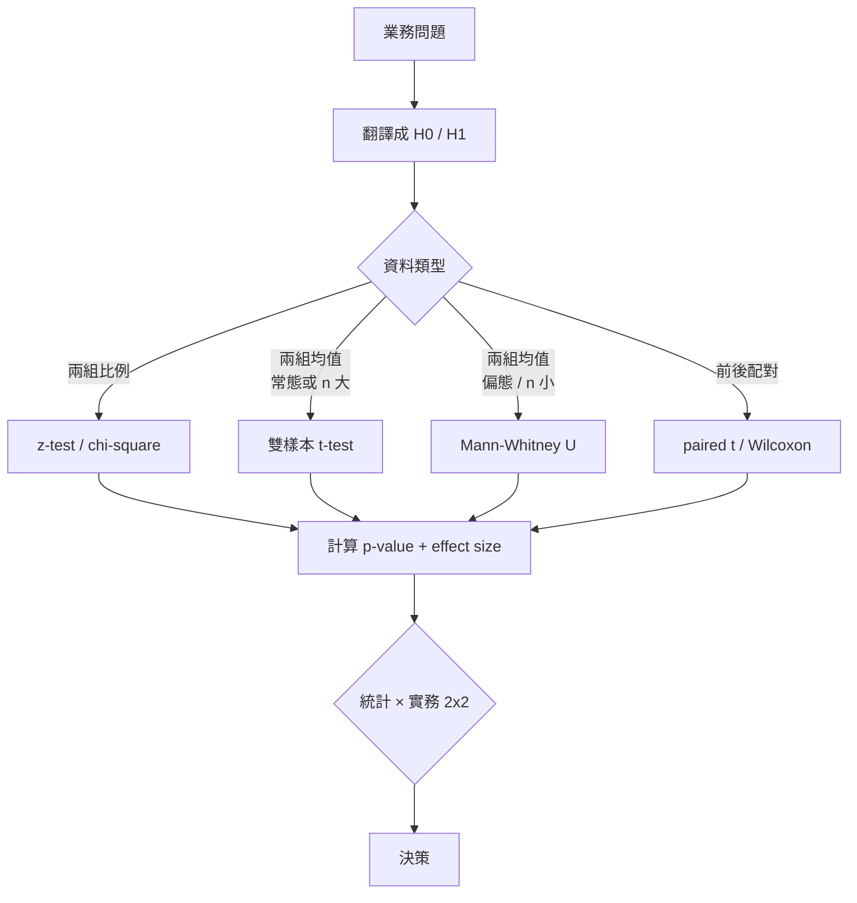
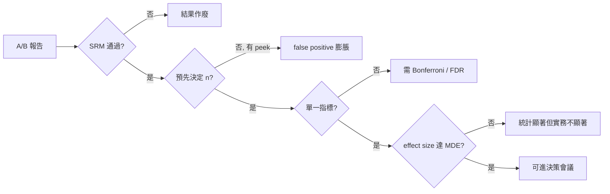

# 04 版面與視覺規格（Layout & Visual Spec）— M4 EDA、視覺化與統計直覺

> **文件定位**：為 M4 BCG 敘事 deck（見 `03_bcg_narrative.md`）以及教學投影片提供 **可執行的視覺規格**。涵蓋 grid 系統、字體層級、顧問級色票（含色盲友善配色）、圖表 before/after 範例、以及至少 5 個 mermaid / matplotlib 程式碼片段。規格目標是讓任何 designer / 講師拿到這份文件都能產出視覺一致、資訊密度正確、且誠實的簡報。
> **語氣**：內部 review + spec writer。
> **對應**：16:9 投影片（1920×1080）、A4 印刷講義（210×297 mm）。

---

## 1. Grid 系統

### 1.1 投影片 Grid（16:9, 1920×1080 px）

- **外邊距**：上 80 / 下 80 / 左 96 / 右 96 px
- **欄數**：12 欄
- **欄寬**：(1920 − 192) / 12 = 144 px
- **欄間距（gutter）**：24 px
- **實際可用欄寬**：120 px

**常用版型**：
| 版型 | 欄位分配 | 用途 |
|-----|---------|------|
| 全版 | 12 | 金句頁、Case study 大圖 |
| 對分 | 6 + 6 | Before / After、左文右圖 |
| 黃金分割 | 8 + 4 | 主圖 + 側欄標注 |
| 三欄 | 4 + 4 + 4 | MECE 三支柱 |
| 四欄 | 3 + 3 + 3 + 3 | 圖表任務四分類、2×2 矩陣 |

### 1.2 講義 Grid（A4 直式，210×297 mm）

- **外邊距**：上下 20 / 左右 18 mm
- **欄數**：6 欄
- **欄寬**：(210 − 36) / 6 = 29 mm
- **欄間距**：4 mm

---

## 2. 字體層級

### 2.1 字體選擇

| 用途 | 英文字體 | 中文字體 | 備援 |
|------|---------|---------|------|
| 標題 | Inter / IBM Plex Sans | 思源黑體 Bold | system-ui |
| 內文 | Inter / IBM Plex Sans | 思源黑體 Regular | sans-serif |
| 數字強調 | Inter Tight / IBM Plex Mono | 思源黑體 Medium | monospace |
| 程式碼 | JetBrains Mono | 思源黑體等寬 | monospace |

**禁用**：微軟正黑體（字形重心偏、標點對齊差）、Comic Sans、任何手寫字體。

### 2.2 字級階層（投影片）

| 層級 | 字級 | 行距 | 字重 | 用途 |
|------|-----|------|-----|------|
| H0 金句 | 72 pt | 1.1 | Bold | 滿版金句頁 |
| H1 標題 | 40 pt | 1.2 | Bold | 每頁主標 |
| H2 副標 | 28 pt | 1.3 | Medium | 段落小標 |
| Body | 20 pt | 1.5 | Regular | 內文 |
| Caption | 14 pt | 1.4 | Regular | 資料來源、註腳 |
| Data label | 16 pt | 1.2 | Medium | 圖表標注 |

**鐵律**：一頁最多 **三個字級**。超過就是視覺混亂。

---

## 3. 顧問級色票系統

### 3.1 主視覺色（Brand Accent）

```
Primary Navy      #0B2A4A    // 標題、線條、主強調
Accent Red        #C8102E    // 警示、負面、關鍵對比
Accent Gold       #C8A44B    // 正面、結論、金句
Neutral Dark      #2C2C2C    // 內文主色
Neutral Mid       #6E6E6E    // 次要文字、副標
Neutral Light     #E8E8E8    // 分隔線、表格斑馬紋
Background        #FAFAF7    // 頁面底色（非純白，降低疲勞）
```

### 3.2 資料視覺化配色（色盲友善）

**首選：Okabe-Ito 8 色盤**（設計目的即為色盲友善，覆蓋三種色盲類型）：

| 名稱 | Hex | RGB | 用途建議 |
|-----|-----|-----|---------|
| Black | `#000000` | 0,0,0 | 基準線、標記 |
| Orange | `#E69F00` | 230,159,0 | 第 1 類別 |
| Sky Blue | `#56B4E9` | 86,180,233 | 第 2 類別 |
| Bluish Green | `#009E73` | 0,158,115 | 第 3 類別（正面） |
| Yellow | `#F0E442` | 240,228,66 | 第 4 類別（注意：低對比，不用於線條） |
| Blue | `#0072B2` | 0,114,178 | 第 5 類別 |
| Vermillion | `#D55E00` | 213,94,0 | 第 6 類別（負面） |
| Reddish Purple | `#CC79A7` | 204,121,167 | 第 7 類別 |

**次選：ColorBrewer**
- **定類（qualitative）**：`Set2`（8 色，柔和）或 `Dark2`（高對比）
- **定量漸變（sequential）**：`Blues` / `YlOrRd`
- **定量發散（diverging）**：`RdBu`（紅藍）或 `BrBG`（褐綠）——比紅綠安全

**禁用組合**：
- **紅 + 綠**（最常見的色盲誤判）：請用紅 + 藍，或改用形狀區分。
- **飽和色 + 飽和色** 並排（視覺疲勞）：至少一方降飽和。
- **彩虹（rainbow / jet）色盤** 用於定量資料：知覺非線性，永遠改用 viridis / plasma。

### 3.3 語意色（給圖表用）

```
Positive / 正向     #009E73   （Okabe-Ito Bluish Green）
Negative / 負向     #D55E00   （Okabe-Ito Vermillion，非純紅）
Neutral / 中性      #6E6E6E
Highlight / 焦點    #C8A44B   （金色，強調單一點）
CI band / 信心區間  #56B4E9 @ 20% alpha
```

---

## 4. 圖表 Before / After 範例

### 4.1 範例 A：比較兩組轉換率

**Before**：
- 3D pie chart，A 占 46%、B 占 54%
- 底部寫 "B wins"
- **問題**：pie 無法準確表達 8% 差異、3D 扭曲角度、沒有誤差資訊、結論斷定

**After**：
- 水平 bar chart，A=12.0% ± 1.4%, B=14.0% ± 1.5%（95% CI 誤差棒）
- Y 軸從 0 起跳，X 軸標示 CI
- 標題：「B 高出 2pp，但 CI 重疊，需加樣本」
- 色彩：A 用 Okabe-Ito Blue `#0072B2`、B 用 Vermillion `#D55E00`，非紅綠

### 4.2 範例 B：單變量分佈

**Before**：
- 長條圖顯示各分位數的平均值
- **問題**：壓縮了分佈形狀、看不到離群、看不到偏態

**After**：
- Histogram + KDE 曲線疊加 + 均值（實線）與中位數（虛線）兩條垂直線
- 右上角小字標注 skewness = 2.3（右偏）
- 標題：「訂單金額右偏嚴重，均值 1,200 元不代表典型用戶」

### 4.3 範例 C：時間序列

**Before**：
- Y 軸從 70% 起跳，兩個月下跌 2pp 看起來像懸崖
- **問題**：truncated axis 誤導觀眾

**After**：
- Y 軸從 0 起跳（或明確標示「截斷自 65%」並加 zigzag 符號）
- 加上 12 週滾動平均（次要色，Okabe-Ito Sky Blue）
- 標題：「留存 85% → 83%：2pp 絕對值下跌，但仍在過去 12 週的 ±1 SD 內」

### 4.4 範例 D：相關關係

**Before**：
- 只有一張散佈圖 + Pearson r = 0.82
- **問題**：看不出是否線性、是否有離群、是否 Anscombe 陷阱

**After**：
- 散佈圖 + LOWESS 平滑曲線 + 標注離群點
- 右上角同時標 Pearson r 與 Spearman ρ（如不同則暗示非線性）
- 標題：「r=0.82 但曲線顯示飽和，線性模型會高估高端預測」

### 4.5 範例 E：類別 × 數值

**Before**：
- Bar chart of group means
- **問題**：不同組的分佈形狀完全消失

**After**：
- Violin plot + 內嵌 boxplot + 疊加原始點（strip plot with jitter，alpha=0.3）
- 橫線標注母體均值（參考基準）
- 標題：「A 組中位數較低但分佈寬，B 組集中但有多個高端離群」

---

## 5. 程式碼片段（Matplotlib / Seaborn）

### 5.1 套用 Okabe-Ito 色盤全域

```python
import matplotlib.pyplot as plt
from cycler import cycler

OKABE_ITO = [
    '#000000', '#E69F00', '#56B4E9', '#009E73',
    '#F0E442', '#0072B2', '#D55E00', '#CC79A7',
]

plt.rcParams.update({
    'axes.prop_cycle': cycler(color=OKABE_ITO),
    'font.family': 'sans-serif',
    'font.sans-serif': ['Inter', 'Noto Sans CJK TC', 'sans-serif'],
    'axes.titlesize': 16,
    'axes.titleweight': 'bold',
    'axes.spines.top': False,
    'axes.spines.right': False,
    'axes.grid': True,
    'grid.alpha': 0.3,
    'figure.dpi': 120,
})
```

### 5.2 Anscombe Quartet 並排示範

```python
import seaborn as sns
import matplotlib.pyplot as plt

df = sns.load_dataset('anscombe')
g = sns.FacetGrid(df, col='dataset', col_wrap=2, height=3.5)
g.map_dataframe(sns.regplot, x='x', y='y',
                ci=None, scatter_kws={'s': 60, 'color': '#0072B2'},
                line_kws={'color': '#D55E00'})
g.set_titles('Dataset {col_name}')
g.fig.suptitle('統計量相同，結構完全不同 — Anscombe (1973)',
               y=1.04, fontsize=14, fontweight='bold')
plt.tight_layout()
```

### 5.3 帶 95% CI 誤差棒的轉換率比較

```python
import numpy as np
import matplotlib.pyplot as plt
from scipy import stats

def wilson_ci(successes, n, alpha=0.05):
    p = successes / n
    z = stats.norm.ppf(1 - alpha/2)
    denom = 1 + z**2/n
    centre = (p + z**2/(2*n)) / denom
    spread = z * np.sqrt(p*(1-p)/n + z**2/(4*n**2)) / denom
    return centre - spread, centre + spread

groups = ['A (舊版)', 'B (新版)']
rates = [0.120, 0.140]
n = 500
cis = [wilson_ci(r*n, n) for r in rates]
errors = [[r - lo for r,(lo,_) in zip(rates, cis)],
          [hi - r for r,(_,hi) in zip(rates, cis)]]

fig, ax = plt.subplots(figsize=(7, 4))
ax.barh(groups, rates, xerr=errors, color=['#0072B2', '#D55E00'],
        capsize=8, alpha=0.85)
ax.set_xlabel('轉換率 (95% Wilson CI)')
ax.set_title('B 高出 2pp，但 CI 重疊 — 加樣本或承認不確定')
ax.set_xlim(0, 0.20)
plt.tight_layout()
```

### 5.4 分佈 + 均值/中位數雙線示範

```python
import numpy as np
import matplotlib.pyplot as plt

rng = np.random.default_rng(42)
data = rng.lognormal(mean=7, sigma=0.8, size=5000)  # 右偏分佈

fig, ax = plt.subplots(figsize=(8, 4.5))
ax.hist(data, bins=60, color='#56B4E9', alpha=0.7, edgecolor='white')
ax.axvline(np.mean(data), color='#D55E00', lw=2.2, label=f'均值 {np.mean(data):,.0f}')
ax.axvline(np.median(data), color='#009E73', lw=2.2, ls='--',
           label=f'中位數 {np.median(data):,.0f}')
ax.set_xlabel('訂單金額（元）')
ax.set_ylabel('訂單數')
ax.set_title('右偏分佈：均值被少數高端拉高，中位數更代表典型用戶')
ax.legend()
plt.tight_layout()
```

### 5.5 Violin + Box + Strip 三合一

```python
import seaborn as sns
import matplotlib.pyplot as plt

fig, ax = plt.subplots(figsize=(8, 5))
sns.violinplot(data=df, x='group', y='order_amount',
               palette=['#0072B2', '#D55E00'],
               inner=None, ax=ax, alpha=0.5)
sns.boxplot(data=df, x='group', y='order_amount',
            width=0.15, showcaps=False,
            boxprops={'facecolor': 'white', 'zorder': 2},
            ax=ax)
sns.stripplot(data=df, x='group', y='order_amount',
              color='black', alpha=0.25, size=2, jitter=0.15, ax=ax)
ax.set_title('A 組分佈寬但中位數低，B 組集中但高端離群多')
plt.tight_layout()
```

---

## 6. Mermaid 結構圖範例

### 6.1 MECE 三支柱



### 6.2 EDA 七步法流程



### 6.3 圖表選擇決策樹



### 6.4 假設檢定決策流



### 6.5 A/B Test 地雷檢查流



---

## 7. 投影片版型範例（規格表）

### 7.1 金句頁（P3, P10, P15）

- 背景：`#FAFAF7`
- 文字：Primary Navy `#0B2A4A`，72 pt Bold，左對齊距左 160 px
- 底部 Caption：16 pt `#6E6E6E`，距左 160 px，距下 80 px
- **禁止**：任何裝飾圖案、logo、頁碼

### 7.2 2×2 矩陣頁（P8 統計 vs 實務顯著）

- 4 欄 × 4 列 grid
- 矩陣佔 8 欄寬 × 4 列高，置中
- 每格尺寸：(8×144 + 7×24) / 2 = 660 px 寬 × 320 px 高
- 四格底色分別：
  - 右上（✅）：`#009E73` @ 15% alpha
  - 左上（⚠️）：`#F0E442` @ 25% alpha
  - 左下（🔁）：`#56B4E9` @ 15% alpha
  - 右下（❌）：`#D55E00` @ 15% alpha
- 軸標籤：H2 28 pt Medium

### 7.3 三欄 MECE 頁（P4）

- 4 + 4 + 4 欄，gutter 24 px
- 每卡片：圓角 12 px、1 px 邊框 `#E8E8E8`、內 padding 32 px
- 卡片頂端 4 px 色條（各自不同 Okabe-Ito 色）
- 標題 H2 28 pt Bold，內文 Body 20 pt

---

## 8. 誠實度檢查清單（出圖前必過）

交稿前每張圖自檢 8 問：

1. Y 軸是否從 0 起跳？若否，是否明確標示截斷？
2. 是否使用了雙 Y 軸？若是，能否改為 small multiples 或 index=100？
3. 配色是否色盲友善？紅綠對比是否用紅藍或紅褐取代？
4. 是否所有比例類指標都帶 CI？
5. 均值圖是否配上分佈（violin / strip / CI）？
6. 是否有資料來源、時間範圍、樣本數標注？
7. 標題是否為 **takeaway title**（一句話結論），而非「銷售分析」這種標籤？
8. 是否有可以刪的裝飾（3D、陰影、漸層、logo）？刪掉。

**任何一項不過，圖不出門。**
