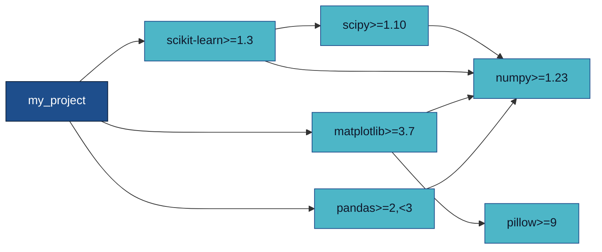
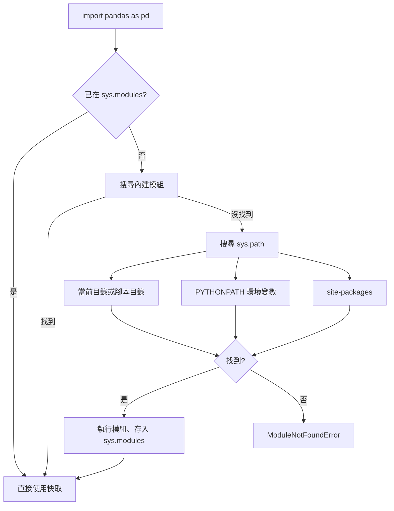
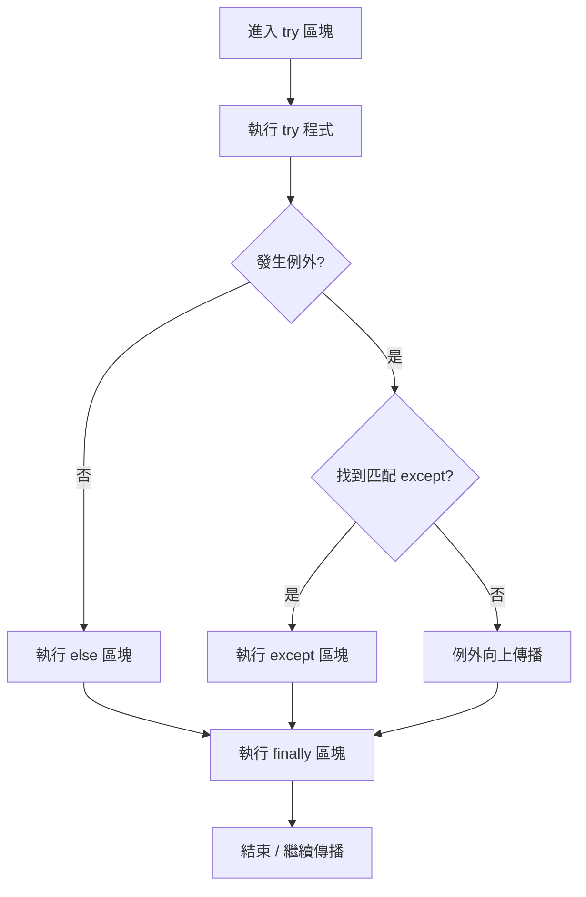
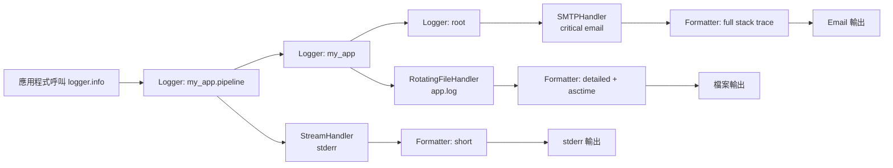
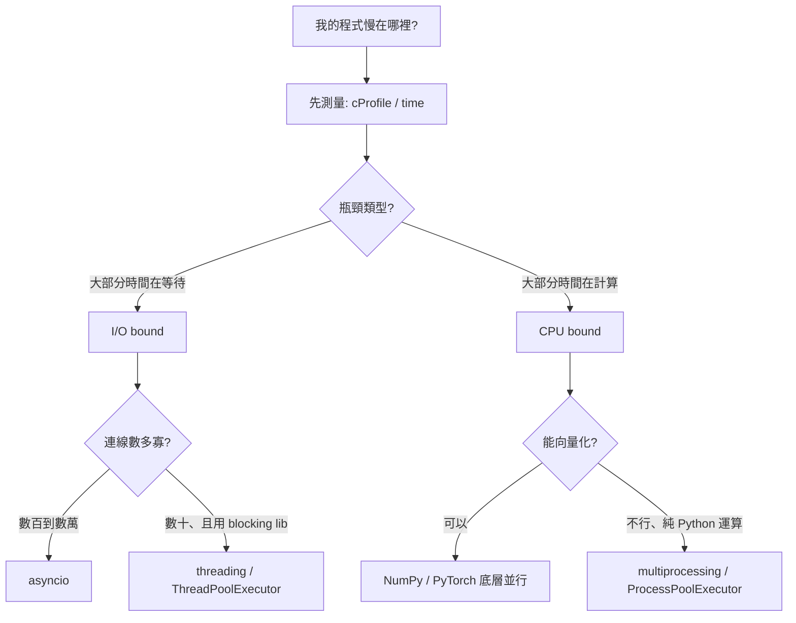

# M5 版面與視覺規格：Layout / Typography / Color / Infographics

> **文件定位：** 本文件為 M5 簡報（12–18 頁 BCG 敘事版）與講義的視覺規格書。目標是讓設計師、助教、講師以同一份規格產出一致的投影片與講義圖表。內容涵蓋版面 grid、字體規範、色票、四張核心資訊圖的規格、以及至少 5 個 mermaid 片段。內部 review 語氣。

---

## 一、版面 Grid 系統

### 1.1 投影片基本設定

- **比例：** 16:9（1920×1080 px 設計稿，export 1280×720 為常用會議用版本）
- **邊距：** 外框留白上下各 80 px、左右各 120 px
- **Safe zone：** 核心資訊（主標、key message）必須置於 1680×920 的 safe zone 內，避免投影機裁切

### 1.2 Grid 選擇

採 **12 欄 grid** + **8 列 baseline**，理由是 12 可整除 2/3/4/6，能同時支援二分、三分、四分、六分版面。

| 欄位配置 | 用途 | 使用頁面 |
|---|---|---|
| 12 欄滿版 | 金句頁、封面 | Slide 1、2、7、10、13、16 |
| 6+6 | 左右對照（script vs system） | Slide 3 |
| 4+4+4 | 三支柱並列 | Slide 4、14 |
| 3+6+3 | 中央主圖、左右備註 | Slide 5、11 |
| 2+8+2 | 中央大圖滿版、四邊留白 | Slide 6、9、12 |

### 1.3 欄距與列高

- **欄距（gutter）：** 24 px
- **列高（baseline）：** 8 px 基準，文字行高對齊 8 的倍數（16 / 24 / 32 / 48 / 64）

---

## 二、字體規範（Typography）

### 2.1 字體家族

| 語言 | 主字體 | 備援 |
|---|---|---|
| 繁體中文 | **思源黑體 TC（Noto Sans TC）** | 蘋方 TC、微軟正黑體 |
| 英文／數字 | **Inter** | SF Pro、Helvetica Neue |
| 程式碼 | **JetBrains Mono** | Fira Code、Consolas |

> **Reviewer 備註：** 避免用「標楷體／細明體」，投影機下模糊；不要混用超過兩種英文字體。

### 2.2 字級階層

| 層級 | 用途 | 字級（px） | 行高 | 字重 |
|---|---|---|---|---|
| H0 Display | 封面／金句頁 | 96 | 112 | Bold 700 |
| H1 Headline | 投影片主標 | 56 | 72 | Bold 700 |
| H2 Subhead | 投影片副標 | 36 | 48 | Semibold 600 |
| H3 Section | 區塊標題 | 28 | 40 | Semibold 600 |
| Body | 內文要點 | 22 | 32 | Regular 400 |
| Caption | 註解、來源 | 16 | 24 | Regular 400 |
| Code Inline | 內文程式碼 | 20 | 28 | JetBrains Mono Regular |
| Code Block | 程式片段 | 18 | 28 | JetBrains Mono Regular |

### 2.3 字距與行寬

- **中文字距：** 0（不加 letter-spacing）
- **英文字距：** H0/H1 −0.5、其他 0
- **行寬上限：** 一行中文不超過 24 個字、英文不超過 75 個字元（超過要折行）

---

## 三、色票（Color Palette）

### 3.1 主色系（Primary）

> 設計意圖：冷色調為主軸（工程、理性），以一組暖色作強調（錨點、警示）。

| 名稱 | Hex | RGB | 用途 |
|---|---|---|---|
| Engineering Navy | `#0B1F3A` | 11, 31, 58 | 深色背景、主標、金句頁底 |
| Systems Blue | `#1E4E8C` | 30, 78, 140 | 圖表主色、強調 |
| Terminal Cyan | `#4DB6C7` | 77, 182, 199 | 次強調、資訊圖線條 |
| Paper White | `#F8FAFC` | 248, 250, 252 | 淺色背景 |
| Ink Black | `#0F172A` | 15, 23, 42 | 淺色背景上的主文字 |
| Mid Slate | `#64748B` | 100, 116, 139 | 次要文字、註解 |

### 3.2 強調色（Accent / Semantic）

| 名稱 | Hex | 用途 |
|---|---|---|
| Anchor Amber | `#F59E0B` | 錨點、核心概念 highlight |
| Warning Red | `#DC2626` | 錯誤、反模式、Reviewer 標記 |
| Success Green | `#16A34A` | 正確做法、驗收打勾 |
| Muted Lavender | `#A78BFA` | 未來訊號（PEP 703）、選修主題 |

### 3.3 對比與無障礙

- 所有正文對背景對比 **WCAG AA**（比值 ≥ 4.5:1）
- 主標對背景對比 **WCAG AAA**（比值 ≥ 7:1）
- 紅／綠不單獨用於傳遞語意（加 icon 或文字標籤，避免色盲使用者誤讀）

---

## 四、四張核心資訊圖規格

### 4.1 圖 A：venv 隔離示意（用於 Slide 5）

**目標：** 讓觀眾一眼看懂「全域環境」vs「隔離環境」的本質差異。

**版面：** 左右對稱二分。左側「全域環境」、右側「隔離環境」。

**視覺元素：**
- 左側：一個大圓（OS Python）內塞進三個專案 A/B/C，三個專案指向同一套 site-packages，三個套件版本衝突以紅色閃電 icon 標記。
- 右側：三個獨立小圓（`.venv-A`、`.venv-B`、`.venv-C`），各自擁有獨立 site-packages，三個專案各指向自己的 venv，無衝突。
- 中央垂直分隔線、標註「`python -m venv`」。

**色彩：** 左側用 `Warning Red` 的 10% 透明底色、衝突用 `Warning Red`；右側用 `Terminal Cyan` 底色、正常用 `Success Green`。

**字體：** 標題 H2、說明 Body。

---

### 4.2 圖 B：例外傳播樹（用於 Slide 9）

**目標：** 展示例外如何沿呼叫鏈向上傳播，以及 `raise ... from ...` 如何保留根因。

**版面：** 縱向流程圖，上到下依序四層。

**視覺元素（由下而上）：**
1. **最底層：** `open("data.csv")` → 觸發 `FileNotFoundError`（根因，`Warning Red`）
2. **中間層：** `load_dataset()` 捕捉 → `raise DataLoadError("cannot load X") from e`
3. **上層：** `run_pipeline()` 捕捉 → `raise PipelineError("step 1 failed") from e`
4. **最上層：** main 程式收到 → logging + stack trace 輸出

每層右側標註「`__cause__`」箭頭回指上一層，形成因果鏈。

**色彩：** 根因 `Warning Red`、中間層 `Systems Blue`、最終輸出 `Anchor Amber`。

---

### 4.3 圖 C：process / thread / coroutine 對比矩陣（用於 Slide 11）

**目標：** 一張圖定位三種並行模型的本質。

**版面：** 表格 + 小示意圖混排，3 欄 × 6 列。

| 維度 | multiprocessing | threading | asyncio |
|---|---|---|---|
| 執行單位 | 作業系統 process | 作業系統 thread（受 GIL） | 應用層 coroutine |
| 記憶體 | 完全隔離 | 共享 | 共享 |
| 啟動成本 | ~10 ms | ~10 μs | < 1 μs |
| 適合場景 | CPU bound | Blocking I/O | 高併發 I/O |
| 資料傳遞 | IPC（pickle，貴） | 共享記憶體（需鎖） | 直接傳物件 |
| GIL 影響 | 無 | 強（CPU bound 無效） | 單 thread 無影響 |

**視覺元素：** 每一欄頂部放一個簡圖 icon——process 用獨立方塊群、thread 用同一方塊內多條時間線、coroutine 用同一時間線上多個 `await` 事件點。

**色彩：** 三欄背景用 `Systems Blue` 10% / `Terminal Cyan` 10% / `Muted Lavender` 10%，欄內數值用 `Ink Black`。

---

### 4.4 圖 D：GIL 圖解（用於 Slide 11 末或 Slide 12）

**目標：** 直觀展示為什麼 Python thread 在 CPU bound 時無效、在 I/O bound 時有效。

**版面：** 上下兩段時間軸。

**上段（CPU bound）：**
- 時間軸上三條水平條，代表三個 thread。
- GIL 用一個鎖圖示在時間軸上移動——同一時刻只有一個 thread 上色（執行中），其他灰色（等待 GIL）。
- 結論標註：「三 thread 總執行時間 ≈ 單 thread × 3」

**下段（I/O bound）：**
- 同樣三條水平條，但每條有大段「等待 I/O」（空白區），此時 GIL 被釋放，其他 thread 可執行。
- 結論標註：「三 thread 總時間 ≈ 單 thread × (1/3 計算 + 重疊 I/O)」

**色彩：** 執行中 `Systems Blue`、等 GIL 灰 `Mid Slate` 20%、等 I/O 用白色+點狀紋、GIL 鎖圖示用 `Anchor Amber`。

**補充框：** 右下角小框標註「PEP 703 free-threaded 會移除上段的 GIL 鎖，讓 CPU bound 也能真正並行。」以 `Muted Lavender` 底色標記為未來訊號。

---

## 五、Mermaid 片段（≥ 5 個）

### 5.1 依賴解析 DAG（環境管理用）

### 5.2 Python import 搜尋路徑

### 5.3 try/except/else/finally 控制流

### 5.4 logging 三層架構

### 5.5 I/O bound vs CPU bound 決策樹

### 5.6（Bonus）Python 打包檔案關係

---

## 六、Icon 與圖示規範

- **Icon 來源：** Lucide / Heroicons（開源、風格一致）。全簡報僅用單一家族，不混用。
- **線條粗細：** 統一 2 px stroke。
- **尺寸：** 標題行 icon 32×32、內文 icon 20×20。
- **色彩：** 僅使用色票內的 Navy / Blue / Cyan / Amber 四色填充；不使用多彩 icon。

---

## 七、程式碼片段視覺規格

- **背景：** 淺色頁用 `#F1F5F9`、深色頁用 `#0F172A`。
- **語法高亮：** 使用 `one-dark-pro`（深色）/ `github-light`（淺色）。全簡報只用一套。
- **行號：** 14 px，灰色 `#94A3B8`。
- **最大行數：** 一張投影片程式碼不超過 12 行；超過要拆兩頁或省略中段以 `# ...` 標示。
- **重點行：** 用 `Anchor Amber` 的 30% 透明底色標示當前講解的一行。

---

## 八、金句頁視覺規格

- 全滿版單一顏色背景（Navy 或 Paper White，兩者交替出現以控制節奏）。
- 文字置中、佔寬 70%、佔高 40%。
- 無其他裝飾元素（不加 logo、不加頁碼）。
- 停留時間短（30 秒內），不要放長段落。

---

## 九、頁腳與頁碼

- **頁腳：** 左 `M5｜進階 Python`、右 `Slide N / 16`。
- **字級：** 14 px、`Mid Slate`。
- **例外：** 金句頁、封面頁隱藏頁腳。

---

## 十、Reviewer 驗收清單

- [ ] 所有正文對背景對比 ≥ 4.5:1
- [ ] 無單一投影片含超過三種強調色（避免視覺噪音）
- [ ] 所有 mermaid 圖表可在 GitHub / Obsidian / VS Code preview 正常渲染
- [ ] 程式碼片段行數 ≤ 12
- [ ] 字體 fallback 在無 Inter / JetBrains Mono 的機器上仍可讀
- [ ] 金句頁出現至少 3 次（Slide 2、7、10、13、16 中至少選 3）
- [ ] 四張核心資訊圖（venv 隔離、例外傳播樹、並行對比矩陣、GIL 圖解）皆已完成
- [ ] 色彩語意：紅不單獨傳達錯誤（必搭 icon/文字）

> **Reviewer 結語：** 規格寫越清楚，設計師越自由——他們不用猜意圖，能專心處理美感層面。這份文件同時是「設計契約」與「視覺 code review checklist」。
