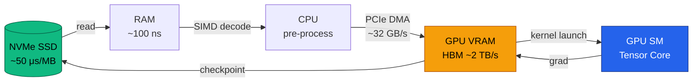
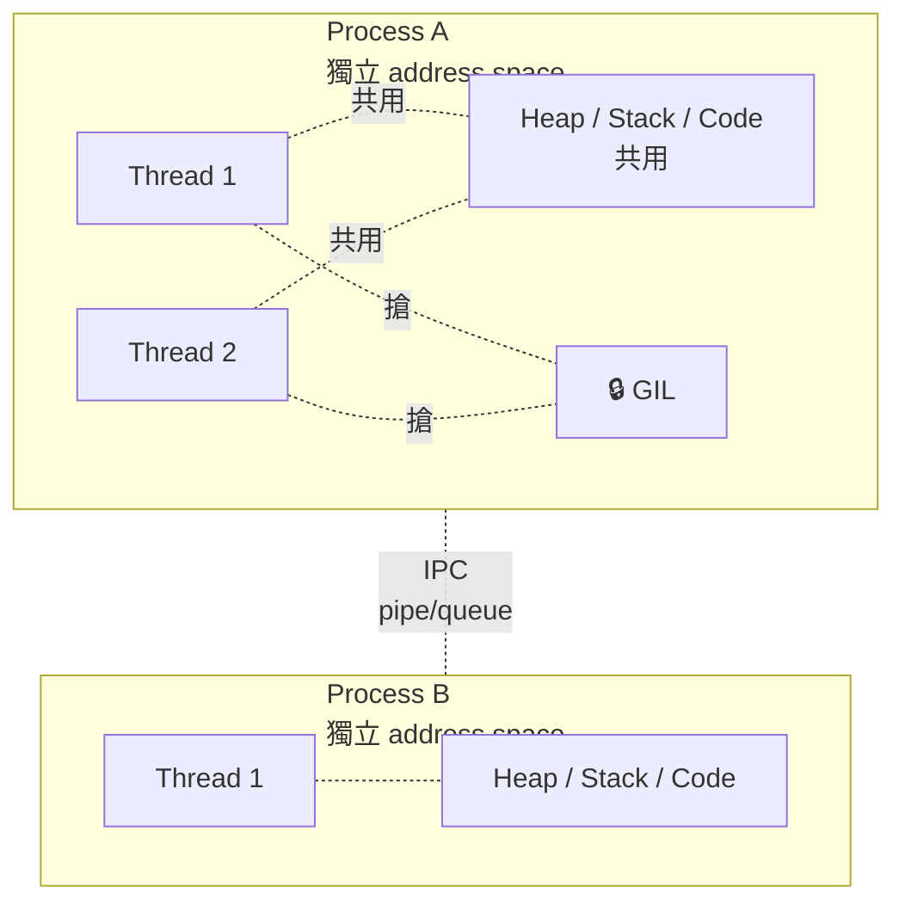
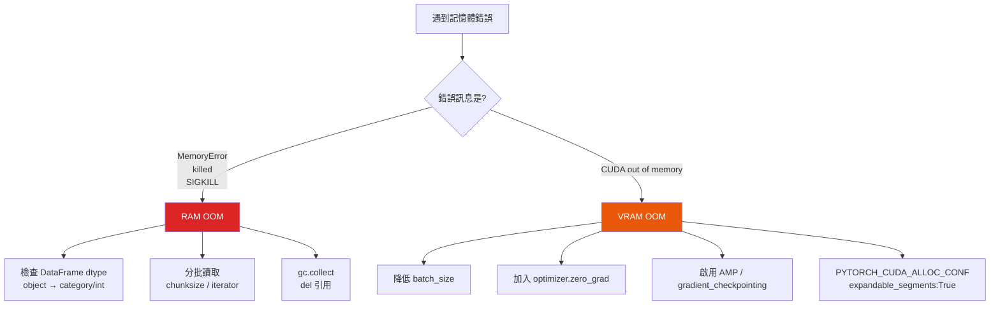
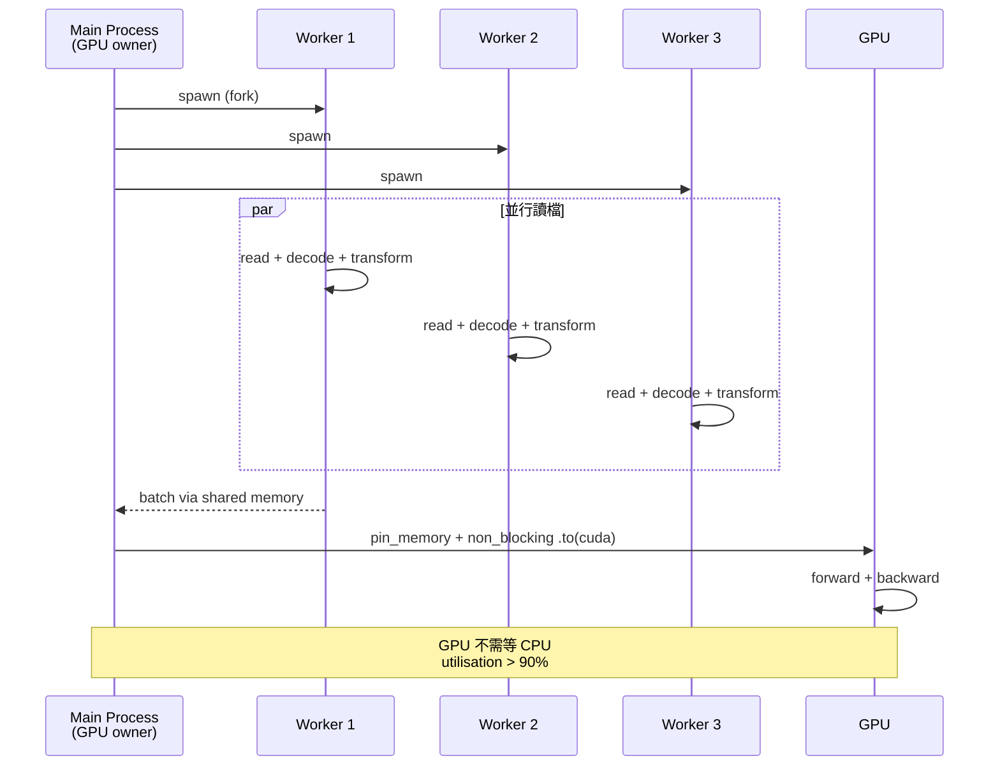

# M6 版面與視覺規格：Layout & Visual Spec

> **定位：** 本文件是 M6 簡報（配套文件 03 BCG 敘事版）與教學投影片（原始 M6.md）的視覺設計規格。供簡報設計師、插畫師、資訊圖表製作者作為交付 SSOT。內部 review 語氣，工程師可以按此實作，設計師可以按此出稿。

---

## 一、Grid 系統

**版型基準**：16:9（1920 × 1080 px），列印備援 A4 橫向（297 × 210 mm）。

**12 欄 grid**：
- 外 margin：96 px（左右）/ 72 px（上下）
- Gutter：24 px
- 欄寬：約 128 px / column
- Baseline grid：8 px

**常用版型模組**：

| 版型代號 | 用途 | 區塊 |
|---------|------|------|
| L1 | 純標題 / 金句 | 滿版置中 |
| L2 | 標題 + 一張大圖 | 上 1/5 標題，下 4/5 圖 |
| L3 | 雙欄對比 | 左 6 欄 vs 右 6 欄 |
| L4 | 三欄 MECE | 各 4 欄 |
| L5 | 標題 + 圖 + 右側 so-what | 左 8 欄圖，右 4 欄文字 |
| L6 | 表格頁 | 滿版 10 欄（兩側各留 1 欄） |

**規則**：每頁主標題高度固定 96 px，so-what footer 固定 48 px（置底，12pt）。

---

## 二、字體系統

### 字型選擇

| 用途 | 字型 | Weight |
|------|------|--------|
| 中文標題 | Noto Sans TC / 思源黑體 | Bold (700) |
| 中文內文 | Noto Sans TC | Regular (400) / Medium (500) |
| 英文標題 | Inter / IBM Plex Sans | SemiBold (600) |
| 英文內文 | Inter | Regular (400) |
| Mono / 程式碼 | JetBrains Mono / IBM Plex Mono | Regular (400) |
| 數字強調 | Inter | Bold (700) + tabular-nums |

### 字級

| 階層 | Size | Line Height | 用途 |
|------|------|-------------|------|
| H0 (金句) | 72 pt | 1.2 | 扉頁 / 金句頁 |
| H1 | 40 pt | 1.3 | 頁標題 |
| H2 | 28 pt | 1.35 | 區塊標題 |
| H3 | 20 pt | 1.4 | 小節 |
| Body Large | 18 pt | 1.5 | 正文 |
| Body | 16 pt | 1.5 | 正文 |
| Caption | 12 pt | 1.4 | 圖說 / footer |
| Code | 14 pt | 1.4 | 程式碼區塊 |

**台灣用語慣例**：標題不加句號；中英混排時英數前後留 0.25em 空隙（CSS `word-spacing` 或手動空白）。

---

## 三、色票（Color Palette）

### 主色

| 色名 | HEX | 用途 |
|------|-----|------|
| Deep Slate（主背景） | `#1E2A38` | 扉頁 / 金句頁背景 |
| Ink（主文字） | `#0F1720` | 淺背景文字 |
| Bone（淺背景） | `#F5F3EE` | 內頁主背景 |
| Paper White | `#FFFFFF` | 純白背景 |

### 語意色（三支柱）

| 支柱 | 色名 | HEX | 用途 |
|------|------|-----|------|
| Compute（運算） | Electric Blue | `#2563EB` | CPU / GPU 相關圖示 |
| Memory（記憶體） | Amber | `#F59E0B` | RAM / cache / VRAM |
| I/O & Scheduling | Emerald | `#10B981` | DataLoader / OS / 檔案系統 |

### 功能色

| 色名 | HEX | 用途 |
|------|-----|------|
| Alert Red | `#DC2626` | 錯誤訊息 / OOM 警示 |
| Warning Orange | `#EA580C` | Reviewer 警語 |
| Success Green | `#16A34A` | 完成 / Pass |
| Neutral Gray 100 | `#F3F4F6` | 次要背景 |
| Neutral Gray 400 | `#9CA3AF` | 分隔線 |
| Neutral Gray 700 | `#374151` | 次要文字 |

**對比規則**：主文字與背景對比 ≥ 7:1（AAA）；次要文字 ≥ 4.5:1（AA）。

---

## 四、資訊圖規格（必出四圖 + 5 mermaid 片段）

### 資訊圖 1 — 記憶體階層金字塔（含延遲數字）

**位置**：BCG 敘事 P5、教學版 P4 補充頁。

**構圖**：倒金字塔（由上而下層次擴張），每層標示 名稱 / 容量 / 延遲 / 量級倍數。

**視覺規格**：
- 上窄下寬，7 層
- 色彩由 Deep Slate（CPU 內部，近）→ Electric Blue（RAM）→ Amber（SSD）→ Emerald（Network）漸層
- 右側 Y 軸為 log 尺的延遲軸，標記 1 ns / 100 ns / 10 μs / 10 ms
- 每層右側放一個「距離」icon（暗示光速）

**實作素材清單**：
```
Layer 1 | Register | per core | ~0.3 ns | 1×
Layer 2 | L1 Cache | 32-64 KB | 1 ns | 3×
Layer 3 | L2 Cache | 256 KB-1 MB | 4 ns | 13×
Layer 4 | L3 Cache | 8-64 MB | 30 ns | 100×
Layer 5 | RAM (DDR5) | 16-512 GB | 100 ns | 333×
Layer 6 | NVMe SSD | TB | 10-100 μs | 10^5×
Layer 7 | Network (same DC) | - | 500 μs | 10^6×
```

---

### 資訊圖 2 — CPU vs GPU 架構對比

**位置**：BCG 敘事 P3/P4、教學版 P5。

**構圖**：左右並排方形晶片示意。

**CPU 側**（左）：
- 4 大方塊（core），每塊內有小字：「Control + ALU + L1」
- 中央共用 L2/L3 大方塊
- 色彩：Electric Blue + 大面積冷色

**GPU 側**（右）：
- 數十個中方塊（SM），每 SM 內有 32 × N 個小點（CUDA cores / warp lanes）
- 周圍 HBM 方塊（Amber）
- 下方大面積 L2（40 MB）

**下方對比表**（規格欄）：
```
             CPU          GPU (A100)
核心數       ~16         6,912 CUDA + 432 TC
頻率         ~4 GHz       ~1.4 GHz
記憶體頻寬   ~50 GB/s    ~2,000 GB/s
強項         分支/邏輯    矩陣乘加
```

---

### 資訊圖 3 — Process Lifecycle

**位置**：教學版 P9 補充、BCG 敘事 P9。

**構圖**：狀態機圖，五個圓形節點 + 有向箭頭。

**節點**：
- New（淺灰）→ Ready（Amber）→ Running（Emerald）→ Blocked/Waiting（Warning Orange）→ Terminated（深灰）

**箭頭標籤**：
- New → Ready: `admit`
- Ready → Running: `scheduler dispatch`
- Running → Ready: `time slice expire (preempt)`
- Running → Blocked: `I/O request / wait`
- Blocked → Ready: `I/O complete / signal`
- Running → Terminated: `exit / kill`

**註解側欄**：
- Context switch 成本：process ~1-10 μs
- Linux 排程器：CFS（Completely Fair Scheduler）
- 優先權 nice 值：-20（最高）到 19（最低）

---

### 資訊圖 4 — 虛擬記憶體映射

**位置**：教學版建議新增頁（P9.5）、BCG 敘事 P6 註解。

**構圖**：三層水平條帶。

- **上層**：Process A / Process B 兩個 Virtual Address Space（各自 0 ~ 2^48），用不同顏色 block 表示 code / heap / stack / mmap 區段
- **中層**：Page Table（樹狀或表格），由 MMU 箭頭連到 Physical Memory
- **下層**：Physical RAM（連續 bar），兩 process 的 page 交錯分佈；旁邊一小塊 Swap（SSD）

**標注**：
- Page size: 4 KB (standard) / 2 MB (hugepage)
- TLB cache（放 MMU 旁邊）: 64-1024 entries, ~1 ns hit / ~100 ns miss
- 箭頭示意 Copy-on-Write（兩 process 指向同一 physical page，寫入時才分裂）

---

## 五、Mermaid 片段（至少 5 個）

### Mermaid 1 — 訓練硬體旅程



---

### Mermaid 2 — Process vs Thread 對比



---

### Mermaid 3 — OOM 診斷決策樹



---

### Mermaid 4 — DataLoader 並行管線



---

### Mermaid 5 — CUDA Memory Hierarchy

```mermaid
flowchart TB
    subgraph GPU[GPU (A100)]
        subgraph SM[SM (108 個)]
            REG[Register<br/>1 cycle]
            SMEM[Shared Memory / L1<br/>~30 cycles, 192 KB]
        end
        L2[L2 Cache<br/>~200 cycles, 40 MB]
        HBM[HBM2e VRAM<br/>~500 cycles, 80 GB, 2 TB/s]
        SM --> L2
        L2 --> HBM
    end
    Host[Host RAM<br/>DDR5, 100 ns] -.PCIe 4.0 x16<br/>~32 GB/s.- HBM
    style REG fill:#2563EB,color:#fff
    style SMEM fill:#3B82F6,color:#fff
    style L2 fill:#60A5FA
    style HBM fill:#F59E0B
    style Host fill:#10B981
```

---

### Mermaid 6（bonus） — 跨環境邊界

```mermaid
flowchart LR
    subgraph Dev[本機開發]
        OS1[Windows 11]
        Py1[Python 3.11<br/>torch 2.1]
        Path1[C:\data\train]
    end
    subgraph Prod[雲端 GPU 伺服器]
        OS2[Ubuntu 22.04]
        Py2[Python 3.9<br/>torch 1.13]
        Path2[/mnt/s3/data/train]
    end
    Dev -.💥 環境漂移.- Prod
    Docker[📦 Docker Image<br/>OS + Python + 套件 + ENV]
    Dev --> Docker
    Docker --> Prod
    style Docker fill:#2563EB,color:#fff
```

---

## 六、圖示（Icon）規格

使用 Lucide 或 Heroicons 系列，stroke 1.5px，size 24 / 32 / 48 px 三階。

對應表：

| 概念 | Icon |
|------|------|
| CPU | `cpu` |
| GPU | `chip` (custom) |
| RAM | `memory-stick` |
| Disk | `hard-drive` |
| File | `folder` |
| Process | `box` |
| Thread | `git-branch` |
| Error | `alert-triangle` |
| Speed | `zap` |
| Lock (GIL) | `lock` |

---

## 七、Code block 風格

- 背景：`#0F1720`（Ink）
- 文字：`#E6EDF3`
- Keyword：`#FF7B72`
- String：`#A5D6FF`
- Comment：`#8B949E`
- 高亮行：左側 3px Amber `#F59E0B` 邊條
- 字型：JetBrains Mono 14pt，行高 1.4
- 最大寬度 80 字元，超過自動 wrap

---

## 八、版面一致性 Checklist（給 reviewer）

每頁交稿前核對：

- [ ] 標題高度固定 96 px
- [ ] So-what footer 存在且 ≤ 1 行
- [ ] 色彩不超過 3 主色 + 1 強調色
- [ ] 數字使用 tabular-nums
- [ ] 中英混排有 0.25em 間距
- [ ] Mermaid 圖對應三支柱色票
- [ ] 程式碼區塊字級 14pt、背景 Ink
- [ ] 對比符合 WCAG AA（內文）/ AAA（標題）
- [ ] 底部頁碼 + 章節代號（M6 / p.X）
- [ ] 禁用未授權 emoji（內部 review 可，對外版刪除）

---

## 九、交付清單（給設計團隊）

1. 主檔：Keynote / Figma（Figma 優先）
2. 資訊圖 4 張 SVG + PNG@2x
3. Mermaid 6 段原始碼（本文件內）
4. 色票 Figma Variable 檔
5. 字型授權確認書（Noto 與 Inter 皆 open，JetBrains Mono CC0）
6. 匯出：PDF（列印）、MP4（報讀備援）、PPTX（相容備援）

---

_配套文件：`01_on_page_annotation.md`、`02_three_lens_analysis.md`、`03_bcg_narrative.md`、`05_minimum_viable_knowledge.md`。_
