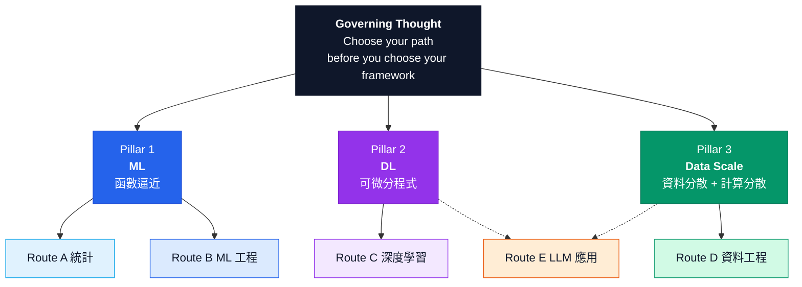
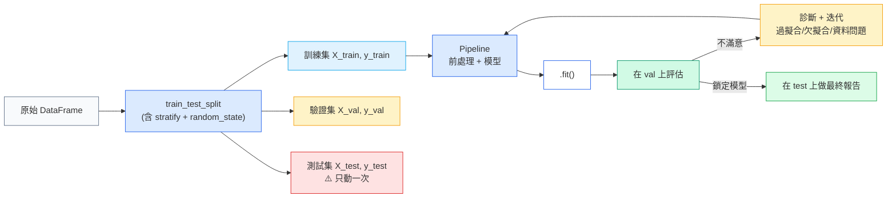
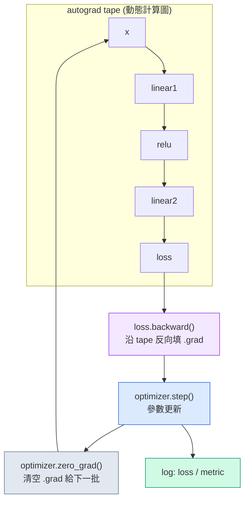
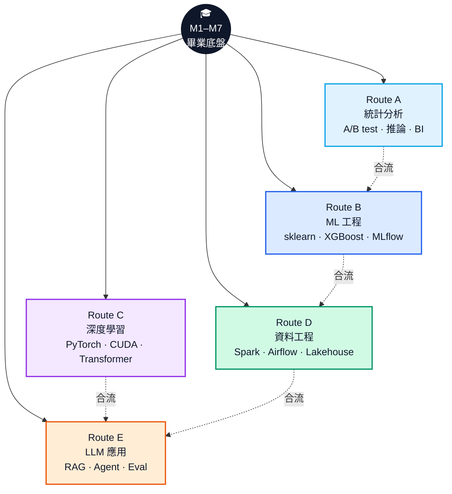
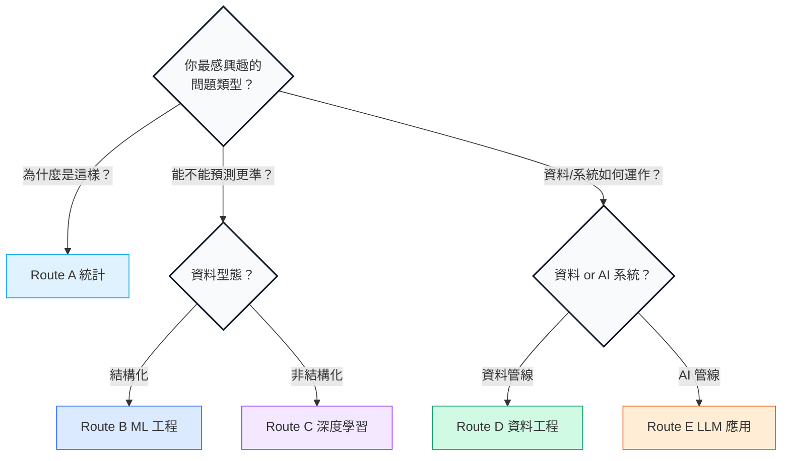
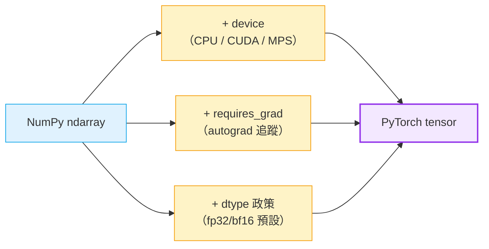

# M7 Layout & Visual Spec（版面與視覺規格）

> **文件定位**：這份文件是 M7 投影片 / 講義 / 書籍版型的視覺規格書。面向設計師、排版工程師、講義製作團隊。規範 grid、字體、色票、資訊圖規格、圖表 mermaid 原始碼。
>
> **使用方式**：依此檔案可直接在 Figma / Keynote / Reveal.js / LaTeX Beamer / Quarto 等工具建立一致的版型。色票以 hex 表示，字體以開源可商用字型為主。
>
> **語氣**：內部 review。規格文件，不解釋設計哲學，直接給尺寸。
> **日期**：2026-04-14。

---

## 1. Grid 系統

### 1.1 投影片（16:9, 1920×1080）

- Base grid：**12 columns × 6 rows**
- Gutter：24 px
- Margin：64 px（左右）/ 48 px（上下）
- Safe area：1792 × 984 px

```
│ 64 │   12 cols × 128 px 寬 + 24 px gutter    │ 64 │
```

**layout preset（五種）**
| preset | 用途 | 內容區 |
|---|---|---|
| L1 cover | 封面/分節頁 | title 居中、副標下置 |
| L2 quote | 金句頁 | 單欄居中、字 96pt |
| L3 content-1col | 單欄內文 | 12 cols 全寬、Action title + 3 bullets + takeaway |
| L4 content-2col | 雙欄（文+圖） | 5 cols 文 / 7 cols 圖 |
| L5 full-viz | 全幅資訊圖 | 12 cols × 5 rows、底部 1 row 放 caption |

### 1.2 講義/書籍內頁（A4, 210×297 mm）

- Base grid：**8 columns × 12 rows**
- Gutter：4 mm
- Margin：20 mm（內外）/ 24 mm（上下）
- Footer reserved：10 mm（頁碼 + 章節）

---

## 2. 字體

### 2.1 字型家族

| 用途 | 字型 | 授權 |
|---|---|---|
| 中文內文 | Noto Sans TC / 思源黑體 | OFL |
| 中文強調 | Noto Serif TC / 思源宋體 | OFL |
| 英文內文 | Inter | OFL |
| 英文 code | JetBrains Mono | OFL |
| 數學公式 | STIX Two Math | OFL |

**不使用** Microsoft YaHei、PingFang（授權風險）。

### 2.2 字級階層（投影片）

| tier | size | line-height | 用途 |
|---|---|---|---|
| T1 display | 96 pt | 1.1 | 金句頁 |
| T2 title | 56 pt | 1.2 | 分節頁標題 |
| T3 action title | 36 pt | 1.3 | 每頁 action title |
| T4 body | 24 pt | 1.5 | bullet 內文 |
| T5 caption | 18 pt | 1.4 | 圖表 caption / takeaway |
| T6 footnote | 14 pt | 1.4 | 頁碼 / attribution |

### 2.3 字級階層（講義）

| tier | size | line-height |
|---|---|---|
| H1 | 24 pt | 1.3 |
| H2 | 18 pt | 1.3 |
| H3 | 14 pt | 1.3 |
| body | 11 pt | 1.6 |
| caption | 9 pt | 1.4 |
| code | 10 pt | 1.5 |

---

## 3. 色票

### 3.1 主色系統（Foundation Neutral + 三支柱強調色）

```
Foundation（中性底色）
─────────────────────
ink        #0F172A   主要文字
graphite   #334155   次要文字
slate      #64748B   caption / 輔助
mist       #E2E8F0   分隔線
paper      #F8FAFC   背景
white      #FFFFFF   畫布

Pillar accents（三支柱強調色）
──────────────────────────
pillar-ml      #2563EB   (Pillar 1 — ML / 函數逼近)     深藍
pillar-dl      #9333EA   (Pillar 2 — DL / 可微分程式)    紫
pillar-scale   #059669   (Pillar 3 — Data Scale)        深綠

Semantic（語意色）
─────────────────
success    #16A34A
warning    #F59E0B
danger     #DC2626
info       #0EA5E9
```

### 3.2 路線色（Route A–E）

與三支柱獨立、用於職涯地圖：

```
Route A 統計      #0EA5E9   天青（推論）
Route B ML        #2563EB   寶藍（與 Pillar-ML 同色系，深一階）
Route C DL        #9333EA   紫（與 Pillar-DL 同）
Route D DE        #059669   深綠（與 Pillar-Scale 同）
Route E LLM       #EA580C   橘（跨支柱標記色）
```

### 3.3 對比度檢驗

所有正文色對背景色需 ≥ WCAG AA（4.5:1）。投影片大字可放寬到 AA-Large（3:1）。code block 底色使用 `#F1F5F9` + `ink` 文字（對比 10.3:1）。

---

## 4. 資訊圖規格（5 張核心視覺）

### 4.1 資訊圖 #1 — 五條路線 Roadmap

**用途**：S11 / BCG 頁 13–14。
**尺寸**：full-viz（12 cols × 5 rows）。
**布局**：左側「畢業點」圓盤（240 px 直徑）、右側輻射出五條路線，每條路線是一條時間軸（0–30 天、30–90 天、90 天+ 三個里程碑節點）。
**配色**：五條路線各用其 Route 色、畢業點用 `ink`、時間軸用 `graphite`。
**節點 icon**：30 天 = 實心圓、90 天 = 雙圈、90+ = 三角（代表開放方向）。
**caption**：底部一行「同一個底盤，五條真實職涯。」T5 caption 大小。

### 4.2 資訊圖 #2 — scikit-learn Pipeline 結構

**用途**：S04 / S05 / 講義附錄。
**尺寸**：content-2col 的圖區（7 cols × 4 rows）。
**布局**：水平流程圖，從左到右：
```
[raw df] → [ColumnTransformer] → [Estimator (.fit/.predict)] → [eval]
```
**細節**：
- ColumnTransformer 內分上下兩格：numeric（StandardScaler）/ categorical（OneHotEncoder）
- Estimator 下方標示 `.fit` / `.predict` / `.score` / `.get_params` 四個方法
- 箭頭上方寫 dtype（DataFrame → ndarray → ndarray → float）
**配色**：`pillar-ml` 主色、處理節點用 `mist` 底 + `ink` 字。

### 4.3 資訊圖 #3 — PyTorch 訓練迴圈

**用途**：S07 / S08 / Route C 參考。
**尺寸**：content-2col 的圖區。
**布局**：垂直循環箭頭圖，六個節點：
```
forward → loss → zero_grad → backward → step → log
  ↑                                              │
  └──────────────────────────────────────────────┘
```
**細節**：
- 每個節點標示一行 PyTorch 代碼
- 在 `backward` 右側掛一個「autograd tape」圖示（虛線框住 forward → loss）
- 在 `step` 下方標 `optimizer.zero_grad()` 的位置含義
**配色**：`pillar-dl` 主色、tape 框用虛線 `slate`。

### 4.4 資訊圖 #4 — PySpark 執行計畫 DAG

**用途**：S10 / Route D 參考。
**尺寸**：full-viz。
**布局**：Catalyst 分三層展示：
```
邏輯計畫（LogicalPlan）→ 優化後邏輯計畫 → 物理計畫（PhysicalPlan）
                                             │
                                             ▼
                                    stage 1 ──shuffle── stage 2
                                       │                   │
                                  narrow op            narrow op
```
**細節**：
- stage 邊界用紅色虛線 + 「shuffle boundary」標示
- 每個 stage 內畫 3–5 個 task（小方塊）
- 底部放一個 mini code snippet 展示 `df.explain(mode="formatted")` 的前 5 行輸出
**配色**：`pillar-scale` 主色、shuffle 邊界 `danger` 色。

### 4.5 資訊圖 #5 — 職涯地圖 2×2 Matrix

**用途**：BCG 頁 13 補充 / S11 延伸。
**尺寸**：content-1col 置中（8 cols × 4 rows）。
**兩軸**：
- X：資料型態（結構化 ← → 非結構化）
- Y：工作角色（建模/分析 ← → 系統/工程）

```
                   系統 / 工程
                        │
           Route D     │    Route E
        (結構化+工程)   │  (非結構化+工程)
                        │
  結構化 ────────────────┼──────────────── 非結構化
                        │
           Route A/B    │    Route C
         (結構化+建模)   │  (非結構化+建模)
                        │
                   建模 / 分析
```

**細節**：Route E 跨在右上象限但延伸箭頭指向其他象限（代表 LLMOps 在合流）。
**配色**：四象限用極淡色底（`paper` + 10% Route 色）、Route 名稱用該 Route 色、箭頭用 `graphite`。

---

## 5. Mermaid 片段

以下 5+ 個 mermaid diagram 可直接貼進講義/書籍渲染。繁體中文標籤，使用 `graph` / `flowchart` / `sequenceDiagram` 等。

### 5.1 Mermaid #1 — 三支柱 MECE（BCG 頁 3）



### 5.2 Mermaid #2 — scikit-learn 建模工作流（S05）



### 5.3 Mermaid #3 — PyTorch 訓練迴圈 + autograd tape（S07/S08）



### 5.4 Mermaid #4 — PySpark 執行模型：lazy → action → DAG（S10）

```mermaid
flowchart LR
  T1["df.filter(...)"]:::lazy --> T2["df.select(...)"]:::lazy
  T2 --> T3["df.groupBy(...).agg(...)"]:::lazy
  T3 --> T4["df.join(other, ...)"]:::lazy
  T4 --> A1["df.show() / .write()<br/><b>action 觸發 job</b>"]:::action
  A1 --> C1["Catalyst 優化器"]:::catalyst
  C1 --> P1["Physical Plan"]:::plan
  P1 --> ST1["Stage 1<br/>narrow ops"]:::stage
  ST1 -->|shuffle| ST2["Stage 2<br/>reduce/join"]:::stage
  ST2 --> OUT["結果"]:::out

  classDef lazy fill:#F8FAFC,stroke:#64748B,stroke-dasharray:5 5
  classDef action fill:#FEE2E2,stroke:#DC2626
  classDef catalyst fill:#D1FAE5,stroke:#059669
  classDef plan fill:#DCFCE7,stroke:#16A34A
  classDef stage fill:#DBEAFE,stroke:#2563EB
  classDef out fill:#fff,stroke:#0F172A
```



### 5.5 Mermaid #5 — 五條路線職涯地圖（S11 / BCG 頁 13）



### 5.6 Mermaid #6（bonus）— 路線分岔決策樹（BCG 頁 14）



### 5.7 Mermaid #7（bonus）— tensor vs ndarray 的三個差異



---

## 6. 圖示與 icon 規格

- 線寬一致：1.5 px（細）/ 2.5 px（粗強調）
- 圓角半徑：4 px（小方塊）/ 12 px（大卡片）
- 陰影：`0 2px 8px rgba(15, 23, 42, 0.08)`（輕微浮起）
- icon set：Lucide Icons（MIT，線性風格、與 Inter 字型搭配和諧）

---

## 7. 程式碼區塊樣式

```
背景：#F1F5F9
文字：#0F172A
行高：1.5
font：JetBrains Mono 10pt (講義) / 20pt (投影片)
highlight line：背景 #FEF3C7
error line：背景 #FEE2E2 + 左側紅色 2px 標記條
```

**語言標記**：code block 右上角小標籤（10pt、slate 色）顯示 `python` / `bash` / `sql`。

---

## 8. 版型一致性檢查表（ship 前必跑）

- [ ] 所有投影片都有 action title（非名詞性標題）
- [ ] 所有內容頁都有 takeaway 一行
- [ ] 三支柱的配色在整份教材中保持一致（ML 藍 / DL 紫 / Scale 綠）
- [ ] Route 色與 Pillar 色可清楚區分
- [ ] 所有 mermaid diagram 在最終渲染環境下可正確顯示繁中
- [ ] 金句頁至少 5 張，且均為 full-bleed
- [ ] 所有圖表 caption 使用 T5 字級
- [ ] 所有 code block 有語言標籤
- [ ] 封面 + 分節頁共 4 張（開場 + Part A/B/C）

— end of layout & visual spec —
